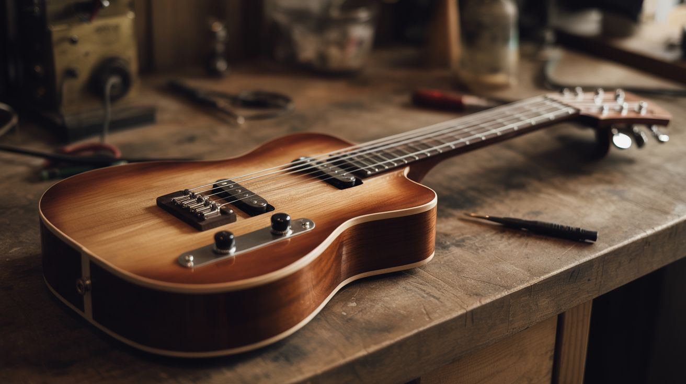

# 🎸 Junk Instruments

  

  

> Playable instruments from PVC, cigar boxes, and whatever was in the recycling bin this morning.

There's a reason "jug band" is a real genre. Humans have been making music out of whatever's lying around since the first caveman banged two rocks together and liked the sound. The difference now is you've got access to dumpsters full of PVC pipe, dead washing machines, and hardware store clearance bins.

These builds turn trash into instruments that actually play — not toy-sounding novelties, but things you can tune, perform with, and record. Some are acoustic, some are electronic, and a few blur the line in ways that would make a luthier's eye twitch.

No music theory required. No woodworking shop required. Just garbage, hand tools, and a willingness to make some noise.

## Builds

<a class="cat-card" href="235-cigar-box-guitar.md">
#235Cigar Box Guitar

Jaw

Brain

Wallet

Spicy

Clout

Time

</a>
<a class="cat-card" href="236-pvc-pipe-organ.md">
#236PVC Pipe Organ

Jaw

Brain

Wallet

Spicy

Clout

Time

</a>
<a class="cat-card" href="237-bucket-drum-kit.md">
#237Bucket Drum Kit

Jaw

Brain

Wallet

Spicy

Clout

Time

</a>
<a class="cat-card" href="238-tin-can-banjo.md">
#238Tin Can Banjo

Jaw

Brain

Wallet

Spicy

Clout

Time

</a>
<a class="cat-card" href="239-steel-tongue-drum.md">
#239Steel Tongue Drum

Jaw

Brain

Wallet

Spicy

Clout

Time

</a>
<a class="cat-card" href="240-garden-hose-didgeridoo.md">
#240Garden Hose Didgeridoo

Jaw

Brain

Wallet

Spicy

Clout

Time

</a>
<a class="cat-card" href="241-bottle-xylophone.md">
#241Bottle Xylophone

Jaw

Brain

Wallet

Spicy

Clout

Time

</a>

---

### Suggested Build Order

Start with pure percussion, progress toward tuned instruments:

1. **[#240 — Garden Hose Didgeridoo](240-garden-hose-didgeridoo.md)** — Pure breath power. No tuning required.
2. **[#237 — Bucket Drum Kit](237-bucket-drum-kit.md)** — Basic percussion assembly.
3. **[#238 — Tin Can Banjo](238-tin-can-banjo.md)** — Simple string tension setup.
4. **[#235 — Cigar Box Guitar](235-cigar-box-guitar.md)** — String tuning and basic acoustics.
5. **[#241 — Bottle Xylophone](241-bottle-xylophone.md)** — Precision tuning via water fill levels.
6. **[#239 — Steel Tongue Drum](239-steel-tongue-drum.md)** — Precision cutting and tuning of steel.
7. **[#236 — PVC Pipe Organ](236-pvc-pipe-organ.md)** — Air chamber calculations and multi-pipe tuning.

### Related Categories

- [Sound & Music](../sound-and-music/) — Audio amplification and acoustic experiments
- [Raspberry Pi & Arduino](../pi-and-arduino/) — MIDI and stepper motor music (#135)
- [Mechanical & Kinetic](../mechanical-and-kinetic/) — Musical marble machine and rhythm-based kinetic art

---

## 📚 Reference Guides

- [Tools Needed](../../docs/reference/tools-needed.md)
- [Sourcing Guide](../../docs/reference/sourcing-guide.md)
- [Difficulty & Ratings Guide](../../docs/reference/difficulty-guide.md)
