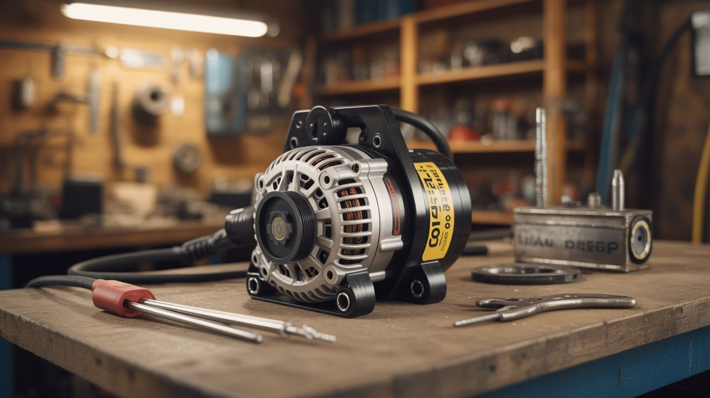

# #219 — Alternator Welder

  

> Car alternator + car battery = field stick welder capable of 60-100A output. Weld anywhere there's a running engine.

## Ratings

     

## 🧪 What Is It?

A car alternator is a three-phase AC generator that outputs 13.8V at up to 100+ amps when driven at engine RPM. That's more than enough current to melt steel with a welding rod. The stock internal voltage regulator limits output to battery-charging levels, but bypass it — run the field winding at full excitation — and the alternator becomes a brute-force current source. Connect the output to a welding electrode holder and a ground clamp, and you have a functional stick welder that runs off any engine with a belt. Farmers, off-roaders, and field mechanics have been doing this for decades. It's ugly. It works. The welds aren't pretty, but they'll hold a gate hinge or a broken trailer tongue together when you're 50 miles from the nearest shop.

<strong>🧰 Ingredients</strong>

- [ ] Car alternator — the bigger the better, 100A+ rating preferred *(junkyard, any vehicle)*
- [ ] Car battery — 12V, healthy enough to start the excitation *(junkyard or existing vehicle)*
- [ ] Welding electrode holder (stinger) *(welding supply, ~$10)*
- [ ] Ground clamp — heavy-duty C-clamp style *(welding supply, ~$8)*
- [ ] Welding rods — 6011 or 6013, 1/8" diameter *(hardware store)*
- [ ] Heavy gauge cable — 4 AWG or thicker, for output leads *(auto parts store or junkyard battery cables)*
- [ ] Belt and pulley setup — to spin the alternator with a gas engine or existing vehicle engine *(junkyard)*
- [ ] Toggle switch or rheostat — to control field winding excitation *(electronics supplier)*
- [ ] Welding helmet and gloves *(hardware store)*

## 🔨 Build Steps

1. **Pull the alternator.** Grab the biggest alternator you can find at the junkyard. Truck and SUV alternators are typically rated 120-160A. Keep the wiring harness connector — it tells you which pin is the field winding.
2. **Identify the field winding terminals.** Most alternators have a plug with two pins for the field coil (sometimes labeled F and ground, or IG and L). The field winding is an electromagnet inside the rotor. More current through the field = more output from the stator.
3. **Bypass the internal voltage regulator.** Remove the built-in regulator/brush assembly. Wire the field winding directly to 12V through a toggle switch or rheostat. This gives you manual control over the output current — full field current means maximum welding amps.
4. **Mount the alternator.** If using a standalone gas engine (lawnmower engine, generator engine), mount the alternator on a bracket and connect it with a belt. If using a vehicle, you can mount a second alternator alongside the stock one or just modify the stock unit.
5. **Wire the output leads.** Connect the alternator's main output stud (B+ terminal) to the welding electrode holder using 4 AWG cable or heavier. Connect the alternator case ground to the ground clamp using the same gauge cable. Keep the cables as short as practical — resistance is the enemy of amperage.
6. **Connect the battery.** Wire the car battery in parallel with the alternator output. The battery acts as a buffer, smoothing the pulsating DC output. This makes the arc more stable and easier to strike.
7. **Set the RPM.** The alternator needs to spin at 3,000-5,000 RPM to produce welding current. If belt-driven from a small engine, size your pulleys accordingly. If using a running vehicle, a fast idle (1,500-2,000 engine RPM) with the right pulley ratio gets you there.
8. **Strike an arc.** Clamp the ground to your workpiece, insert a 6011 rod into the stinger, put on your welding helmet, and scratch-start the arc. Adjust the field winding current (via switch or rheostat) until the arc is stable. A buzzing, spattery arc means too much current; a stubbing, sticky arc means too little.
9. **Practice and tune.** Alternator welders produce DC with some ripple, which actually helps with certain rod types. Start with thin material (1/8" steel) and 6013 rods, which are more forgiving. Work up to structural welds only after you can run consistent beads.

## ⚠️ Safety Notes

> **Spicy Level 3 build.** Read the Safety Guide before starting.

- This is a real welder producing real UV radiation and molten metal. Wear a proper welding helmet (auto-darkening shade 10+), leather gloves, and long sleeves. Welding flash burns your corneas and you won't feel it until hours later.
- The alternator output is low voltage (14V) but extremely high current. A short circuit across the output cables can melt copper instantly and start a fire. Always disconnect the battery when not welding. Never let the output cables touch each other without a welding rod in the circuit.
- Hot metal, sparks, and slag are part of the process. Work on a non-flammable surface, keep a fire extinguisher within reach, and never weld near fuel, solvents, or dry grass.

## 🔗 See Also

- [Spot Welder](../functional-machines/027-spot-welder/)
- [Desktop Foundry](../fire-and-plasma/005-desktop-foundry/)
