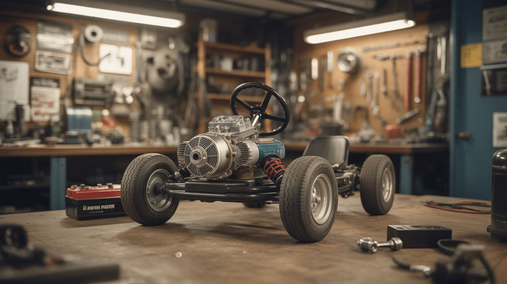

# #221 — Starter Motor Go-Kart

  

> A starter motor's insane torque + chain drive + car battery = a go-kart that launches like it owes you money.

## Ratings

     

## 🧪 What Is It?

A car starter motor is a DC motor designed to crank a cold engine against compression — which means it delivers savage torque from a dead stop. Most starters pull 150-300 amps and spin at 2,000-3,000 RPM under load. That's way too fast for direct drive on a wheel, but add a chain reduction (big sprocket on the axle, small sprocket on the motor) and you have a torque-multiplied drive system with neck-snapping acceleration. The motor is built to survive brief, violent duty cycles — 10 seconds of cranking followed by cool-down. For a go-kart, that means it overheats under sustained use, so you either run it in short bursts or add active cooling. A car battery provides power, a solenoid or contactor acts as the throttle switch, and the frame can be welded from scrap steel or salvaged from an old kart. The result: a vehicle that accelerates like a drag car for the first 50 feet, powered entirely by junkyard parts.

<strong>🧰 Ingredients</strong>

- [ ] Car starter motor — larger truck starters have more torque *(junkyard)*
- [ ] Car battery — 12V, group 24 or larger for runtime *(junkyard or auto parts store)*
- [ ] Chain and sprockets — #35 or #40 roller chain, small sprocket for motor shaft, large for rear axle *(go-kart supply or hardware store)*
- [ ] Rear axle — solid steel rod, 3/4" to 1" diameter with bearing mounts *(go-kart supply or fabricate)*
- [ ] Wheels and tires — go-kart or lawnmower wheels *(junkyard, hardware store)*
- [ ] Frame — weld from steel tubing or salvage an existing go-kart chassis *(scrap metal, junkyard)*
- [ ] Solenoid or contactor — heavy-duty 12V, for throttle switching *(junkyard starter solenoid, or ~$15)*
- [ ] Steering assembly — spindles, tie rods, steering shaft *(go-kart supply or fabricate)*
- [ ] Seat and seat mount *(junkyard, office chair, etc.)*
- [ ] Kill switch — big red mushroom button *(electronics supplier, ~$5)*

## 🔨 Build Steps

1. **Salvage the starter motor.** Pull a starter from the biggest engine you can find — truck and SUV starters are beefier. Keep the starter solenoid too, it's your throttle relay. Test the motor with a car battery before committing: jumper 12V to the solenoid's small terminal and verify the motor spins hard.
2. **Build or source the frame.** Weld a rectangular frame from 1" square steel tubing. A basic go-kart frame is roughly 4 feet long by 2 feet wide. If you salvage an existing frame, verify it can handle the torque — starter motors accelerate violently and weak frames crack at the motor mount.
3. **Install the rear axle.** Mount a solid rear axle across the back of the frame using pillow block bearings. The axle needs to spin freely with minimal friction. Press or weld the large sprocket onto the axle and mount wheels on both ends.
4. **Mount the starter motor.** Bolt the starter to the frame near the rear axle. Align the small drive sprocket (mounted on the starter's output shaft) with the large sprocket on the axle. The chain reduction ratio determines your speed vs. torque — a 4:1 ratio (e.g., 10-tooth motor, 40-tooth axle) is a good starting point for usable speed with strong acceleration.
5. **Install the chain.** Run #35 or #40 roller chain between the two sprockets. Tension it properly — too loose and it jumps off under load, too tight and it binds. A chain tensioner (spring-loaded idler sprocket) helps maintain tension as things flex.
6. **Wire the throttle circuit.** Mount the starter solenoid to the frame. Wire the battery positive to the solenoid's main input terminal. Wire the solenoid's main output terminal to the starter motor's positive terminal. Wire a momentary button (foot pedal or thumb switch) to the solenoid's small trigger terminal. When you press the button, the solenoid closes, and full battery current hits the motor. Release to stop.
7. **Install the kill switch.** Wire a big red mushroom-head emergency stop switch in series with the solenoid trigger circuit. This cuts power to the motor instantly. Mount it where you can reach it without looking.
8. **Add steering and brakes.** Install a front steering assembly with spindles and tie rods. For brakes, a simple band brake or disc brake on the rear axle works. Do NOT skip brakes — this thing accelerates faster than you expect.
9. **Test in a safe area.** Start on flat ground, open space, no traffic. The first time you hit the throttle, the starter motor will try to rip the small sprocket off its shaft and fling you forward. Short bursts — 5-10 seconds on, then coast. The motor heats up fast under continuous load.
10. **Upgrade as needed.** If the motor overheats quickly, add a fan blowing on it or duct air from vehicle motion. If you want more top speed, go with a higher gear ratio (smaller driven sprocket). If you want more runtime, wire two car batteries in parallel.

## ⚠️ Safety Notes

- Starter motors draw 150-300 amps. The wiring, solenoid, and battery connections must be rated for this current. Undersized wires will melt and cause electrical fires. Use battery cable (4 AWG or thicker) for all power connections. Fuse the circuit with an appropriately rated fuse or fusible link.
- This vehicle has no suspension, minimal brakes, and violent acceleration. Wear a helmet. Start slow. Test brakes before testing speed. Never ride near traffic, pedestrians, or on hills until you trust the braking system completely.
- The starter motor is designed for 10-second duty cycles, not continuous use. Running it for extended periods will cause the motor to overheat, potentially melting insulation and shorting the windings. Monitor motor temperature by touch (carefully, with the power off) and let it cool between runs.

## 🔗 See Also

- [Electric Go-Kart](../functional-machines/024-electric-go-kart.md)
- [Electric Skateboard](../scooter-and-motor/088-electric-skateboard.md)

**References:**
- [Appliance Teardown Guide](../../reference/appliance-teardown-guide.md)
- [Technical Glossary](../../reference/glossary.md)
