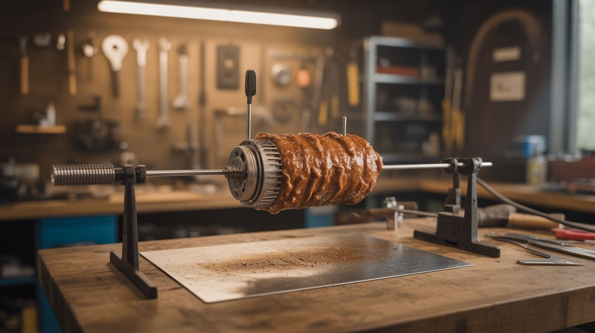

# #222 — Wiper Motor Rotisserie

  

> Wiper motor's worm-geared slow spin + a spit rod = the laziest, most effective BBQ rotisserie ever built.

## Ratings

     

## 🧪 What Is It?

A windshield wiper motor is a DC motor with an internal worm gear reduction that converts high-speed motor rotation into slow, high-torque output — typically 40-65 RPM. That's almost exactly what you need for a rotisserie spit. Commercial rotisserie motors cost $30-80 and do the same thing worse, because wiper motors are overbuilt to survive years of rain, snow, and ice loads on a windshield. Wire a wiper motor to a 12V battery (or a 12V wall adapter), attach a spit rod to the output shaft, and you have a rotisserie motor that will turn a whole chicken for hours without complaint. The worm gear is self-locking, meaning the weight of the food can't backdrive the motor — it holds position even when power is cut. This is the easiest, most useful junkyard build in the entire repo.

<strong>🧰 Ingredients</strong>

- [ ] Windshield wiper motor — any vehicle *(junkyard)*
- [ ] 12V power source — car battery, 12V wall adapter (2A+), or bench power supply *(existing or ~$10)*
- [ ] Spit rod — 3/8" to 1/2" stainless steel rod, 24-36 inches long *(hardware store)*
- [ ] Spit forks — two-prong forks to hold the meat, or fabricate from stainless steel *(BBQ supply or fabricate)*
- [ ] Mounting bracket — L-bracket or angle iron to mount the motor to the grill *(hardware store)*
- [ ] Toggle switch — to start and stop *(electronics supplier, ~$2)*
- [ ] Wire — 16 AWG, a few feet *(hardware store)*

## 🔨 Build Steps

1. **Pull the wiper motor.** At the junkyard, unbolt the wiper motor from the firewall. Cut the wiring harness with a few inches of wire still attached. There are usually three wires: ground, low speed, and high speed. You only need ground and low speed for a smooth, slow rotation.
2. **Test the motor.** Connect 12V across the ground wire and the low-speed wire. The output shaft should turn slowly and steadily at about 40-50 RPM. If it's too fast, you can reduce the voltage with a simple voltage divider or PWM controller. Most wiper motors at 12V are already a perfect rotisserie speed.
3. **Adapt the output shaft.** The wiper motor's output is a splined or knurled shaft with a threaded tip (designed to hold the wiper arm). You need to connect the spit rod to this shaft. Options: drill a hole through the spit rod end and bolt it to the wiper arm mount, use a coupling nut, or weld a socket adapter to the shaft. The connection must be solid — a 5-pound chicken creates real torque.
4. **Build the motor mount.** Bend or weld an L-bracket from angle iron that bolts the motor to the side of your grill, smoker, or fire pit. The motor body should be outside the heat zone — wiper motors have plastic housings and internal grease that don't love sustained high temperatures. Keep the motor at least 12 inches from direct flame.
5. **Install the spit rod and forks.** Slide the spit rod through the motor adapter, through the grill/smoker, and rest the far end on a bearing or V-bracket support. Install spit forks on the rod to hold the meat. Tighten the fork thumbscrews so the food is centered on the rod's axis — off-center loads wobble and stall the motor.
6. **Wire the switch.** Install a toggle switch in-line with the positive wire between your 12V source and the motor. This lets you stop and start the rotation for loading and unloading food.
7. **Cook.** Load the food, balance it on the spit, turn on the motor, and let it spin. A whole chicken takes about 90 minutes over medium coals. The constant rotation bastes the meat in its own juices and produces an insanely even cook. The wiper motor won't care — it was designed to run for hours in a blizzard.

## ⚠️ Safety Notes

- Keep the motor body and wiring away from direct flame and high heat. The motor housing is often plastic and the internal grease is petroleum-based. Mount the motor outside the cooking zone with the spit rod extending into the heat area.
- If using a car battery as the power source, keep it away from the grill — batteries vent hydrogen gas when charging, which is flammable. A 12V wall adapter is safer for stationary setups.

## 🔗 See Also

- [Scooter Motor Lathe](../functional-machines/025-scooter-motor-lathe.md)
- [Stirling Engine](../mechanical-and-kinetic/182-stirling-engine.md)

**References:**

- [Appliance Teardown Guide](../../docs/reference/appliance-teardown-guide.md)
- [Technical Glossary](../../docs/reference/glossary.md)
