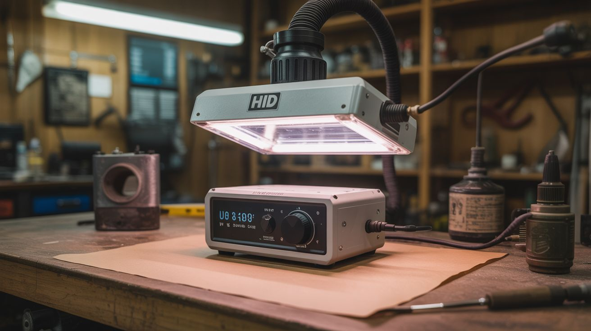

# #226 — HID Headlight UV Curer

  

> HID ballast + UV bulb = a professional UV curing station for resin, epoxy, gel nails, and UV-reactive coatings. Junkyard optics, workshop results.

## Ratings

     

## 🧪 What Is It?

HID (High-Intensity Discharge) headlight ballasts are precision power supplies designed to ignite and sustain an arc inside a xenon or metal-halide bulb. The ballast takes 12V DC in and outputs a high-voltage ignition pulse (up to 25kV) followed by a regulated 35-55 watts of AC power to sustain the arc. This is exactly the same technology used in commercial UV curing lamps, UV sterilizers, and industrial UV coating systems — just in a different bulb. Swap the xenon headlight bulb for a UV bulb with a compatible socket (or adapt the wiring), and the ballast drives it perfectly. The result is a high-intensity UV light source that cures UV resin in seconds, hardens gel nail polish, activates UV-reactive coatings, and sterilizes surfaces. Commercial UV curing stations cost $50-200. An HID ballast from the junkyard is free, and a UV bulb costs $10-15.

<strong>🧰 Ingredients</strong>

- [ ] HID headlight ballast — 35W or 55W unit from any car with factory HID headlights *(junkyard)*
- [ ] UV bulb — 365nm or 395nm wavelength, with a compatible base (H1, H7, D2S, etc.) *(online specialty supplier, ~$10-15)*
- [ ] 12V power supply — 5A+ for a 55W ballast *(electronics supplier or car battery)*
- [ ] Reflector housing — the original headlight housing, a desk lamp reflector, or a metal can *(junkyard or hardware store)*
- [ ] Cooling fan — small 12V fan to cool the ballast *(salvage from PC or electronics)*
- [ ] Enclosure — box or frame to mount everything and contain UV light *(build from wood or metal)*
- [ ] UV-blocking safety glasses — rated for 365nm *(online, ~$10)*
- [ ] Toggle switch and wiring *(electronics supplier)*

## 🔨 Build Steps

1. **Pull the HID ballast.** Find a car with factory HID headlights at the junkyard (look for projector-style headlight lenses — they're a giveaway). The ballast is usually mounted near the headlight assembly, a sealed black box with a high-voltage connector on one side and a 12V power input on the other. Keep the wiring harness.
2. **Source the UV bulb.** Match the bulb base type to your ballast's output connector. D2S and D2R ballasts are the most common OEM types — you can find UV bulbs in these bases from specialty lighting suppliers. If your ballast uses a different connector, adapt the wiring or use a bulb base adapter. Target 365nm wavelength for resin curing (most effective) or 395nm for general UV applications.
3. **Test the ballast.** Connect the ballast to 12V and install the UV bulb. The ballast will fire a high-voltage ignition pulse — you'll hear a brief tick or snap — then the bulb should light up with a deep violet glow. If the bulb doesn't ignite within 3-4 seconds, check connections. Some ballasts retry automatically; others need a power cycle.
4. **Build the curing chamber.** Construct a box from wood, metal, or thick cardboard lined with aluminum foil. The reflective interior bounces UV light around the curing area for more even exposure. Mount the bulb and reflector inside the top of the box, pointing down at a work surface. The box should be open on one side (or have a door) for loading parts.
5. **Mount the ballast.** Attach the ballast to the outside of the curing chamber with screws or Velcro. Keep it outside the box — ballasts generate heat and need airflow. Mount a small 12V PC fan to blow air across the ballast's heat sink.
6. **Wire the power circuit.** Connect the 12V supply to the ballast through a toggle switch. Add an inline fuse (10A for a 55W ballast). Route the high-voltage wire from the ballast to the UV bulb inside the chamber through a grommet or sealed hole — keep this wire well-insulated and away from hands.
7. **Add a safety interlock (recommended).** Install a microswitch on the chamber door that cuts power to the ballast when the door is open. This prevents accidental UV exposure when reaching inside. Commercial UV curing stations all have this feature.
8. **Calibrate and use.** Place a UV resin print, gel nail, or coated part inside the chamber. Close the door, flip the switch. Most UV resins cure in 30-120 seconds under a 35-55W UV source at 365nm. Start with 60 seconds and increase if the cure is incomplete. Rotate the part for even exposure if needed.

## ⚠️ Safety Notes

- UV light at 365nm causes eye damage and skin burns with extended exposure. Never look directly at the UV bulb while it's operating. Wear UV-blocking safety glasses rated for the specific wavelength whenever the chamber is open or UV light could escape. Cover exposed skin.
- The HID ballast generates a 25kV ignition pulse to strike the arc. This voltage can cause a painful shock or cardiac event. Never touch the high-voltage connector or bulb socket while the ballast is powered. Always disconnect 12V power before changing bulbs or working on the high-voltage side.
- UV-cured resins can be irritating to skin in their uncured state. Wear nitrile gloves when handling uncured resin. Work in a ventilated area — some resins off-gas during curing.

## 🔗 See Also

- [UV Reactive Water Wall](../light-and-visual/023-uv-reactive-water-wall.md)
- [UV Mineral Display](../light-and-visual/177-uv-mineral-display.md)
