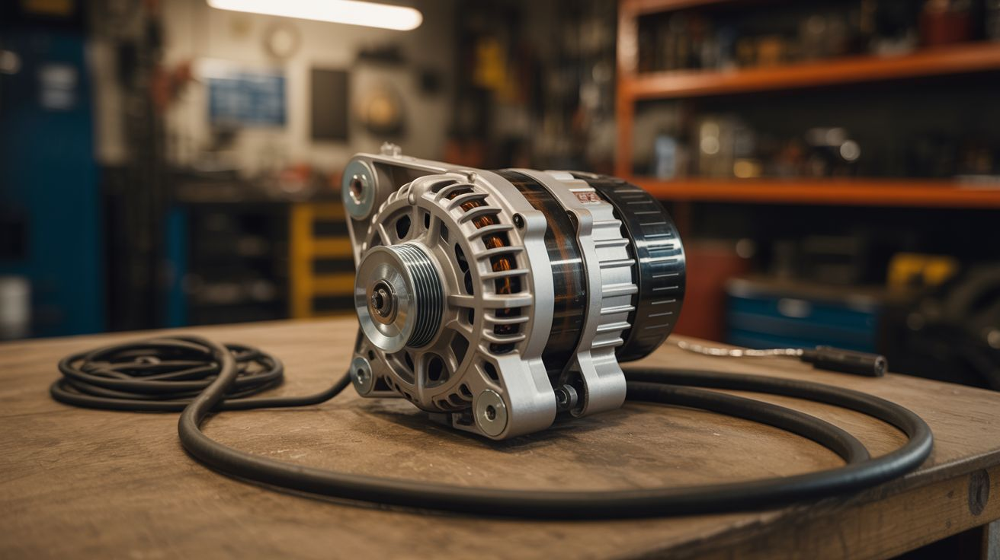

# Junkyard Auto

  

> Every car in the scrapyard is a parts bin full of precision-engineered components begging for a second life.

Modern cars are rolling electronics labs. An alternator is a three-phase generator capable of 100+ amps. A starter motor delivers brutal torque in a compact package. Ignition coils step up 12V to 40,000V. Window motors are geared DC units with enough force to move a glass pane against gravity. Wiper motors spin slowly and continuously with enormous torque through a worm gear. Seat heaters are flexible resistance elements designed to distribute heat evenly. HID headlight ballasts generate high-voltage AC to ignite xenon gas. And the humble spark plug is the world's most reliable ignition source.

All of this hardware costs pennies at the scrapyard but hundreds from a supplier. One trip to the junkyard with a socket set and a pair of bolt cutters, and you've got the raw materials for welders, go-karts, BBQ rigs, hidden doors, and things that would make your insurance agent cry.

---

## Builds

| # | Build | Jaw Drop | Brain Melt | Wallet | Spicy | Clout | Time |
|---|---|---|---|---|---|---|---|
| 219 | [Alternator Welder](219-alternator-welder.md) | ⭐⭐⭐⭐ | ⭐⭐⭐ | ⭐⭐ | ⭐⭐⭐ | ⭐⭐⭐⭐ | ⭐⭐ |
| 220 | [Ignition Coil Tesla Coil](220-ignition-coil-tesla-coil.md) | ⭐⭐⭐⭐⭐ | ⭐⭐ | ⭐ | ⭐⭐⭐⭐ | ⭐⭐⭐⭐⭐ | ⭐⭐ |
| 221 | [Starter Motor Go-Kart](221-starter-motor-go-kart.md) | ⭐⭐⭐⭐ | ⭐⭐⭐ | ⭐⭐ | ⭐⭐⭐ | ⭐⭐⭐⭐ | ⭐⭐⭐ |
| 222 | [Wiper Motor Rotisserie](222-wiper-motor-rotisserie.md) | ⭐⭐⭐ | ⭐ | ⭐ | ⭐ | ⭐⭐⭐⭐ | ⭐ |
| 223 | [Spark Plug Cannon](223-spark-plug-cannon.md) | ⭐⭐⭐⭐ | ⭐⭐ | ⭐ | ⭐⭐⭐⭐ | ⭐⭐⭐⭐ | ⭐ |
| 224 | [Window Motor Secret Door](224-window-motor-secret-door.md) | ⭐⭐⭐⭐ | ⭐⭐ | ⭐ | ⭐ | ⭐⭐⭐⭐⭐ | ⭐⭐⭐ |
| 225 | [Seat Heater Sous Vide](225-seat-heater-sous-vide.md) | ⭐⭐⭐ | ⭐⭐ | ⭐ | ⭐ | ⭐⭐⭐ | ⭐⭐ |
| 226 | [HID Headlight UV Curer](226-hid-headlight-uv-curer.md) | ⭐⭐⭐ | ⭐⭐⭐ | ⭐ | ⭐⭐ | ⭐⭐⭐ | ⭐⭐ |
