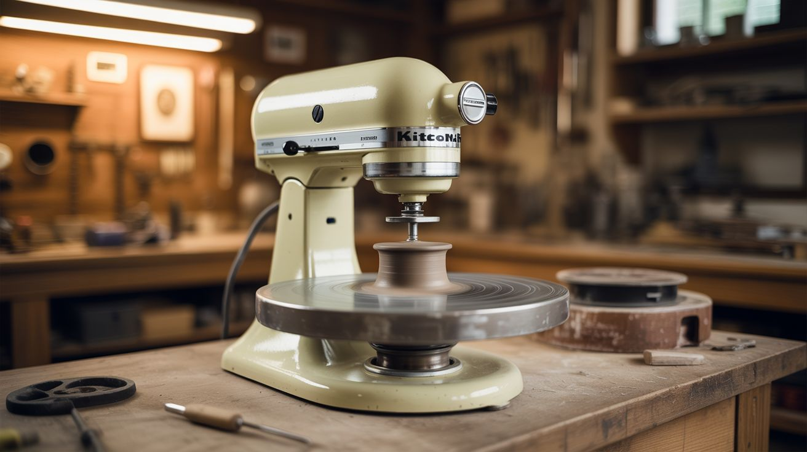

# #261 — Stand Mixer Pottery Wheel

  

> KitchenAid power take-off port + circular bat = instant pottery wheel. The motor was literally built for torque.

## Ratings

| Jaw Drop Rating | Brain Melt Level | Wallet Damage | Spicy Level | Clout Potential | Time to Build |
|---|---|---|---|---|---|
| ⭐⭐⭐⭐ | ⭐⭐ | ⭐ | ⭐ | ⭐⭐⭐⭐ | ⭐⭐ |

## What Is It?

A KitchenAid stand mixer has a power take-off (PTO) port on the front — a rotating drive shaft where attachments like pasta rollers and meat grinders connect. The motor inside is a serious piece of engineering: it's geared through a planetary gearbox for massive torque at low RPM, mounted on a heavy cast base that absorbs vibration. A real pottery wheel needs exactly the same things: a motor that delivers sustained torque at 0-300 RPM while resisting the lateral force of hands shaping wet clay, on a stable base that doesn't walk or wobble. The KitchenAid's speed dial gives you smooth, variable speed control. The gearbox handles torque multiplication. The 25-pound base keeps everything planted.

KitchenAid just doesn't know they made a pottery wheel.

The conversion is straightforward: build an adapter that fits the PTO drive shaft and holds a flat circular disc (called a bat in pottery terms). The clay goes on the bat, the bat spins, and you shape the clay. The trade-off is that you can't throw massive pieces — a 10-pound block of clay at high speed will eventually stall the motor or strip gears. But for cups, small bowls, vases, and decorative pieces up to about 3-5 pounds of clay, it works genuinely well. It's also a perfect way to discover whether you actually enjoy pottery before dropping $400 on a dedicated wheel.

## Ingredients

- [ ] KitchenAid stand mixer — any model with the front PTO port; tilt-head or bowl-lift both work *(you probably already own one; thrift stores $30-60)*
- [ ] PTO adapter hub — must match the mixer's drive profile (usually a rounded square or hex shaft) *(salvaged from a broken KitchenAid attachment $2-5, or machined/3D-printed to spec)*
- [ ] Circular bat — 8-12" diameter flat disc, 3/4" plywood or MDF *(hardware store scrap bin, $2)*
- [ ] Thrust bearing — handles the downward force of your hands on the clay *(hardware store, $3-5)*
- [ ] Shaft coupler or bolt — connects the PTO adapter to the bat through the bearing *(hardware store, $1-2)*
- [ ] Mounting bracket or platform — extends the bat out from the mixer at a working height *(scrap wood, L-brackets, $2-5)*
- [ ] Splash tray — large plastic basin or tray to catch water and clay slurry *(dollar store, $1)*
- [ ] Potter's clay — 5-10lb to start, any throwing body (stoneware, porcelain, earthenware) *(art supply store, $10-15)*
- [ ] Water bucket, sponge, wire clay cutter *(kitchen, dollar store)*
- [ ] Optional: plastic wrap — to protect the mixer body from clay spray *(kitchen)*

## Build Steps

1. **Examine the PTO port.** Remove the protective cap from the front of the mixer and study the drive shaft. KitchenAid uses different drive profiles across models — most are a rounded square (like a #10 square drive), some newer models use a hex. Measure carefully with calipers. If you have a broken KitchenAid attachment (a meat grinder with stripped gears, a pasta roller with a cracked body), harvest the drive hub from it — that's the easiest and most precise adapter you'll find. The hub fits the shaft perfectly because it was made for it.

2. **Build the drive adapter.** You need to get from the PTO's drive profile to a vertical shaft that can hold the bat. If using a salvaged attachment hub, you may be able to bolt directly through its face to a shaft or flange. If building from scratch, find a deep socket wrench that matches the drive profile — it slides on and locks in. Attach a threaded rod or bolt to the socket's base using JB Weld, welding, or a drilled-and-tapped hole. This rod extends outward from the PTO and serves as the bat's mounting shaft.

3. **Install the thrust bearing.** When you press down on clay during throwing, that force transfers through the bat, through the shaft, and into the mixer's gearbox — which isn't designed for heavy axial loads. A thrust bearing between the bat and the mounting bracket absorbs this force. Mount the bearing on a support bracket at the height where the bat will sit. The drive shaft passes through the bearing's center, and the bat mounts above it.

4. **Build the bat.** Cut an 8-12" circle from 3/4" plywood or MDF using a jigsaw with a pivot pin, a bandsaw, or a router with a circle-cutting jig. Sand the top surface lightly — you want flat but slightly textured so wet clay grips. Drill a center hole that fits your mounting shaft or bolt. Balance is critical: spin the bat by hand on the shaft and watch for wobble. If one side dips, sand material from the heavy side or add a small counterweight until the bat runs true. Even 2mm of runout makes centering clay frustrating.

5. **Assemble the wheel.** Mount the bat on the shaft, above the thrust bearing, secured with a nut or clip. Connect the drive adapter to the mixer's PTO port. With the mixer off, spin the bat by hand — it should rotate freely (the bearing doing its job) with no wobble. Turn the mixer on at speed 1 and verify the bat spins smoothly and quietly. If you hear grinding or clicking, the drive adapter isn't seated properly. If the bat wobbles, re-check your center hole alignment.

6. **Build the support platform.** The mixer needs to be positioned so the bat sits at a comfortable working height — roughly waist to belly-button height when seated on a stool. Build a sturdy shelf or table that the mixer sits on, with the bat extending off the front edge. Bolt or clamp the mixer down — it must not walk or vibrate during use. A mixer that shifts while you're centering clay ruins the piece. Some builders screw a plywood base plate to the table and bolt the mixer's rubber feet to it.

7. **Set up splash containment.** Pottery throws water and clay slurry in every direction. Build or buy a splash tray — a large shallow basin with a cutout for the bat's shaft that sits under and around the bat. Line the work area with plastic sheeting. Have a bucket of clean water and a sponge within arm's reach. Wrap the mixer's body in plastic wrap or a garbage bag, leaving only the PTO port exposed — clay slurry in the motor's ventilation slots is a dead motor.

8. **Throw your first piece.** Wedge (knead) your clay to remove air bubbles — fold, press, rotate, repeat 30-40 times until the clay feels uniform. Slam a ball of clay onto the center of the wet, spinning bat. Start at speed 2. Wet your hands generously. Center the clay by pressing inward and downward with both hands — the clay should stop wobbling and spin as a smooth, symmetric cone. This is the hardest skill in pottery and takes practice. Once centered, push your thumbs into the center to open the clay, then pull the walls up by squeezing between inside and outside fingers. Keep your hands wet. Work slowly.

9. **Remove and dry.** When your piece is done, stop the mixer. Hold the wire cutter taut against the bat surface and slide it under the base of the piece to separate it. Gently lift the piece onto a board. Let it dry slowly under loose plastic to prevent cracking. Once leather-hard (firm but still slightly damp), trim the foot and refine the shape with a trimming tool.

10. **Clean up immediately.** Clay and water dry fast and become abrasive. Wipe down the bat, splash tray, and mixer surface after every session. Remove the plastic wrap from the mixer body. Cover the PTO port with its cap. Never let clay slurry dry on the mixer or work its way into the gearbox housing.

## Safety Notes

- Do not exceed speed 4-6 on the mixer dial. High speeds with an unbalanced clay load create violent vibration that stresses the mixer's planetary gearbox beyond its design envelope. You can strip gears or burn out the motor winding.
- Never put your fingers near the PTO coupling while the mixer is running. The gear reduction produces enormous torque at low speed — the motor will not stall if something gets caught. It will keep turning.
- Clay dust contains crystalline silica, which causes silicosis (a serious, irreversible lung disease) with chronic inhalation. Never sweep dry clay dust — always clean with wet methods (damp sponge, wet mop). If sanding dried greenware, wear an N95 or P100 respirator.
- Thrown pieces need to be fired in a kiln to become permanent. Air-dried clay is fragile and dissolves if it gets wet. Local pottery studios usually offer kiln firing for $1-3 per piece.

## See Also

- [Coffee Maker Essential Oil Distiller](262-coffee-maker-distiller.md)
- [Waffle Iron Heat Press](264-waffle-iron-press.md)
- [Toaster Reflow Oven](260-toaster-reflow-oven.md)
