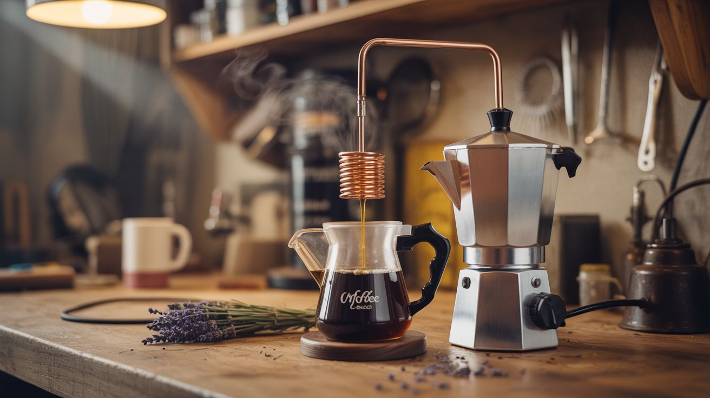

# #262 — Coffee Maker Essential Oil Distiller

  

> Coffee maker heats water, steam passes through herbs, copper coil condenses the vapor. Lavender oil from a Mr. Coffee.

## Ratings

     

## 🧪 What Is It?

Steam distillation is the standard method for extracting essential oils from plants, and it's been used for over a thousand years. Water is heated to produce steam. The steam passes through plant material — lavender, rosemary, peppermint, eucalyptus, whatever you're extracting from. The heat and moisture cause the plant's oil glands to rupture, releasing volatile aromatic compounds into the steam. The oil-laden steam then travels through a condenser (a coiled tube cooled by cold water), where it turns back into liquid. Oil and water don't mix, so the essential oil floats on top and can be separated.

A drip coffee maker already does 90% of this job. It heats water in a reservoir, generates steam pressure, and pumps hot water up through a tube to drip over material in a filter basket. Replace the coffee grounds with dried herbs, extend the output through a copper condenser coil submerged in ice water, and collect the resulting liquid. The coffee maker's heating element runs at exactly the right temperature range for steam distillation — around 90-100C. It's thermostatically controlled so it won't overheat and scorch delicate aromatic compounds. The water reservoir holds enough for a full distillation run. And you can pick one up at Goodwill for $3.

You won't produce industrial quantities — a single coffee-maker run yields a few milliliters of essential oil from a basket full of plant material. But a few milliliters of pure lavender or peppermint oil is enough for dozens of soap batches, candles, diffusers, balms, and cleaning solutions. It's also a gorgeous demonstration of a 1000-year-old chemical process running on a kitchen appliance that costs less than lunch.

<strong>🧰 Ingredients</strong>

- [ ] Drip coffee maker — standard Mr. Coffee style with top basket and glass carafe *(thrift store, $3-5)*
- [ ] Copper tubing — 1/4" OD soft copper, 4-6 feet *(hardware store plumbing section, $5-8)*
- [ ] Silicone tubing — to connect the coffee maker's output to the copper condenser, match the drip spout diameter *(hardware store or pet store aquarium section, $2-3)*
- [ ] Collection vessel — small glass jar with narrow mouth for easier oil separation *(mason jar, baby food jar, spice jar — free)*
- [ ] Dried plant material — lavender, rosemary, peppermint, eucalyptus, chamomile, or other aromatic herbs *(garden, grocery store, farmer's market — $3-8)*
- [ ] Large jar, bowl, or bucket — for the cold water bath around the condenser coil *(kitchen — free)*
- [ ] Ice — to keep the condenser bath cold throughout the run *(freezer)*
- [ ] Hose clamps or zip ties — to seal tubing connections *(hardware store, $1)*
- [ ] Dowel or broomstick — to wrap the copper coil around *(junk pile — free)*
- [ ] Optional: pipette, turkey baster, or separating funnel — for separating oil from hydrosol *(kitchen, lab supply, $2-5)*

## 🔨 Build Steps

1. **Clean and test the coffee maker.** Run 2-3 cycles of plain water through the coffee maker to flush out any old coffee oils and residue. Observe the steam/water path: water heats in the base reservoir, steam pressure pushes hot water up the internal riser tube, and it drips from the showerhead onto the filter basket below. For distillation, the hot water passes through herbs in the basket (picking up aromatic compounds) and exits the brew spout. You'll redirect that output through a condenser instead of letting it fall into the carafe.

2. **Build the condenser coil.** Take 4-6 feet of 1/4" soft copper tubing and wrap it into a tight spiral around a broomstick or 1-2" diameter dowel. Make 8-12 coils, keeping them tight and even. Leave 6 inches straight at each end for inlet and outlet connections. The more coil surface area submerged in cold water, the more complete the condensation. Copper is ideal because it conducts heat extremely well — the temperature difference between hot vapor inside and cold water outside causes rapid condensation.

3. **Clean the copper coil.** New copper tubing contains flux residue and manufacturing oils that are toxic. Flush the coil with a solution of hot water and white vinegar (50/50), then rinse thoroughly with clean water 3-4 times. If the copper is tarnished or visibly contaminated, soak it in vinegar for 30 minutes before flushing. This is a food-contact application — take the cleaning seriously.

4. **Connect the coffee maker output to the condenser.** Fit a piece of silicone tubing over the brew spout (where liquid normally drips into the carafe) and connect the other end to the inlet of the copper condenser coil. Use a hose clamp at each connection point for a snug fit. The connection doesn't need to be pressure-tight (this isn't a pressure vessel), but it should be snug enough that hot vapor travels through the condenser rather than venting into the room.

5. **Set up the cold bath.** Place the copper coil inside a bucket, large jar, or bowl. Fill with cold water and ice. The condenser coil should be fully submerged. Position the coil's outlet end so it drips downward into your collection vessel below. The entire setup, from left to right: coffee maker --> silicone tube --> copper coil in ice bath --> collection jar.

6. **Load the herbs.** Remove the paper coffee filter (or use a reusable mesh filter). Pack the coffee maker's filter basket tightly with dried plant material. Dried herbs yield significantly more oil per volume than fresh because the water content is already gone — you're getting concentrated aromatic material. Chop or crush the herbs first to increase surface area and rupture more oil glands. Fill the water reservoir to the maximum line with cold water.

7. **Run the distillation.** Turn on the coffee maker. Hot water will rise through the riser tube, drip over the packed herb bed, dissolve and carry volatile aromatic compounds, exit the brew spout through the silicone tubing, enter the copper condenser coil, condense from hot vapor to cool liquid, and drip into your collection jar. The liquid in the collection jar is a mixture of water (called hydrosol or floral water) with a thin film of essential oil floating on top. Replenish the ice in the condenser bucket as it melts.

8. **Run multiple cycles.** A single pass extracts only a fraction of the available oil. Pour the collected hydrosol back into the water reservoir and run it through the same herb bed again. After 2-3 passes with the same herbs, swap in a fresh batch of herbs but keep reusing the hydrosol — it becomes progressively more concentrated. Five cycles with fresh herbs each time produces a meaningful quantity of oil.

9. **Separate the oil.** After your final collection, let the liquid settle undisturbed for 15-30 minutes. Essential oil is less dense than water and will float as a thin film on the surface. Use a pipette, eyedropper, or turkey baster to carefully skim the oil layer off the top. Transfer to a small dark glass vial (amber or cobalt blue) for storage — essential oils degrade in light. The remaining hydrosol is itself a useful product: it retains a gentle fragrance and is used in skincare, room sprays, linen mists, and cooking (rose water, lavender water).

10. **Clean and store.** Run a full cycle of plain water through the coffee maker to flush herb residue from the riser tube and showerhead. Flush the copper condenser with hot water and let it dry completely to prevent oxidation. Store the system assembled or disassembled in a clean, dry place.

## ⚠️ Safety Notes

- Not all plants are safe to distill. Some produce toxic compounds when steam-distilled. Stick to well-known culinary and aromatic herbs: lavender, rosemary, peppermint, eucalyptus, chamomile, thyme, sage, citrus peel. Do not distill unknown plants, ornamental flowers treated with pesticides, or anything you can't positively identify.
- Essential oils are concentrated and potent. Never apply undiluted essential oil directly to skin — many cause chemical burns and allergic reactions at full concentration. Always dilute in a carrier oil (coconut, jojoba, olive) for topical use.
- Copper tubing flux residue is toxic. Clean the condenser coil thoroughly before first use as described in Step 3.
- The coffee maker and copper coil get hot during operation. Don't touch the riser tube, basket area, or inlet end of the condenser during a run. Let the system cool before disassembling or changing herb loads.
- Once dedicated to distillation, the coffee maker should not return to food use. Herb residues and essential oils are difficult to completely remove from the internal water path and can impart off-flavors.

## 🔗 See Also

- [Blender Vortex Centrifuge](263-blender-centrifuge.md)
- [Stand Mixer Pottery Wheel](261-stand-mixer-pottery-wheel.md)
- [Rocket Stove](../survival-off-grid/253-rocket-stove.md)
