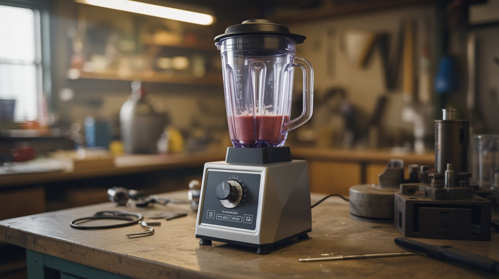

# #263 — Blender Vortex Centrifuge

  

> Your smoothie maker's secret identity is a science lab.

## Ratings

| Jaw Drop Rating | Brain Melt Level | Wallet Damage | Spicy Level | Clout Potential | Time to Build |
|---|---|---|---|---|---|
| ⭐⭐⭐ | ⭐⭐ | ⭐ | ⭐ | ⭐⭐⭐ | ⭐ |

## What Is It?

A centrifuge is one of those pieces of lab equipment that sounds intimidating until you realize what it actually does: spin things really fast so heavy stuff goes to the outside and light stuff stays near the middle. Lab centrifuges spin at 3,000–15,000 RPM and cost hundreds of dollars. A thrift store blender motor spins at 10,000–20,000 RPM and costs three bucks. The physics doesn't care about the price tag.

Replace the blade assembly with a balanced rotor — a flat disc that holds sample tubes at an angle — and you've built a centrifuge that outspins most benchtop lab models. Separate cream from whole milk in under a minute. Isolate DNA from strawberries using dish soap, salt, and rubbing alcohol (the centrifuge step clarifies the lysate so you can see the DNA strands precipitate — it's genuinely magical). Spin down paint pigments for perfectly even mixing. Clarify fruit juice. Separate blood plasma from red cells if you're into that sort of thing.

The one critical requirement is balance. An unbalanced rotor at 10,000 RPM doesn't vibrate politely — it tries to leave the building. Get the balance right and this thing is whisper-quiet. Get it wrong and you'll understand why lab centrifuges have locking lids.

## Ingredients

- [ ] Blender with working motor — countertop type, any brand *(thrift store, $3–5)*
- [ ] Flat disc of wood, plastic, or metal — 4–6" diameter for the rotor *(scrap bin, hardware store, free–$2)*
- [ ] Test tubes, microcentrifuge tubes, or small vials — for holding samples *(science supply, pharmacy, $3–8)*
- [ ] Tape, zip ties, or small clips — to secure tubes to the rotor *(junk drawer, free)*
- [ ] Bolt and nut — to attach rotor to the blender shaft *(hardware store, $1)*
- [ ] Drill and bits — for drilling rotor mounting holes *(toolbox)*
- [ ] Counterweights — coins, nuts, washers for balancing *(junk drawer, free)*
- [ ] Heavy bucket or plywood box — containment shield *(garage, free)*

## Build Steps

1. **Remove the blender jar and blade assembly.** Unscrew the blade assembly from the base coupling. You need access to the motor's drive shaft — the stubby part that normally spins the blade. Note how it couples: most blenders use a square or splined shaft that mates with the blade housing. You'll replicate this connection with your rotor.

2. **Cut and shape the rotor disc.** Cut a flat disc from plywood, HDPE cutting board, or aluminum plate. Drill a center hole that fits snugly on the blender's drive shaft. Roundness matters here — imperfections at rest become violent oscillations at speed. If you're using wood, cut it on a bandsaw or jigsaw, then sand to final shape on a belt sander. A hole saw makes a decently round disc if you have one.

3. **Drill tube holders at matching angles.** Mark 4 equally spaced points around the perimeter of the disc (90 degrees apart). Drill angled holes at about 45 degrees from horizontal to hold your sample tubes. The angle is important — it allows the sample to separate along the length of the tube rather than just piling against the cap. If drilling angled holes is tricky, you can also tape tubes to the disc surface at an angle.

4. **Mount the rotor to the blender shaft.** Slide the rotor onto the drive shaft and secure it with a bolt, set screw, or by epoxying it to the original blade coupling nut. Spin it by hand and watch for wobble. If one side dips, that edge is heavy — sand it down or add material to the light side. The rotor must spin true before you add power.

5. **Balance with obsessive precision.** Fill all tube positions with equal-weight samples (water works fine for testing). Spin the rotor gently by hand and watch which side drops — that side is heavy. Tape a coin or nut to the light side and test again. Repeat until the rotor settles at random positions rather than always dropping to one side. At 10,000 RPM, a 1-gram imbalance produces forces that will rattle your fillings. At 15,000 RPM, it'll rattle the blender off the counter.

6. **Build a containment shield.** Place the entire blender-rotor assembly inside a heavy bucket, thick-walled cardboard box, or behind a plywood barrier. If a tube comes loose at full speed, it becomes a small projectile with a surprising amount of enthusiasm. The shield catches it. Never run the centrifuge in the open — this is the one step you absolutely cannot skip.

7. **Test at low speed first.** Power on the blender at its lowest setting. A balanced rotor sounds smooth and quiet. An unbalanced one screams like a washing machine with a brick in it — you'll know immediately. If vibration is bad, kill the power, rebalance, and try again. Only increase speed once low speed is smooth.

8. **Load samples in matched pairs and spin.** Always load tubes in opposing pairs of equal weight — if position 1 has 5ml of milk, position 3 (directly opposite) needs 5ml too. Start at low speed for 30 seconds, then ramp to high for 2–5 minutes. Cream separates from milk in under a minute. Clarifying strawberry DNA lysate takes 3–5 minutes. Paint pigments redistribute in about 2 minutes.

9. **Harvest your separated layers.** Power off and wait for the rotor to stop completely before touching anything. Remove tubes carefully — the separated layers will be clearly visible. Use a pipette or eyedropper to extract the layer you want without disturbing the boundary. For DNA extraction, the clear layer on top is what you want; the cell debris is compacted at the bottom.

## Safety Notes

- Always balance tubes in matched pairs of equal weight on opposite sides. Never run with an odd number of filled tubes — the imbalance at speed is dangerous.
- Always operate inside a containment shield. Tube failures, rotor cracks, and coupling failures fling fragments at high velocity. A bucket around the blender base is the bare minimum.
- If you hear grinding, rattling, or rising vibration, stop immediately. These are signs of imbalance or mechanical failure. Nothing good has ever come from ignoring strange noises at 10,000 RPM.
- The blender motor can overheat during extended runs. Limit continuous operation to 5 minutes, then let the motor cool for a few minutes before the next spin.

## See Also

- [Toaster Reflow Oven](260-toaster-reflow-oven.md)
- [Coffee Maker Distiller](262-coffee-maker-distiller.md)

**References:**
- [Appliance Teardown Guide](../../reference/appliance-teardown-guide.md)
- [Technical Glossary](../../reference/glossary.md)
