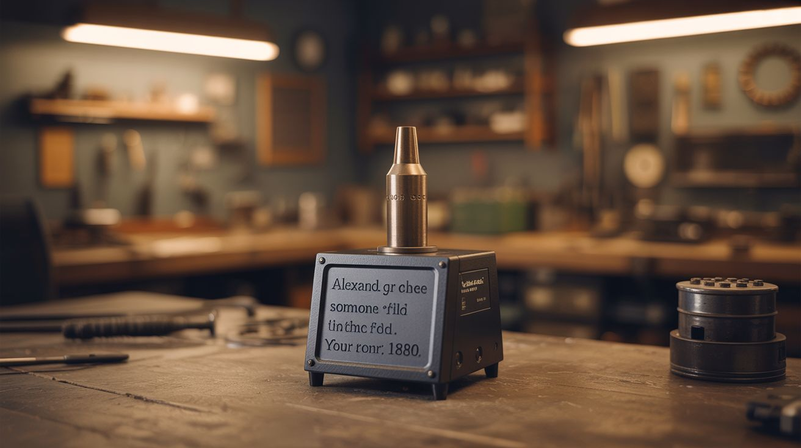

# #265 — Laser Voice Communicator

  

> Talk to someone across a field using nothing but a beam of light. Alexander Graham Bell did it in 1880. Your turn.

## Ratings

     

## 🧪 What Is It?

Before Bell invented the telephone, he invented something arguably cooler: the photophone. In 1880, he transmitted voice on a beam of sunlight reflected off a vibrating mirror. He called it his greatest invention — greater than the telephone. The world disagreed and went with copper wire instead. But the principle is elegant and simple, and with a $2 laser pointer and some basic components, you can build one that works across a room, across a yard, or across a football field on a clear night.

The transmitter side modulates a laser beam with audio. An audio signal from a microphone or phone drives current through the laser diode, causing its brightness to fluctuate in sync with the sound waves. These fluctuations are invisible to the human eye — the beam looks perfectly steady — but they carry your voice encoded as variations in light intensity. The receiver side uses a photocell (solar cell, photodiode, or phototransistor) aimed at the incoming beam. As the laser brightness fluctuates, the photocell generates a varying electrical signal that, when amplified and fed to a speaker, reproduces the original audio.

No wires. No radio waves. No detectable RF emissions. Just photons carrying your voice at the speed of light. It is the same fundamental principle behind modern fiber optic communication, except your "fiber" is a beam of light through open air. The communication is inherently secure — nobody can intercept it without physically stepping into the beam path, at which point the audio cuts out and you know immediately. It is also completely unregulated — no FCC license, no spectrum allocation, no carrier fees. Just light.

<strong>🧰 Ingredients</strong>

- [ ] Laser pointer or laser diode module — red (650nm) is fine, green is brighter but harder to modulate *(dollar store, electronics supplier, $2-5)*
- [ ] Small audio amplifier module — LM386 breakout board or similar *(electronics supplier, $2)*
- [ ] Electret microphone — for voice input on the transmitter *(electronics supplier, salvage from old headset, $1)*
- [ ] Photocell, photodiode, or small solar cell — for the receiver *(electronics supplier, salvage from solar garden light, $1-3)*
- [ ] Second audio amplifier module — for the receiver side *(electronics supplier, $2)*
- [ ] Small speaker — for receiver audio output *(salvage from old radio, toy, or phone, free)*
- [ ] 9V batteries or USB power bank — power for both sides *(junk drawer)*
- [ ] Audio cable with 3.5mm jack (optional) — to connect a phone as audio source *(junk drawer)*
- [ ] Tripods, clamps, or stands — to aim the laser and receiver at each other *(junk drawer, dollar store, $3)*
- [ ] Resistors — 100 ohm and 10k ohm for current limiting and biasing *(electronics supplier, $1)*
- [ ] NPN transistor (2N2222) or MOSFET — for modulating laser current *(electronics supplier, $0.50)*
- [ ] Capacitor (10uF electrolytic) — for AC coupling if using direct-drive modulation *(electronics supplier, $0.25)*
- [ ] Optional: magnifying glass or convex lens — to focus incoming light onto the receiver for extended range *(dollar store, $1)*

## 🔨 Build Steps

1. **Build the transmitter circuit.** The laser needs to be modulated by audio — meaning its brightness has to vary in proportion to the sound signal. The simplest approach: power the laser diode through a transistor (2N2222 or similar) whose base is driven by the amplified microphone signal. The LM386 amplifier boosts the mic signal, and the output drives the transistor, which controls current through the laser. Add a DC bias resistor so the laser stays on at a dim baseline and the audio signal makes it brighter and dimmer around that point. Without the bias, the laser clips to full-off on negative half-cycles and you lose half your signal.

2. **Alternative: direct-drive modulation.** If your laser pointer already has a driver circuit, you can bypass the transistor and inject the amplified audio signal directly into the laser power line through a capacitor (10uF electrolytic). The capacitor blocks DC and passes only the AC audio signal, superimposing it on the laser supply voltage. This is simpler but gives less modulation depth. Try both approaches and use whichever sounds cleaner at the receiver.

3. **Test the transmitter.** Power on the laser and speak into the mic (or play music from your phone through the audio jack). You may be able to see very slight brightness fluctuation on a wall if you look carefully — though with bass-heavy music it is easier to spot. If you see no change, the modulation depth is too low — increase the amplifier gain or adjust the bias point. If the laser is flickering hard on and off rather than smoothly varying, you are over-modulating — reduce the gain until it smooths out.

4. **Build the receiver circuit.** The photocell or photodiode connects to the second LM386 amplifier. When light hits the photocell, it generates a small voltage proportional to light intensity. The amplifier boosts this signal and drives the speaker. Wire the photocell between the amplifier input and ground. Add a 10k ohm resistor in parallel for biasing. Connect the amplifier output to the speaker. The receiver circuit is simpler than the transmitter because the photocell does the hard work of converting light fluctuations back to electrical signals.

5. **Aim the beam.** Mount the transmitter laser on a tripod or clamp so it is stable and aimed at the receiver photocell. Mount the photocell on another stand, facing the laser. Start at close range — across a table, maybe 3 feet — to verify the system works before attempting distance. Alignment is critical: the photocell needs to be squarely in the beam path. A wider beam (slightly defocused laser) makes aiming easier at the cost of signal strength per unit area.

6. **Test and tune.** Play music from a phone into the transmitter (music is easier to evaluate for quality than voice). You should hear it reproduced through the receiver speaker. If the audio is distorted, reduce the transmitter amplifier gain — you are over-modulating the laser so much that it fully extinguishes during negative peaks. If it is too quiet, increase receiver gain. Background light from lamps and windows adds noise — see next step for the fix.

7. **Reject ambient light noise.** Add a tube around the photocell (a section of drinking straw, pen barrel, or rolled electrical tape) aimed directly at the laser. This narrows the sensor field of view so it only sees the laser beam, rejecting light from other directions. Without this shroud, changes in room lighting cause a constant background hum. For even better performance, add a red color filter (or bandpass filter matched to your laser wavelength) over the tube opening — this blocks all light except the laser color, dramatically improving signal-to-noise ratio.

8. **Extend the range.** Once it works across a room, take it outside at dusk or after dark. On a clear night with no ambient light interference, communication over hundreds of feet is straightforward. The limiting factor is beam divergence — the laser spot grows larger with distance, so less of the total light hits the small photocell. Mount a magnifying glass or convex lens on a stand in front of the photocell so it focuses a larger area of incoming light onto the sensor. This lens acts like a telescope for the receiver and can easily double or triple your effective range.

9. **Build a matched pair for two-way communication.** Build a second transmitter and receiver pair. Each end gets a transmitter (laser + mic + amp) and a receiver (photocell + amp + speaker). Point your transmitter at their receiver and vice versa. Now you have full-duplex voice communication over a beam of light — walkie-talkies without radio waves, no FCC license required, no subscription fees, no cell towers, no internet. Just light and sound.

10. **Experiment with data transmission.** Once voice works, try transmitting digital data. Feed audio tones from a computer into the transmitter — a modem-style FSK (frequency shift keying) signal. On the receiver end, feed the audio output back into a computer running a simple FSK decoder. You have now built an optical data link. It is slow by modern standards (a few hundred bits per second with basic audio modulation) but it is a working free-space optical communication link built from a laser pointer and a garden light solar cell. That is genuinely impressive.

## ⚠️ Safety Notes

- Never aim a laser at anyone's eyes, even from a distance. This build uses low-power laser pointers (Class IIIa or below), but direct eye exposure to any laser can cause permanent retinal damage. Keep the beam path below knee level or above head height — never at eye level.
- The transmitter laser should be securely mounted so it cannot slip and sweep across someone's face. Tape it, clamp it, weigh the base down — whatever it takes to keep it locked on target.
- If using higher-power laser diodes (from DVD/Blu-ray drives) for greater range, the safety stakes increase significantly. Wear appropriate laser safety goggles during alignment. Stay with standard pointers for your first build.
- Operating outdoors at night, be aware of aircraft. Never aim a laser skyward or anywhere near the flight path of planes or helicopters. This is both dangerous and illegal in most jurisdictions.

## 🔗 See Also

- [Laser Tripwire Security System](268-laser-tripwire-alarm.md)
- [Galvanometer Laser Light Show](266-laser-galvo-show.md)
- [Laser Harp](267-laser-harp.md)
