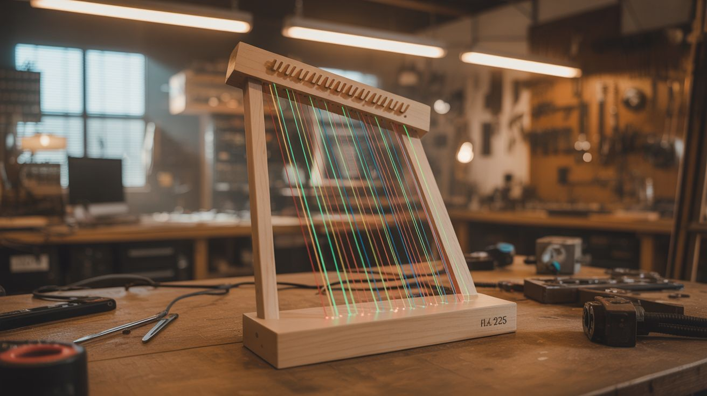

# #267 — Laser Harp

  

> Play music by waving your hands through beams of light. Jean-Michel Jarre made these famous. You can build one for $25.

## Ratings

     

## 🧪 What Is It?

A laser harp is exactly what it sounds like: an instrument where the strings are replaced by beams of laser light. Multiple laser beams fan out vertically like the strings of a harp. When you break a beam with your hand, a sensor detects the interruption and triggers a musical note. Different beams produce different notes. Wave your hands through the light and you are playing music on photons. It is the kind of instrument that makes everyone in the room stop what they are doing and stare.

Jean-Michel Jarre played a laser harp during his massive outdoor concerts in the 1980s and 90s, and it became one of the most iconic electronic instrument performances ever staged. His version cost tens of thousands of dollars and required a dedicated technician. Yours will cost about $25, take a weekend to build, and the only technician it needs is you.

The physics is delightfully simple. Each laser beam shines continuously toward a photosensor (photodiode or LDR) mounted at the far end. The sensor sees constant light and stays quiet. When your hand enters the beam, the sensor goes dark, and the microcontroller detects the change and plays the corresponding note. Multiple beam/sensor pairs give you multiple notes — typically 5 to 8 for a pentatonic or full octave scale. Add fog to make the beams visible, dim the lights, and you have built one of the most visually stunning instruments that exists. Every person at a party will immediately ask "can I try?"

<strong>🧰 Ingredients</strong>

- [ ] 5-8 laser modules — red (650nm) or green (532nm), low power 1-5mW each *(electronics supplier, dollar store laser pointers, $1-3 each)*
- [ ] 5-8 photoresistors (LDRs) or photodiodes — one per laser beam *(electronics supplier, $0.50 each)*
- [ ] Arduino Uno or Mega — Mega is better if you need more than 6 analog pins *(electronics supplier, $5-15)*
- [ ] Piezo buzzer or small speaker — for direct audio output *(electronics supplier, $1)*
- [ ] MIDI shield or USB-MIDI library (optional) — to trigger software synths for richer sound *(electronics supplier, $5-10)*
- [ ] VS1053 codec module (optional) — built-in General MIDI synthesizer, no computer needed *(electronics supplier, $8)*
- [ ] 10k ohm resistors — one per photoresistor for voltage dividers *(electronics supplier, $1 for a pack)*
- [ ] Mounting frame — wood strips, PVC pipe, or metal angle bracket for laser and sensor positions *(hardware store, $5-10)*
- [ ] Fog machine or incense — essential for making beams visible *(party store, $15; or incense, $3)*
- [ ] 5V power supply or USB power — for Arduino and lasers *(USB charger, free)*
- [ ] Drinking straws or pen barrels — as light shrouds for the sensors *(junk drawer, free)*
- [ ] Wire — 22 gauge hookup wire for sensor runs *(electronics supplier, $3)*

## 🔨 Build Steps

1. **Plan the beam layout.** Decide on the number of beams: 5 for a pentatonic scale (sounds good no matter what combination you play — you literally cannot hit a wrong note), 7 for a major or minor scale, or 8 for a full octave. The beams should fan out from a common origin point at the base, spreading upward and outward like harp strings. Space them 4-6 inches apart at playing height (roughly chest level) so you can break individual beams with one hand without accidentally triggering neighbors.

2. **Build the laser mount.** Create a base frame from wood strips or PVC pipe. Mount all laser modules at the bottom, angled slightly outward so the beams fan apart as they rise. The fan angle determines the harp width at playing height — aim for about 2-3 feet total width at chest level for comfortable playing with both hands. Secure each laser firmly with hot glue, cable ties, or screw clamps so they cannot shift once aligned. Alignment is tedious enough to do once — you do not want to repeat it.

3. **Build the sensor bar.** Mount the photoresistors or photodiodes at the positions where each laser beam terminates — either at the top of a harp frame (for a freestanding instrument) or on a ceiling-mounted bar (for a floor-to-ceiling installation). Each sensor needs to receive its beam and only its beam. Slide a short tube (cut drinking straw, pen barrel, or rolled black paper) over each sensor, pointing the open end toward its corresponding laser. These shrouds block ambient room light and stray light from neighboring beams. This step is the difference between a harp that works reliably and one that triggers notes at random.

4. **Wire the sensor circuits.** Each photoresistor forms a voltage divider with a 10k ohm resistor: one leg of the LDR to 5V, the other leg to a 10k ohm resistor to ground, and the junction goes to an Arduino analog input. When the laser hits the LDR, resistance drops and voltage at the junction rises (typically to 3.5-4.5V). When the beam is broken by a hand, resistance increases and voltage drops (below 1V). The Arduino reads this voltage change to detect beam interruptions. Run the wires neatly along the frame — a rats nest of wires kills the visual magic.

5. **Program note detection.** Write Arduino code that reads each sensor analog value in a continuous loop. Set a threshold voltage — when a sensor reading drops below the threshold, the corresponding beam is broken and the note triggers. Add a debounce delay (20-50ms) to prevent retriggering from hand jitter at the beam edge. Map each beam to a musical note: C4, D4, E4, F4, G4, A4, B4, C5 for a full octave. A pentatonic mapping (C, D, E, G, A) is more forgiving — it always sounds harmonious no matter which combination of beams you break.

6. **Detect note-on and note-off separately.** For a real instrument feel, detect both the moment the beam breaks (note-on) and the moment the beam is restored (note-off, when the hand moves away). Send note-on when the reading drops below threshold and note-off when it returns above. This gives you sustain — the note plays for as long as your hand is in the beam. Without note-off detection, each note either plays a fixed duration (boring) or sustains forever (cacophony).

7. **Add sound output — basic.** The simplest option: use the Arduino tone() function to drive a piezo buzzer with the frequency of each note (C4 = 262 Hz, D4 = 294 Hz, etc.). This works but sounds like a smoke alarm recital. Upgrade to a small speaker through an LM386 amplifier module for warmer tone. Still square-wave synthesis, but it has more body.

8. **Add sound output — advanced.** For genuinely musical sound, use MIDI output. Send MIDI note-on and note-off messages over USB serial to a computer running a DAW (GarageBand, Reaper, Ableton) with a software synthesizer loaded — piano, strings, synth pads, organ, or any sound you want. The Arduino MIDI library makes this straightforward. For a standalone instrument with no computer, use a VS1053 codec module that contains a built-in General MIDI synthesizer and speaker driver — load any of 128 instrument patches and play directly.

9. **Handle polyphony.** A real harp plays multiple notes simultaneously — you should be able to break two or three beams at once for chords. If using tone(), you are limited to one note at a time on most Arduinos (monophonic). For polyphony, MIDI output to a software synth handles multiple voices natively. The VS1053 supports up to 64 simultaneous voices. Polyphony transforms the harp from a novelty into a real playable instrument — you can do chords, arpeggios, two-handed harmonies.

10. **Align and calibrate.** Power on all lasers and verify each one hits its corresponding sensor cleanly. Read each sensor analog value with serial monitor — check both beam-on and beam-off readings. You need clear separation between the two states (ideally 3V+ difference). If a sensor's readings are close together, ambient light is washing out the laser signal. Deepen the shroud tube, use a higher-power laser on that beam, or add a color filter. Test in the actual lighting conditions you plan to perform in.

11. **Add fog and perform.** The beams are invisible without particles in the air to scatter the light. Fire up a fog machine, haze machine, or burn several sticks of incense to fill the performance space. Turn off the room lights. The laser beams appear as solid, glowing lines fanning upward from the base. Wave your hands through them and music plays. Green lasers are significantly more visible in fog than red. A combination of colors (alternating red and green beams) looks spectacular. This is peak "I cannot believe I built this" territory.

## ⚠️ Safety Notes

- Even low-power lasers (1-5mW) can cause eye damage with prolonged direct exposure. Mount the lasers so beams travel vertically, well above eye level at their origin. Never look down into the beam origin point. If beams travel to a sensor bar overhead, the entire path should be above the line of sight of anyone playing or watching.
- If using green laser modules, be aware that cheap green pointers often emit invisible infrared alongside the visible green beam. An IR-blocking filter is recommended if the module does not include one.
- Fog machines produce glycol-based or glycerin-based haze that can irritate lungs with prolonged exposure in enclosed spaces. Ventilate the room between performances. People with asthma or respiratory conditions should use caution.
- Secure all laser mounts permanently. A laser that slips from vertical to horizontal becomes an eye-level hazard instantly. Hot glue, screws, clamps, zip ties — whatever keeps them locked in position for the duration of use.

## 🔗 See Also

- [Galvanometer Laser Light Show](266-laser-galvo-show.md)
- [Motorized Laser Spirograph](271-laser-spirograph.md)
- [Laser Voice Communicator](265-laser-communicator.md)

**References:**
- [Appliance Teardown Guide](../../reference/appliance-teardown-guide.md)
- [Technical Glossary](../../reference/glossary.md)
- [Electronics & Microcontrollers Guide](../../reference/electronics-and-microcontrollers.md)
