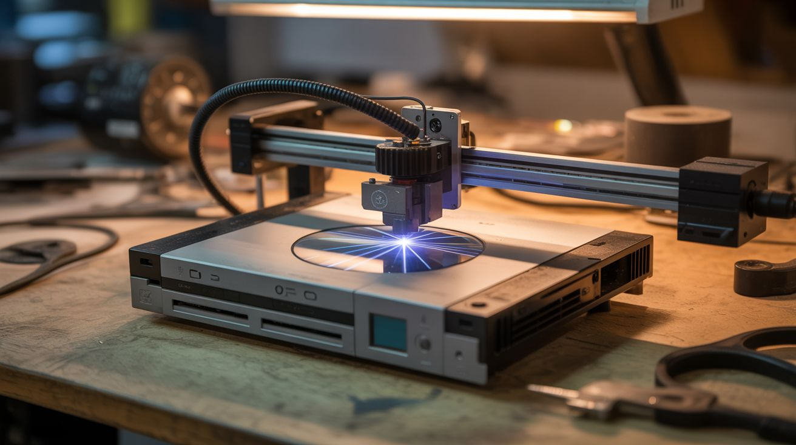

# #269 — Blu-Ray Laser Cutter

  

> A dead PS3 contains a laser diode that cuts and etches. A dead printer contains a CNC frame. Put them together.

## Ratings

     

## 🧪 What Is It?

Blu-ray players and game consoles (PS3, PS4, Xbox One) contain 405nm violet laser diodes rated at 100-250mW. That is enough power to etch wood, cut thin dark materials, engrave leather, burn patterns into cork, and mark anodized aluminum. It will not slice through steel plate — you would need a CO2 laser several hundred times more powerful for that — but for fine detail work on organic and dark-colored materials, a Blu-ray diode punches well above its weight class.

The laser diode alone is just a focused dot of destruction. To make it useful, you need to move it in precise patterns across a workpiece. That is where a CNC frame built from printer stepper motors comes in. Mount the Blu-ray diode on the toolhead of a stepper-motor CNC frame, focus the beam to its tightest point at the workpiece surface, and feed it G-code toolpaths. The Arduino running GRBL firmware does not know or care that the "tool" is a laser instead of a router bit — it just moves the head along the programmed path while the laser burns the material underneath.

The result is a legitimate laser engraver/cutter built entirely from salvaged electronics. It will engrave detailed images onto wood, cut thin craft foam, etch designs into leather wallets, and burn patterns into dark paper. The resolution depends on your CNC frame accuracy and the laser focal spot size — typically 0.1-0.2mm, which is plenty for detailed artwork, text, and even photographs converted to raster engravings.

<strong>🧰 Ingredients</strong>

- [ ] Blu-ray laser diode — salvaged from dead PS3, PS4, Xbox One, or standalone Blu-ray player *(e-waste bin, free-$5)*
- [ ] Laser driver board — constant-current driver, adjustable output (LM317-based or dedicated laser driver module) *(electronics supplier, $3-5)*
- [ ] Focusing lens — glass or acrylic, from the Blu-ray drive optical assembly *(salvaged with the diode, free)*
- [ ] Lens holder/heatsink — aluminum block or copper mount for the diode with thermal management *(hardware store, e-waste, $2-5)*
- [ ] CNC frame — XY gantry from printer stepper motors and rails, or any equivalent 2-axis motion platform *(already built from salvaged printers, or $15-25 in parts)*
- [ ] Arduino with CNC shield — running GRBL firmware for G-code interpretation *(from CNC build, or $8-12 new)*
- [ ] 12V power supply — 3A+ for steppers and laser driver *(old laptop charger, free)*
- [ ] Laser safety goggles — rated for 405nm with OD4+ attenuation *(online, $10-20 — not optional)*
- [ ] Scrap wood, leather, cork, dark paper, craft foam — test materials *(craft store, free-$5)*
- [ ] Small fan — for smoke extraction at the cutting point *(salvaged PC case fan, free)*
- [ ] Thermal paste — for diode-to-heatsink contact *(electronics supplier, $2)*

## 🔨 Build Steps

1. **Extract the laser diode.** Open the dead Blu-ray drive or console. Locate the optical pickup assembly — the small sled that rides on rails inside the drive mechanism. The laser diode is a tiny metal can (usually 5.6mm diameter, sometimes 9mm) press-fit into the assembly. Carefully remove it without bending the three pins. There are often two diodes in a Blu-ray pickup — the Blu-ray diode (405nm, violet) and a CD/DVD diode (650/780nm, red). The violet one is the more powerful cutter. Handle by the metal case, never the pins. Ground yourself before touching it — static discharge destroys laser diodes instantly. An anti-static wrist strap is cheap insurance.

2. **Build or buy the driver circuit.** Laser diodes cannot be powered directly from a voltage source — they have a sharp threshold where current goes from zero to destructive within millivolts. They need constant-current regulation. Use a dedicated laser driver module (search for "laser diode driver board" or "constant current laser driver") or build one from an LM317 regulator configured as a constant-current source with a sense resistor. Set the current to the diode rated operating current (typically 200-400mA for Blu-ray diodes). Start at 50% of rated current and increase gradually while observing the output beam. Exceeding rated current kills the diode permanently.

3. **Mount the diode in a heatsink.** Press-fit or thermal-epoxy the laser diode into an aluminum or copper block that acts as both a heatsink and a physical mount. Apply a thin layer of thermal paste between the diode case and the heatsink bore for maximum heat transfer. The diode generates significant waste heat at full power — without adequate heatsinking, it overheats and degrades within minutes. A 1-inch aluminum cube with a drilled bore that friction-fits the 5.6mm diode case works well. Larger heatsinks allow longer continuous operation.

4. **Install the focusing lens.** The bare diode emits a wide, diverging beam. You need a lens to focus it to a tight point at the workpiece surface. The focusing lens from the Blu-ray drive optical assembly is ideal — it is already designed for the 405nm wavelength and has a short focal length that produces a very small spot. Mount it in a small tube (pen barrel, aluminum tube) in front of the diode. The focal distance is typically 5-15mm. Adjust by sliding the lens in the tube until the spot on a dark test surface is as small and sharp as possible. A properly focused Blu-ray diode produces a spot under 0.2mm in diameter.

5. **Mount the laser assembly on the CNC toolhead.** Attach the heatsink/diode/lens assembly to the Z-axis carriage of your CNC frame in place of (or alongside) the rotary tool. The laser focal point should coincide with the workpiece surface when the Z-axis is at its working height. Z-axis movement is not needed during laser operation (the focus distance is fixed), but Z adjustment lets you fine-tune focus for different material thicknesses. Secure the assembly firmly — any vibration or looseness translates to jagged engravings.

6. **Wire laser control to the CNC shield.** Connect the laser driver enable/TTL input to the spindle PWM output on the CNC shield. This lets GRBL control laser power proportionally: M3 S255 = full power, M3 S128 = half power, M3 S0 or M5 = off. In GRBL settings, enable laser mode ($32=1). In laser mode, the laser automatically turns off during rapid (non-cutting) moves and only fires during feed (cutting) moves. Without laser mode enabled, the laser stays on during rapids, burning unwanted marks during repositioning.

7. **Set up ventilation and fume extraction.** Mount a small PC fan near the cutting area to blow smoke away from the lens and extract fumes from the work area. Burning wood and leather produce visible smoke that deposits soot on the focusing lens if not cleared, degrading beam quality and reducing cutting power within minutes. Point the fan so it blows across the workpiece surface laterally, not directly at the lens. For enclosed workspace setups, add flexible ductwork to route fumes out a window.

8. **Safety setup before first cut.** Put on your 405nm laser safety goggles. Verify they are the correct wavelength rating — goggles for other wavelengths (like 532nm green) will not protect against 405nm. Close or cover nearby windows to prevent the beam from escaping the workspace. Remove reflective objects (mirrors, shiny metal, glossy surfaces) from the work area — specular reflections of a 200mW beam are just as dangerous as the direct beam. Keep a fire extinguisher within reach. Clear all flammable materials from the cut zone except the intended workpiece.

9. **Test on scrap materials.** Start with dark paper — it absorbs 405nm light efficiently and burns at low power. Generate a simple test pattern (square, circle, text) as G-code using free software like LaserGRBL or Inkscape with a G-code plugin. Run at low feed rate (100-200mm/min) and full power. The laser should leave a clean, visible burn line. If the line is faint, reduce feed rate. If it is charred and wide, increase feed rate or reduce power. Build a reference chart of optimal speed/power combinations for each material you plan to use.

10. **Engrave and cut real projects.** Convert images to raster G-code with LaserGRBL or LightBurn software. Etch designs into leather belts and wallets. Engrave photos onto light-colored wood (birch and maple work well). Cut thin dark craft foam and cardstock. For through-cuts on thicker material, use multiple passes at moderate speed rather than one very slow pass — this produces cleaner edges with less charring. Dark materials absorb more 405nm light and cut more readily than light-colored ones.

## ⚠️ Safety Notes

> **Spicy Level 3 build.** Read the [Safety Guide](../../docs/safety/README.md) and [High Voltage Safety](../../docs/safety/high-voltage.md) before starting.

> [!WARNING]
> **405nm laser light is genuinely dangerous to eyes.** Wear laser safety goggles rated for 405nm (OD4 or higher) whenever the laser is powered, even if it is not actively cutting. The beam and its reflections from any shiny surface can cause permanent retinal damage faster than the blink reflex. This is the single most important safety requirement for this build.

- The laser burns materials by design — it will also burn skin, clothing, paper, and anything else in the beam path. Never reach into the cut area while the laser is powered. Never leave the cutter running unattended. Keep a fire extinguisher or bucket of water within arm's reach.
- Burning wood, leather, and plastics produces irritating and potentially toxic fumes. Always operate with active ventilation. Never cut PVC, vinyl, or any chlorine-containing material — these release chlorine gas, which is acutely toxic. Acrylic (PMMA) and ABS also produce unpleasant fumes and should only be cut with strong exhaust ventilation.
- The laser diode is extremely sensitive to static electricity and current spikes. Handle with anti-static precautions at all times. Ensure the driver circuit provides clean, regulated constant current with no transients.

## 🔗 See Also

- [Laser Scanning Microscope](270-laser-microscope.md)
- [Galvanometer Laser Light Show](266-laser-galvo-show.md)
- [Toaster Reflow Oven](../kitchen-hacks/260-toaster-reflow-oven.md)

**References:**

- [Appliance Teardown Guide](../../docs/reference/appliance-teardown-guide.md)
- [Technical Glossary](../../docs/reference/glossary.md)
- [Electronics & Microcontrollers Guide](../../docs/reference/electronics-and-microcontrollers.md)
