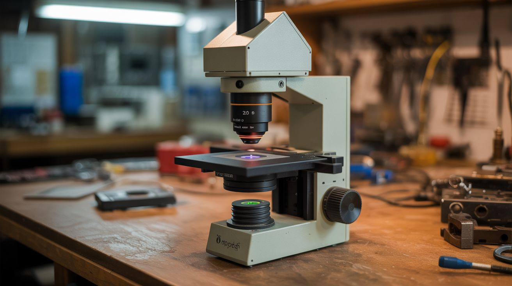

# #270 — Laser Scanning Microscope

  

> Confocal microscopy from a laser pointer. Build an image pixel by pixel from a spinning mirror and a photocell.

## Ratings

| Jaw Drop Rating | Brain Melt Level | Wallet Damage | Spicy Level | Clout Potential | Time to Build |
|---|---|---|---|---|---|
| ⭐⭐⭐⭐ | ⭐⭐⭐⭐⭐ | ⭐ | ⭐⭐ | ⭐⭐⭐⭐ | ⭐⭐⭐⭐ |

## What Is It?

A conventional microscope illuminates an entire sample at once and uses lenses to magnify the image. A laser scanning microscope does something fundamentally different: it focuses a laser to a single point, sweeps that point across the sample, and records the reflected (or transmitted) light intensity at each position. A computer assembles these point measurements into a complete image, pixel by pixel. It is like the difference between taking a photograph and painting a picture one dot at a time with a flashlight.

Why bother? Because a scanning approach lets you do things a regular microscope cannot. The single-point illumination rejects out-of-focus light, producing sharper images with better contrast. This is the principle behind confocal microscopy, a technique that revolutionized cell biology by enabling optical sectioning of thick samples. Commercial confocal microscopes cost $50,000-$500,000. Yours will cost about $15 and take a weekend to build. It will not match the resolution of a research instrument, but it will genuinely produce magnified images by scanning, and the process of building it teaches you more about optics, signal processing, and image formation than a semester of university lectures.

The scanning mechanism is elegant: a small mirror glued to a motor shaft. As the motor spins, the mirror sweeps the reflected laser beam across the sample in one axis. You move the sample for the other axis — manually with a fine-thread bolt, or automatically with a stepper motor from a dead printer. A photocell captures the reflected light intensity at each point, the Arduino digitizes it, and a Processing sketch on your computer assembles the image in real time. Watching an image build up line by line from raw sensor data is deeply satisfying in a way that is hard to explain until you experience it.

## Ingredients

- [ ] Laser pointer or laser module — red (650nm), low power 1-5mW *(dollar store, $2)*
- [ ] Small DC motor — for spinning the scan mirror *(salvage from toy, CD drive, free)*
- [ ] Small mirror fragment — 5-10mm square or round, flat and clean *(craft mirror, broken mirror, free)*
- [ ] Photocell (LDR), photodiode, or phototransistor — for detecting reflected light *(electronics supplier, $0.50-2)*
- [ ] Arduino Uno or Nano *(electronics supplier, $5)*
- [ ] Focusing lens — small convex lens from a magnifying glass, laser pointer, or CD/DVD drive optical assembly *(salvage, $1)*
- [ ] Sample stage — a small platform that can be moved in fine increments *(printer carriage salvage, or manual slide with fine-thread bolt)*
- [ ] Breadboard and jumper wires *(electronics supplier, $3)*
- [ ] Potentiometer — to control motor speed *(electronics supplier, $0.50)*
- [ ] Computer running Processing IDE or Python — for image display *(free software)*
- [ ] Dark enclosure — cardboard box to block ambient light *(recycling bin, free)*
- [ ] IR LED + photodetector pair or Hall sensor + magnet — for line-sync signal *(electronics supplier, $1)*
- [ ] Optional: stepper motor + lead screw — for automated Y-axis scanning *(salvaged from printer, free)*

## Build Steps

1. **Build the scanning mirror.** Glue a small mirror fragment (5-10mm square) to the shaft of a small DC motor using cyanoacrylate (super glue). The mirror should be mounted perpendicular to the shaft axis so that when the motor spins, the mirror angle changes continuously, sweeping the reflected beam in an arc. Let the glue cure fully before running the motor. Balance is less critical here than in the centrifuge build — the mirror is tiny and the speeds are modest — but a severely off-center mirror will vibrate and blur the image.

2. **Set up the optical path.** Mount the laser so it hits the spinning mirror at roughly 45 degrees. The mirror reflects the beam downward (or sideways) toward the sample. As the motor spins, the reflected beam sweeps in an arc across the sample surface. The sweep width depends on the distance between the mirror and the sample — greater distance equals wider sweep but lower intensity at each point. Start with the sample 2-5 cm from the mirror for a reasonable balance of sweep width and signal strength.

3. **Add a focusing lens.** Place a small convex lens between the scanning mirror and the sample. This focuses the laser spot to a smaller point on the sample, increasing both resolution and signal intensity. A lens salvaged from a CD/DVD drive optical assembly works well — these are designed for tight focusing at short distances. A magnifying glass lens also works but produces a larger spot. Adjust the lens-to-sample distance until the laser spot on the sample surface is as small and sharp as possible. The size of this focused spot determines the finest detail your microscope can resolve.

4. **Position the detector.** Mount the photocell or photodiode near the sample, angled to capture light reflected from the sample surface. You are measuring how much laser light bounces back from each point as the beam sweeps across. Dark features on the sample reflect less light; bright features reflect more. For transparent or translucent samples (biological slides, thin sections), mount the detector on the opposite side of the sample to measure transmitted light instead of reflected. Shield the detector from ambient light with a tube or hood — this is critical for image quality.

5. **Wire the detection circuit.** Connect the photocell as a voltage divider: one lead to 5V, junction with a 10k ohm resistor to ground, junction to an Arduino analog input. The output voltage varies with the intensity of reflected light hitting the sensor. Test by pointing the laser at different surfaces (white paper, black tape, printed text) and watching the analog reading on the serial monitor. You need clear, measurable differences between light and dark features. If the readings are noisy, add a small capacitor (100nF) across the sensor to smooth high-frequency noise.

6. **Build the line-sync detector.** To construct a coherent image, you need to know exactly when each scan line begins. Attach a small flag (piece of tape or thin card) to the motor shaft that passes through an optical gate — an IR LED on one side, a photodetector on the other — once per revolution. Each time the flag passes, the detector generates a pulse that tells the Arduino "new scan line starting." Alternatively, glue a small magnet to the motor shaft and use a Hall effect sensor to detect each revolution. Without this sync signal, your image lines will not align and the picture will be horizontally scrambled.

7. **Program the Arduino data acquisition.** Write code that waits for the sync pulse, then rapidly samples the analog input as the beam sweeps across the sample. Take 100-200 samples per sweep (the maximum depends on the motor speed and the Arduino analog sampling rate — about 10,000 samples per second is achievable). Send each line of sampled data over serial to the computer. The motor speed determines the scan rate — use the potentiometer to adjust speed until you get consistent, clean data lines. Too fast and you get too few samples per line. Too slow and the scan takes forever.

8. **Write the display software.** In Processing (or Python with matplotlib or pygame), read serial data from the Arduino. Each incoming line of data becomes one horizontal row of pixels in the image. Map the analog values to grayscale brightness: low reflected intensity = dark pixel, high intensity = bright pixel. Display each row as it arrives, building the image from top to bottom in real time. After all rows are collected (one per Y-axis step), you have a complete microscope image.

9. **Scan the Y axis.** The spinning mirror handles one axis (X). For the other axis (Y), you need to move the sample incrementally between scan lines. The simplest approach: mount the sample on a platform driven by a fine-thread bolt. Turn the bolt a fixed fraction of a rotation between each scan line to advance the sample by a few tens of micrometers. For automation, use a stepper motor and lead screw salvaged from a dead printer — the Arduino can control both the scan data acquisition and the Y-axis stepper in a coordinated sequence.

10. **Image your first sample.** Start with high-contrast subjects that are easy to resolve: printed text on paper, the edge of a coin, the surface of a circuit board, or a leaf with prominent vein structure. These have strong reflectivity differences that produce clear images even with imperfect optics. Adjust focus, scan speed, and sample distance until you get the sharpest image. Once the system works reliably, try biological samples — onion skin cells mounted on a glass slide, pollen grains, insect wing scales, fabric weave patterns.

11. **Improve image quality.** Add software post-processing: normalize each line to correct for uneven laser intensity across the scan arc (the beam is brighter at the center of the sweep than at the edges). Apply a simple digital filter to reduce noise. Average multiple frames for smoother images. Experiment with false-color mapping — assign colors to different intensity ranges for more visually informative images. Save images to disk for comparison as you refine the optical setup.

## Safety Notes

- Low-power laser pointers (Class IIIa, under 5mW) are relatively safe but should still never be aimed at eyes. The spinning mirror creates a fanned beam that sweeps through space — ensure the scan plane does not intersect eye level. Enclose the entire optical path in a cardboard box for best results (blocks ambient light AND contains the beam safely).
- The spinning motor should be securely mounted to the base. A mirror fragment that detaches from a spinning motor shaft becomes a small, sharp, fast-moving projectile. Use strong adhesive and inspect the bond before running at speed. Start at low motor speeds and increase gradually.
- Work in a dimly lit or fully dark environment for best image quality. The detector is sensitive to all ambient light, not just the laser. An enclosure around the entire optical path dramatically improves signal-to-noise ratio and therefore image clarity.

## See Also

- [Laser Voice Communicator](265-laser-communicator.md)
- [Blu-Ray Laser Cutter](269-blu-ray-laser-cutter.md)
- [Galvanometer Laser Light Show](266-laser-galvo-show.md)
