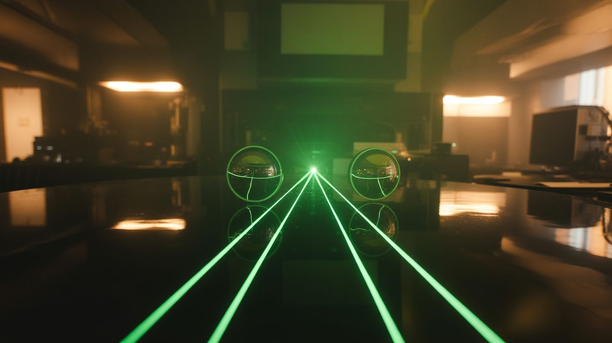

# Laser Lab

  

> Laser builds from salvaged diodes, pointers, and optics.

Lasers used to be the exclusive domain of research labs and James Bond villains. Now they're in every Blu-ray player, barcode scanner, laser pointer, and fiber optic cable on the planet. Which means they're in every junkyard and e-waste bin too. A dead DVD player has a red laser diode. A dead Blu-ray player has a violet one powerful enough to cut tape and etch wood. Barcode scanners have galvanometer mirrors that can steer a beam thousands of times per second.

Combine these components with basic electronics and you get communicators, light shows, musical instruments, alarm systems, cutters, microscopes, and geometric art — all from parts that were headed for the landfill.

---

## Builds

| # | Build | Jaw Drop | Brain Melt | Wallet | Spicy | Clout | Time |
|---|---|---|---|---|---|---|---|
| 265 | [Laser Communicator](265-laser-communicator.md) | ⭐⭐⭐⭐ | ⭐⭐ | ⭐ | ⭐⭐ | ⭐⭐⭐⭐ | ⭐⭐ |
| 266 | [Laser Galvo Show](266-laser-galvo-show.md) | ⭐⭐⭐⭐⭐ | ⭐⭐⭐⭐ | ⭐⭐ | ⭐⭐ | ⭐⭐⭐⭐⭐ | ⭐⭐⭐ |
| 267 | [Laser Harp](267-laser-harp.md) | ⭐⭐⭐⭐⭐ | ⭐⭐⭐ | ⭐⭐ | ⭐⭐ | ⭐⭐⭐⭐⭐ | ⭐⭐⭐ |
| 268 | [Laser Tripwire Alarm](268-laser-tripwire-alarm.md) | ⭐⭐⭐ | ⭐⭐ | ⭐ | ⭐ | ⭐⭐⭐ | ⭐⭐ |
| 269 | [Blu-Ray Laser Cutter](269-blu-ray-laser-cutter.md) | ⭐⭐⭐⭐ | ⭐⭐⭐ | ⭐⭐ | ⭐⭐⭐ | ⭐⭐⭐⭐ | ⭐⭐⭐ |
| 270 | [Laser Microscope](270-laser-microscope.md) | ⭐⭐⭐⭐ | ⭐⭐⭐⭐⭐ | ⭐ | ⭐⭐ | ⭐⭐⭐⭐ | ⭐⭐⭐⭐ |
| 271 | [Laser Spirograph](271-laser-spirograph.md) | ⭐⭐⭐⭐⭐ | ⭐⭐ | ⭐ | ⭐⭐ | ⭐⭐⭐⭐⭐ | ⭐⭐ |

---

### Suggested Build Order

Start with simple optics, progress toward precision laser systems:

1. **[#265 — Laser Communicator](265-laser-communicator.md)** — Simple modulation. Photodiode + laser pointer.
2. **[#271 — Laser Spirograph](271-laser-spirograph.md)** — Mirrors and motors make geometric patterns.
3. **[#268 — Laser Tripwire Alarm](268-laser-tripwire-alarm.md)** — Basic threshold detection.
4. **[#267 — Laser Harp](267-laser-harp.md)** — Laser grid + audio synthesis.
5. **[#269 — Blu-Ray Laser Cutter](269-blu-ray-laser-cutter.md)** — Power control and focus alignment.
6. **[#266 — Laser Galvo Show](266-laser-galvo-show.md)** — Galvanometer mirrors and fast analog control.
7. **[#270 — Laser Microscope](270-laser-microscope.md)** — Advanced optics theory. Precision alignment.

### Related Categories

- [Light & Visual](../light-and-visual/) — Laser projection and light manipulation
- [Mad Scientist](../mad-scientist/) — High-energy physics experiments
- [Raspberry Pi & Arduino](../pi-and-arduino/) — Galvo control and signal generation
