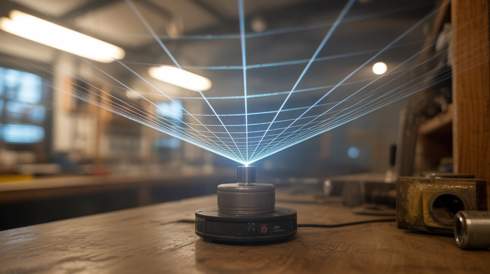

# #017 — Laser Fog Projector

  

> A laser pointer bouncing off a spinning mirror in fog creates sweeping geometric patterns across the sky.

## Ratings

     

## 🧪 What Is It?

A laser beam is invisible in clear air — you only see the dot where it hits a surface. But add fog, smoke, or haze, and the entire beam becomes visible as a bright line cutting through the air. Now point that laser at a small mirror mounted on a spinning motor, and the beam sweeps in a circle, creating a cone or disc of laser light in the fog. Add a second motor axis and the patterns become spirographs, Lissajous figures, and hypnotic geometric shapes.

This is the core technology behind professional laser light shows, stripped down to its cheapest possible form. A $5 laser pointer, a salvaged motor, a scrap mirror, and a fog machine (or a pot of hot water and dry ice) produce effects that look like a $50,000 concert lighting rig.

<strong>🧰 Ingredients</strong>

- [ ] Laser pointer — green is most visible, 5mW or less for safety *(source: dollar store or online, ~$3-5)*
- [ ] Small DC motor *(source: dead CD/DVD drive, old toy, or fan motor, free)*
- [ ] Small mirror — 1/2 to 1 inch, or a piece of mirror tile *(source: craft store or broken compact mirror, ~$1)*
- [ ] Fog machine or dry ice + hot water for fog *(source: party supply store rental ~$15, or dry ice from grocery store ~$3)*
- [ ] 9V battery or small DC power supply for the motor *(source: around the house, free)*
- [ ] Potentiometer for speed control *(source: old stereo volume knob or electronics supply, ~$1)*
- [ ] Hot glue and scrap wood for mounting *(source: around the house)*

## 🔨 Build Steps

1. **Mount the mirror on the motor.** Glue a small mirror to the shaft of your DC motor, slightly off-center or at a slight angle (5-15 degrees from perpendicular to the shaft). The off-axis angle determines how wide the laser cone spreads. A mirror mounted perfectly perpendicular just creates a spinning dot — boring. The angle is what turns it into a cone or disc.

2. **Mount the motor.** Secure the motor to a small wooden base or bracket. The motor shaft (with mirror) should spin freely without the mirror hitting anything. Orient it so the mirror faces outward/upward.

3. **Set up the laser.** Mount the laser pointer so it shines directly at the spinning mirror. Clamp it or tape it in position — it needs to stay aimed at the mirror while the motor spins. Use a binder clip or clothespin to hold the laser button down, or wire the laser's power button to stay on.

4. **Wire the motor.** Connect the motor to a battery or power supply through a potentiometer (variable resistor) for speed control. Different speeds create different visual effects. Slow spinning creates visible individual beam sweeps; fast spinning creates a solid cone of light.

5. **Add fog.** Set up your fog source in the beam path. A fog machine works best for sustained output. For a cheaper option, place dry ice chunks in a bucket of hot water — the cold CO2 fog rolls along the ground and the laser beams cut through it beautifully. In a pinch, even a smoking incense stick near the beam path shows it partially.

6. **Dark room or outdoor nighttime.** Kill all other lights. Turn on the laser, start the motor spinning, and activate the fog. You should see a dramatic cone or disc of green laser light sweeping through the haze. Adjust motor speed for different effects.

7. **Advanced: dual-axis patterns.** Mount a second mirror on a second motor running at a different speed, and bounce the laser off the first mirror onto the second before it enters the fog. The combination of two rotation speeds at different angles creates complex Lissajous-type patterns — spirals, figure-eights, and evolving geometric shapes.

8. **Add music reactivity (optional).** Feed the motor power through a simple audio amplifier connected to a music source. The motor speed will vary with the audio amplitude, making the laser patterns dance with the music.

## ⚠️ Safety Notes

> [!WARNING]
> **Never aim a laser at people's eyes.** Even a 5mW laser pointer can cause permanent retinal damage with direct exposure. Keep the beam path above head height or below eye level. Never point it at aircraft — this is a federal crime in most countries.

- **Fog machines use heated glycol.** The nozzle gets extremely hot. Don't touch it during or immediately after operation. Keep the fog machine upright and away from water or conductive surfaces. Use fog machine fluid, not substitutes.

## 🔗 See Also

- [Laser Maze](176-laser-maze.md) — lasers used for an interactive installation instead of visual projection
- [Holographic Fan Display](022-holographic-fan-display.md) — another way to create floating visual effects

**References:**

- [Appliance Teardown Guide](../../docs/reference/appliance-teardown-guide.md)
- [Technical Glossary](../../docs/reference/glossary.md)
