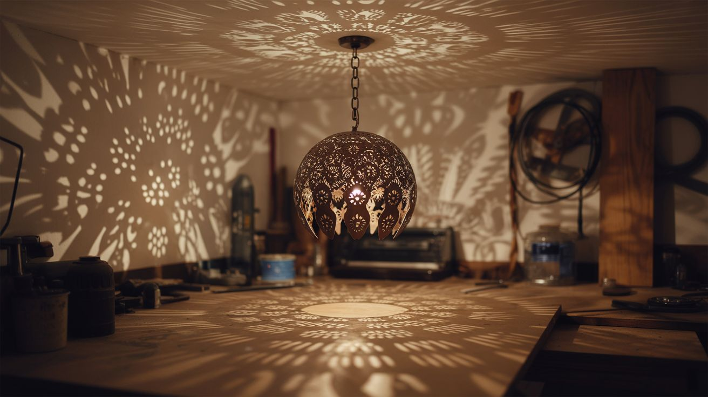

# #018 — Shadow Chandelier

  

> A metal sphere with precisely cut patterns casts intricate shadows across every wall and ceiling of the room.

## Ratings

     

## 🧪 What Is It?

A shadow chandelier is a hollow sphere (or polyhedron) with intricate patterns cut into its surface. A point light source — a single bright LED or small halogen bulb — sits at the center. The light radiates outward through the cutouts, projecting magnified shadow patterns onto every surface in the room: walls, ceiling, floor, furniture. The room becomes a 360-degree canvas of geometric or organic shadow art.

The beauty is in the math: because light travels in straight lines from a point source, every cutout in the sphere projects a clean, sharp shadow pattern that wraps around the room. Small details in the metalwork become room-sized projections. A 12-inch sphere can fill an entire bedroom with forest silhouettes, geometric tessellations, or gothic cathedral patterns.

<strong>🧰 Ingredients</strong>

- [ ] Metal sphere or dome — colander, salad bowl, globe light fixture, or sheet metal formed into a sphere *(source: thrift store or kitchen supply, ~$5-10)*
- [ ] Dremel rotary tool with cutting discs and burrs *(source: own or borrow)*
- [ ] High-brightness point-source LED bulb (small filament area) *(source: hardware store, ~$5)*
- [ ] Light socket and cord set *(source: hardware store pendant light kit, ~$8)*
- [ ] Chain or cord for hanging *(source: hardware store, ~$3)*
- [ ] Paper and pencil for pattern design *(source: around the house)*
- [ ] Safety glasses and gloves *(source: hardware store)*
- [ ] Fine-point marker for transferring patterns *(source: around the house)*

## 🔨 Build Steps

1. **Design the shadow pattern.** Sketch your pattern on paper first. Geometric patterns (Islamic tessellation, sacred geometry, hexagonal grids) are forgiving and always look good. Organic patterns (tree branches, coral, vines) are harder to cut but more dramatic. Remember that the shadows will be magnified — small details in your cut pattern become large shapes on the walls.

2. **Select and prep the sphere.** A stainless steel colander is the easiest starting point — it already has a spherical shape and you can work with or against the existing hole pattern. For a clean build, use a metal globe light fixture or form sheet metal into a hemisphere pair. Clean the surface and remove any coating.

3. **Transfer the pattern.** Draw your design directly on the metal surface with a fine-point permanent marker. Use tape as guides for straight lines. For geometric patterns, divide the sphere into equal sections first (use string to measure circumference and mark divisions). Leave enough solid metal between cutouts for structural integrity.

4. **Cut the pattern.** Using a Dremel with cutting discs and engraving burrs, carefully cut out the pattern sections. Work slowly — thin cuts in metal are unforgiving of mistakes. For intricate patterns, drill starter holes and then cut between them. Wear safety glasses — metal dust and sparks fly.

5. **Smooth and deburr.** File or sand all cut edges smooth. Sharp burrs on the inside will create unwanted shadow artifacts, and sharp edges on the outside are a hazard. A Dremel sanding drum makes this faster.

6. **Install the light source.** Mount the light socket inside the sphere so the bulb sits at the geometric center. This is critical — if the bulb is off-center, the shadow patterns will be distorted on one side. Use a pendant light cord set that comes through the top for both power and hanging.

7. **Choose the right bulb.** A small, bright point source is essential. LED filament bulbs with a tiny light-emitting area work well. Large diffuse bulbs blur the shadows — you want the sharpest possible point of light. A clear-glass bulb with a single small filament is ideal. Test different bulbs and compare the shadow sharpness on the walls.

8. **Hang and adjust.** Hang the chandelier from the ceiling at the desired height. Lower positions project patterns on the ceiling; higher positions emphasize wall coverage. The room should be otherwise dark for maximum impact. The shadows will cover every surface in the room.

## ⚠️ Safety Notes

> [!WARNING]
> **Metal cutting produces hot shards and dust.** Wear safety glasses, gloves, and a dust mask when cutting with the Dremel. Secure the workpiece in a vise or clamp — never hold it freehand while cutting.
- **The bulb inside will generate heat in an enclosed metal sphere.** Use an LED bulb (low heat) rather than halogen (high heat). If the sphere gets too hot to touch, switch to a lower-wattage bulb. Ensure the cord and socket are rated for the bulb's wattage.
- **Hang securely.** The finished chandelier may weigh several pounds. Use an appropriate ceiling anchor rated for the weight, not just a push-in hook.

## 🔗 See Also

- [Camera Obscura Room](175-camera-obscura-room.md) — another project that transforms an entire room using light projection
- [Polarization Art](174-polarization-art.md) — hidden visual patterns revealed through optics
