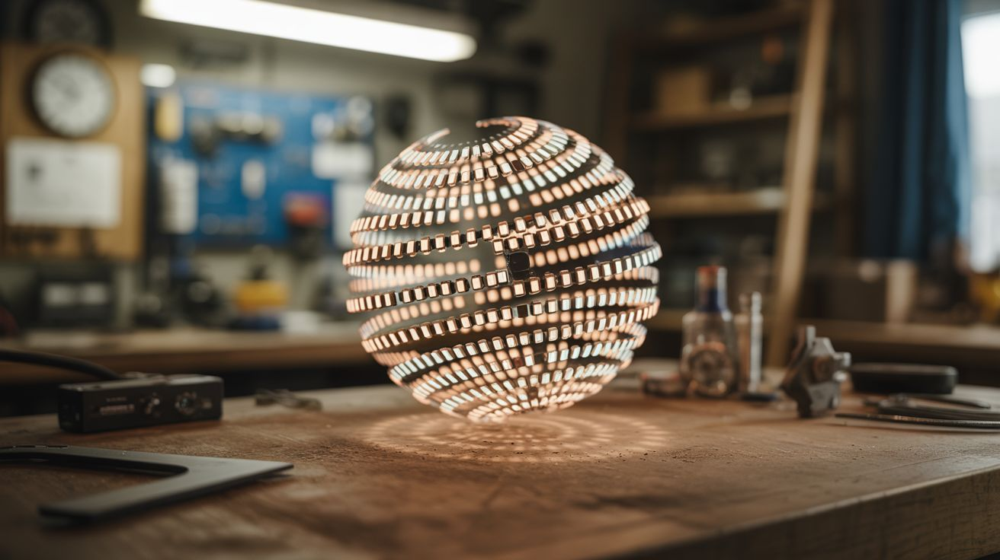

# #019 — POV Globe

  

> A spinning strip of LEDs creates a floating 3D image in mid-air — persistence of vision turns a single strip into a full sphere of pixels.

## Ratings

     

## 🧪 What Is It?

A POV (persistence of vision) globe spins a vertical strip of LEDs around a central axis at high speed. By rapidly changing which LEDs are lit as the strip rotates, you can paint a complete spherical image in the air — the human eye blends the fast-moving LEDs into a seemingly solid, floating image. Globes can display Earth maps, text, patterns, animations, and even video.

The concept exploits the fact that human vision retains an image for about 1/25th of a second. If the LED strip completes a full rotation faster than that, the brain merges all the instantaneous LED positions into a continuous image. A strip with 50 LEDs spinning at 20+ rotations per second creates a sphere of 50 x ~300 pixel-equivalents — enough for recognizable images and text floating in mid-air.

<strong>🧰 Ingredients</strong>

- [ ] Addressable LED strip (APA102 or WS2812B — APA102 preferred for faster data rates) *(source: online, ~$8)*
- [ ] Microcontroller — ESP32 or Arduino *(source: online, ~$5)*
- [ ] Brushless DC motor or high-speed geared motor *(source: dead hard drive, drone motor, or online, ~$5-10)*
- [ ] Slip ring (for passing power and data to spinning components) *(source: online, ~$5-8)*
- [ ] Battery (small LiPo) or slip-ring power delivery *(source: online or salvaged drone battery, ~$5)*
- [ ] Hall effect sensor + magnet for position tracking *(source: old hard drive or online, ~$2)*
- [ ] 3D-printed or machined hub and mount *(source: print yourself or improvise with hardware)*
- [ ] Sturdy base with bearing mount *(source: hardware store or salvaged)*
- [ ] Balancing weights (small bolts/nuts) *(source: hardware store)*

## 🔨 Build Steps

1. **Design the spinning frame.** The LED strip mounts along a vertical arm that spins around a central vertical axis. The arm needs to be lightweight but rigid — acrylic, thin aluminum, or 3D-printed. It should be exactly as long as the diameter of your desired display sphere.

2. **Mount the LEDs.** Attach the LED strip along the full length of the spinning arm. For a globe effect, the strip runs from top to bottom through the center. Each LED becomes one "pixel row" of your spherical display. More LEDs = higher vertical resolution.

3. **Install the motor.** Mount a motor at the base that spins the arm at 15-30 rotations per second (900-1800 RPM). A brushless motor from a dead hard drive is ideal — they're designed for exactly this kind of precise, sustained rotation. Mount the arm to the motor shaft with a secure hub.

4. **Add the slip ring.** Power and (optionally) data need to get from the stationary base to the spinning arm. A slip ring is a rotary electrical connector designed for this. Pass at least power through it. If using a battery on the spinning arm, you only need the slip ring for initial data upload and can run untethered.

5. **Install position sensing.** Mount a Hall effect sensor on the spinning arm and a small magnet on the stationary base. Every time the arm passes the magnet, the sensor triggers an interrupt. This tells the microcontroller exactly where in the rotation it is, so it knows which column of the image to display at each moment.

6. **Program the microcontroller.** Write code that: (a) detects the position pulse from the Hall sensor, (b) divides each rotation into equal angular steps (200-400 steps per revolution), and (c) outputs the correct column of pixel data to the LED strip at each step. Pre-compute the image data as an array of pixel columns.

7. **Create image data.** Convert your desired image (earth map, text, pattern) into a cylindrical projection — essentially unrolling the sphere into a rectangular bitmap where columns correspond to rotation angles and rows correspond to LED positions. Load this into the microcontroller's memory.

8. **Balance the assembly.** An unbalanced spinning arm vibrates violently and can self-destruct. With the motor running at low speed, add small counterweights (bolts, tape-wrapped nuts) to the arm until vibration is minimal. This is critical — do not skip this step.

9. **Test and tune.** Spin up to full speed and observe. The image should appear as a stable, floating sphere of light. If it flickers or has gaps, your RPM may be too low or your angular divisions too few. If the image is rotated or distorted, adjust the Hall sensor trigger timing. Adjust brightness for the ambient light conditions.

## ⚠️ Safety Notes

> [!WARNING]
> **Spinning at 1,000+ RPM is serious.** If the LED strip or any component detaches, it becomes a projectile. Secure everything with screws, not just glue. Test at low speed first. Stand behind a shield (plexiglass panel) during initial high-speed testing. Never put fingers near the spinning arm.

- **Battery safety on spinning components.** If using a LiPo battery on the spinning arm, make sure it's securely mounted and can't shift during rotation. A LiPo battery that detaches at speed will impact something at high velocity, potentially causing a fire.

## 🔗 See Also

- [Holographic Fan Display](022-holographic-fan-display.md) — similar persistence-of-vision concept in a flat form factor
- [Light Painting Robot](178-light-painting-robot.md) — LEDs creating images through motion, captured by long-exposure photography

**References:**

- [Appliance Teardown Guide](../../docs/reference/appliance-teardown-guide.md)
- [Technical Glossary](../../docs/reference/glossary.md)
- [Electronics & Microcontrollers Guide](../../docs/reference/electronics-and-microcontrollers.md)
