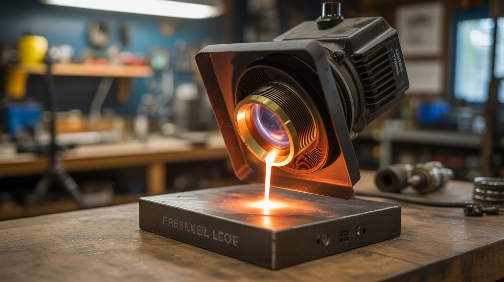

# #020 — Fresnel Lens Solar Forge

  

> A Fresnel lens from a rear-projection TV focuses sunlight into a spot hot enough to melt metal — the sun becomes your welding torch.

## Ratings

| Jaw Drop Rating | Brain Melt Level | Wallet Damage | Spicy Level | Clout Potential | Time to Build |
|---|---|---|---|---|---|
| ⭐⭐⭐⭐⭐ | ⭐ | ⭐ | ⭐⭐⭐⭐⭐ | ⭐⭐⭐⭐⭐ | ⭐ |

## What Is It?

Rear-projection TVs contain a large Fresnel lens — a flat plastic lens with concentric ridges that acts like a giant magnifying glass. These TVs are constantly being thrown away and the lens inside is one of the most powerful solar concentrators you'll ever find for free. A typical RPTV Fresnel lens is about 40x30 inches, and when aimed at the sun, it focuses sunlight into a focal point that easily exceeds 3,000degF (1,650degC) — hot enough to melt aluminum, copper, glass, and even steel.

The focal point is a blinding white spot about the size of a dime that can set wood on fire in under a second, melt a penny in 10 seconds, and reduce rocks to glowing lava. It's essentially free solar energy concentrated to forge-level temperatures with no fuel, no electricity, and no moving parts.

## Ingredients

- [ ] Fresnel lens from a rear-projection TV *(source: RPTV from curb, electronics recycler, or Craigslist free section — the lens is the clear sheet in front of the screen)*
- [ ] Wooden or metal frame to hold the lens upright *(source: scrap lumber, ~$5-10)*
- [ ] Fire bricks for a work surface *(source: hardware store, ~$5)*
- [ ] Welding goggles — shade 10 or darker *(source: hardware store, ~$8)*
- [ ] Leather gloves and long sleeves *(source: hardware store)*
- [ ] Target materials — pennies, aluminum cans, glass bottles, rocks *(source: around the house, free)*
- [ ] Crucible or fire-safe container for melting metal *(source: steel cup or repurposed fire extinguisher, ~$3)*
- [ ] Tongs for handling hot items *(source: hardware store, ~$5)*

## Build Steps

1. **Salvage the Fresnel lens.** Open the front panel of a rear-projection TV. The Fresnel lens is the large, clear, flexible plastic sheet immediately behind the screen surface. There may be two sheets — you want the one with concentric ridges (the Fresnel lens), not the flat lenticular sheet. Handle carefully — it scratches easily and scratches reduce focal quality.

2. **Build a frame.** Construct a simple frame from 2x4 lumber that holds the Fresnel lens vertically, facing the sun. The frame needs to be sturdy enough to resist wind (the lens acts as a sail). Add a brace or foot so it stands freely. The lens should be adjustable in angle to track the sun.

3. **Find the focal point.** On a sunny day, aim the lens at the sun and move a fire brick behind it until you find the focal point — the smallest, brightest spot. For most RPTV Fresnel lenses, this is 30-50 inches behind the lens. Mark this distance. The focal point should be an intense white spot. WARNING: Do not look directly at the focal point without welding goggles.

4. **Set up the work area.** Place fire bricks at the focal distance behind the lens. This is your forge surface. Clear everything flammable from the area — the focal point will ignite paper, leaves, and dry grass instantly. Have a bucket of water or sand nearby.

5. **Test with expendable materials.** Start with a piece of wood — it should begin smoking within 1-2 seconds and burst into flame within 5. Move to a penny — it will glow red, then orange, then melt into a liquid puddle in about 10-15 seconds. This is when it really sinks in what you're dealing with.

6. **Melt aluminum.** Place crushed aluminum cans in a small steel crucible on the fire bricks at the focal point. Aim the lens so the focal spot hits the crucible. The aluminum will melt in 2-3 minutes. You can pour it into sand molds just like with the desktop foundry — but with no fuel cost.

7. **Experiment with materials.** Try glass (it melts and flows like lava), rocks (some glow brilliantly and partially melt), steel (glows white-hot and eventually melts if you hold the focal point on it long enough), and ceramic (often cracks dramatically from thermal shock). Each material responds differently.

## Safety Notes

- **The focal point will blind you permanently and instantly.** The concentrated sunlight at the focal point is thousands of times brighter than direct sun. NEVER look at the focal spot without welding goggles (shade 10+). Regular sunglasses are completely insufficient. Reflections off shiny targets can also cause eye damage — wear the goggles the entire time the lens is aimed at the sun.
- **Everything at the focal point is on fire.** The spot will ignite any organic material in seconds. Work on bare dirt or concrete. Have fire suppression ready. Be aware that the focal point moves as the sun moves — if you walk away for 10 minutes, the spot may have drifted onto the frame or nearby objects.
- **UV exposure.** The concentrated light includes UV. Even standing near the focal area, your skin will sunburn fast. Wear long sleeves, gloves, and a hat. Treat this like spending a day at the beach — except the "beach" has a 3,000-degree spot.

## See Also

- [Desktop Foundry](../fire-and-plasma/005-desktop-foundry.md) — melt aluminum with charcoal when the sun isn't cooperating
- [Thermic Lance](../fire-and-plasma/004-thermic-lance.md) — another way to reach metal-melting temperatures from simple materials
