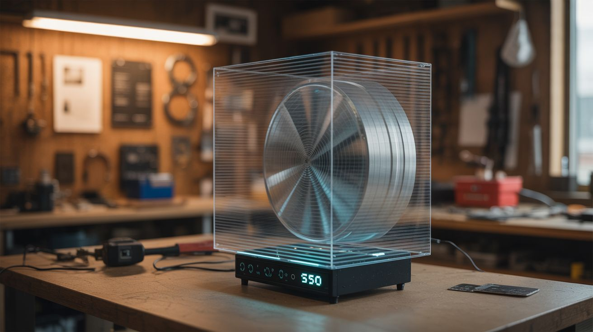

# #022 — Holographic Fan Display

  

> A spinning LED bar creates floating holographic images that appear to hover in mid-air — the commercial version costs $500, this one costs $30.

## Ratings

     

## 🧪 What Is It?

A holographic fan display is a flat persistence-of-vision (POV) device. A bar of LEDs spins rapidly (like a fan blade) and by precisely controlling which LEDs light up at each angular position, it paints a circular 2D image in the air. Because the spinning blade is nearly invisible at speed, the lit LEDs appear to float as a glowing image with no visible support — a fake hologram that looks absolutely real to the naked eye.

Commercial versions of these are used in retail stores and trade shows and cost $300-800. The DIY version uses the same principle: an addressable LED strip on a motor with a microcontroller that synchronizes image data to the rotation. The result is a floating, animated image — logos, text, GIFs, even short video clips hovering in front of a wall.

<strong>🧰 Ingredients</strong>

- [ ] Addressable LED strip (APA102 preferred for fast data rate), 30-60cm *(source: online, ~$5-8)*
- [ ] ESP32 or Arduino microcontroller *(source: online, ~$5)*
- [ ] Brushless DC motor, 1000-2000 RPM *(source: computer fan motor, drone motor, or online, ~$5-10)*
- [ ] Slip ring for power transfer to the spinning blade *(source: online, ~$5-8)*
- [ ] Hall effect sensor + magnet for rotation sync *(source: online, ~$2)*
- [ ] Small LiPo battery (optional — alternative to slip ring for power) *(source: online or salvaged, ~$5)*
- [ ] Rigid blade — aluminum strip, PCB, or 3D-printed arm *(source: hardware store or fabricated, ~$3)*
- [ ] Mounting bracket and motor housing *(source: hardware store, ~$5)*
- [ ] Counterweight for blade balance *(source: bolts and nuts, ~$1)*

## 🔨 Build Steps

1. **Build the blade.** Mount the LED strip along a rigid arm — aluminum flat bar, a custom PCB, or a 3D-printed blade. The blade needs to be strong enough to withstand centrifugal force at 1500+ RPM. The LED strip runs the full length of one side. The other side gets a counterweight to prevent vibration.

2. **Mount electronics on the blade.** Attach the microcontroller and (if using) a small LiPo battery directly to the spinning blade. This eliminates the need to pass data through the slip ring — only power needs to transfer (or nothing, if battery-powered). The microcontroller stores all the image data in memory and runs autonomously.

3. **Install the Hall effect sensor.** Mount the Hall sensor on the spinning blade, and a small magnet on the stationary motor housing. Once per revolution, the sensor detects the magnet and triggers an interrupt. This is the reference pulse that tells the microcontroller where "angle zero" is, so the image stays locked in position instead of spinning.

4. **Program the image renderer.** Write code that converts a circular image into angular columns. For each rotation: detect the Hall sensor pulse (start of rotation), then step through equal angular divisions (200-400 per revolution), outputting the correct column of LED data at each step. Pre-process your image into this columnar format and store it in flash memory.

5. **Create image content.** Use a script or tool to convert any image or GIF into the polar-coordinate format the display needs. The image should be circular (square images waste the corners). White and bright colors on black backgrounds work best — the spinning blade is invisible against a dark background.

6. **Attach the blade to the motor.** Mount the blade securely to the motor shaft with a hub clamp or set screw. Balance is critical — add counterweight material to the non-LED side of the blade until it spins without vibration. An unbalanced blade at 1500 RPM will shake itself apart.

7. **Install the slip ring (if used).** Mount the slip ring between the motor shaft and the stationary base. Route power wires through the slip ring to the spinning blade. This allows continuous operation without a battery. If using a battery instead, skip this — but you'll need to recharge periodically.

8. **Mount and test.** Secure the motor assembly to a wall mount or stand. Spin up the motor and observe. The image should appear as a stable, floating disc of light. If it's blurry, increase RPM. If it jitters, check your Hall sensor timing. If colors are wrong, check your LED strip's data format (RGB vs GRB).

9. **Optimize and deploy.** Adjust brightness for the ambient light level. Add new images and animations by uploading different data sets. For maximum impact, mount it on a dark wall in a dimly lit area — the image will appear to float in space with no visible hardware.

## ⚠️ Safety Notes

> [!WARNING]
> **The spinning blade is invisible and will cut you.** At operating speed, you cannot see the blade. Never reach toward the display while it's running. Install a clear acrylic shield in front of it for public-facing installations. Keep a safe distance during testing.
- **Motor failure throws the blade.** If the hub clamp fails, the blade becomes a projectile. Use a proper set screw or press fit — not just friction. Test at low speed first and verify the blade is secure before going to full RPM. Stand to the side during speed-up, not in the plane of rotation.

## 🔗 See Also

- [POV Globe](019-pov-globe.md) — the spherical version of the same persistence-of-vision concept
- [Laser Fog Projector](017-laser-fog-projector.md) — another way to create floating visual effects

**References:**
- [Appliance Teardown Guide](../../docs/reference/appliance-teardown-guide.md)
- [Technical Glossary](../../docs/reference/glossary.md)
- [Electronics & Microcontrollers Guide](../../docs/reference/electronics-and-microcontrollers.md)
