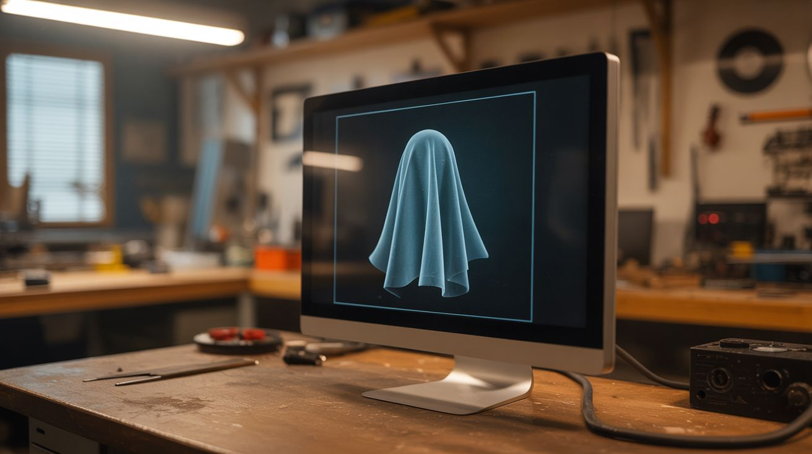

# #171 — Pepper's Ghost Hologram

  

> A monitor, a sheet of glass at 45 degrees, and a dark room — the simplest possible floating hologram that actually works.

## Ratings

     

## 🧪 What Is It?

Pepper's Ghost is the oldest hologram trick in the book — it dates to the 1860s and is still used in haunted houses, concert stages (the famous Tupac "hologram"), and museum exhibits. The principle is dead simple: a sheet of clear glass or acrylic at 45 degrees partially reflects an image from a hidden screen while remaining transparent enough to see through. The reflected image appears to float in the space behind the glass.

Your brain can't tell that the image is a reflection — it interprets it as a real object floating in 3D space. With a dark background and a bright display, the effect is convincing enough to fool almost everyone. You can build one in under an hour with materials already in your house.

<strong>🧰 Ingredients</strong>

- [ ] Monitor, tablet, or phone for the image source *(source: already own)*
- [ ] Clear glass or acrylic sheet — picture frame glass, window pane, or acrylic sheet *(source: dollar store picture frame, ~$1-3)*
- [ ] Dark backdrop — black fabric, black cardboard, or a dark room *(source: around the house, free)*
- [ ] Cardboard, foam board, or wood for the frame/stand *(source: around the house or dollar store, ~$2)*
- [ ] Black tape or paint to hide edges *(source: around the house)*

## 🔨 Build Steps

1. **Understand the geometry.** The display sits flat (face up or face down) and the glass sits at exactly 45 degrees to it. The viewer looks through the glass and sees the reflected image appearing to float in the space behind the glass. The area behind the glass must be dark — any light back there competes with the reflection and ruins the illusion.

2. **Build the frame.** Construct a simple stand that holds the glass at 45 degrees. For a phone-sized hologram, a folded piece of cardboard works. For a monitor-sized one, build a wooden frame. The glass should be clean and scratch-free — imperfections show up in the reflection.

3. **Position the display.** Place your screen perpendicular to the glass — if the glass tilts at 45 degrees, the screen should be flat (horizontal) below the glass, facing up. The image on the screen will reflect off the glass and appear to float at the same distance behind the glass as the screen is in front of it.

4. **Create or find content.** The display should show bright graphics on a pure black background. The black parts of the image become transparent in the reflection (no light = no reflection). White and bright colors appear as the floating "hologram." Pre-made Pepper's Ghost videos and animations are available online, or create your own — any bright image on black background works.

5. **Darken the background.** The space behind the glass (where the image appears to float) must be as dark as possible. Black fabric, black-painted cardboard, or simply a dark room. Any ambient light behind the glass washes out the reflected image.

6. **View and adjust.** Stand in front of the glass and look through it. You should see the reflected image appearing to float in the dark space behind. Adjust the glass angle (should be close to exactly 45 degrees), display brightness (brighter = more visible hologram), and background darkness until the effect is convincing.

7. **Scale up.** For maximum impact, use a large monitor or TV as the source and a large piece of glass or acrylic. A 55-inch TV with a 4x4 foot glass panel creates a life-sized floating image that's genuinely startling. Museum-quality Pepper's Ghost displays use exactly this setup.

## ⚠️ Safety Notes

> [!WARNING]
> **Glass edges are sharp.** If using picture frame glass or window pane, tape the edges with duct tape or electrical tape. Handling large sheets of glass is a two-person job — it's easy to drop and shatter.

- **Don't use this to scare anyone with a heart condition.** A convincing Pepper's Ghost in a dark room is legitimately startling. Give a warning before showing it to anyone who might not handle a surprise well.

## 🔗 See Also

- [Infinity Mirror Table](016-infinity-mirror-table.md) — another optical illusion using partially reflective surfaces
- [Schlieren Optics](172-schlieren-optics.md) — optics that reveal normally invisible phenomena
