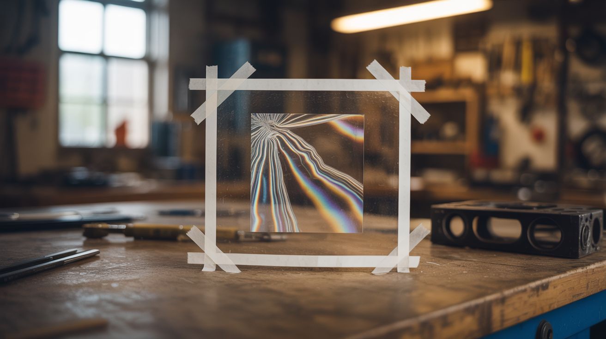

# #174 — Polarization Art

  

> Clear tape on glass, viewed through polarizer film, reveals hidden rainbow patterns that are completely invisible to the naked eye.

## Ratings

     

## 🧪 What Is It?

When you layer clear cellophane tape on a glass or acrylic surface at different angles and thicknesses, it looks completely transparent — just tape on glass. But place a polarizer film behind the glass and another in front, and suddenly the tape lights up in vivid rainbow colors. Different numbers of layers produce different colors, and different angles produce different hues. You can create stained-glass-window-level art that is literally invisible without the polarizers.

The physics: cellophane tape is birefringent — it bends different polarizations of light by different amounts depending on its thickness and orientation. When placed between two polarizers (crossed at 90 degrees), the tape layers selectively transmit certain wavelengths of light (colors) while blocking others. Multiple layers of tape add up, shifting the transmitted color. The result is a hidden artwork that only reveals itself through polarized light.

<strong>🧰 Ingredients</strong>

- [ ] Clear cellophane tape (the cheap, slightly yellow-ish kind works best — NOT packing tape) *(source: already own, ~$1)*
- [ ] Glass or clear acrylic sheet for the canvas *(source: dollar store picture frame, ~$1-2)*
- [ ] Polarizer film — two pieces *(source: salvaged from an old LCD screen, or bought online, ~$3-5)*
- [ ] Backlight — a computer monitor displaying pure white, a light box, or a window *(source: already own)*
- [ ] Scissors and craft knife *(source: around the house)*
- [ ] Design sketch *(source: paper and pencil)*

## 🔨 Build Steps

1. **Salvage or buy polarizer film.** The easiest free source is a broken LCD screen — the front and back layers of every LCD are polarizing film. Carefully peel them off. You need two pieces: one behind your artwork (the "polarizer") and one in front (the "analyzer"). If buying, look for linear polarizer film sheets online.

2. **Set up the viewing system.** Place one polarizer flat on a light source (white monitor, light box, or tape it over a bright window). This is your backlight. Place the glass canvas on top. The second polarizer goes on top of everything — this is what you'll look through. Rotate the top polarizer until the field goes dark (crossed polarizers block all light). Now any birefringent material between them will glow with color.

3. **Test with tape.** Stick a piece of clear tape on the glass and check through the viewing system. You should see the tape appear as a colored rectangle. Add a second layer on top — the color will shift. A third layer shifts again. Each layer advances through the spectrum: yellow, orange, red, purple, blue, green, and back around.

4. **Map your color palette.** Create a test strip: one layer, two layers, three, four, five, six layers of tape side by side. View through the polarizer and note what color each layer count produces. This is your palette — different layer counts = different colors. Rotating the tape 45 degrees also changes the hue and intensity.

5. **Design your artwork.** Sketch your design on paper, planning which areas will have which layer counts. Simple designs work well to start — flowers, landscapes, abstract geometric patterns, or stained glass window designs. Each color region will be built up from the corresponding number of tape layers.

6. **Build the artwork.** Working on the glass canvas, apply tape in the planned shapes and layer counts. Use scissors or a craft knife to cut clean edges. The tape is transparent, so you can see through to your sketch underneath. Build up layers carefully — one layer at a time in each area.

7. **Check frequently.** Look through the viewing system after each region to verify colors. Adjust layer count if a color isn't right. The art is completely invisible without the polarizers, so you must check through the viewing system to see what you're creating.

8. **Frame and display.** Sandwich the finished tape art between the two polarizer films and the glass. Frame it with the backlight behind it (a window works beautifully — the artwork changes character with the sky color throughout the day). For a dramatic reveal, show people the clear glass first, then add the polarizer film and watch their reaction.

## ⚠️ Safety Notes

> [!WARNING]
> **Craft knife safety.** When cutting tape shapes with a blade, cut on a cutting mat and keep fingers clear. The glass surface can cause the blade to slip unpredictably.

- **LCD screen disassembly.** If salvaging polarizer film from a broken LCD, the screen may contain mercury (from CCFL backlights in older models). Work in a ventilated area and don't break the backlighting tubes. LED-backlit screens don't have this issue.

## 🔗 See Also

- [Shadow Chandelier](018-shadow-chandelier.md) — another way to create art through light manipulation
- [Camera Obscura Room](175-camera-obscura-room.md) — optics creating unexpected visual experiences
