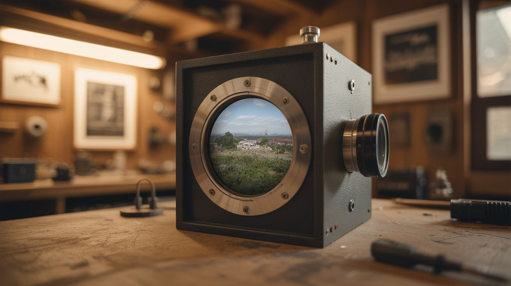

# #175 — Camera Obscura Room

  

> Seal a room, make one small hole, and the entire outside world projects live and inverted on your walls — the original camera, no lens required.

## Ratings

     

## 🧪 What Is It?

A camera obscura (Latin for "dark room") is the oldest optical device in history — it predates photography by centuries. The concept is stunningly simple: seal a room from all light except for a single small hole in one wall. Light from the outside scene passes through the hole and projects a full-color, live, moving, upside-down image of the outside world on the opposite wall.

Trees sway, cars drive by, clouds drift — all projected in real time, fully in color, with no electricity, no screen, no lens. It works because each point of the outside scene sends light rays in all directions; the pinhole selects only the rays from one direction per point, creating a coherent image. It's eerie, beautiful, and profoundly demonstrates how light and optics work. It's literally how your eye works, minus the lens.

<strong>🧰 Ingredients</strong>

- [ ] A room with a window facing an interesting outdoor scene *(source: your house, free)*
- [ ] Black plastic sheeting, trash bags, or heavy black fabric *(source: hardware store or around the house, ~$5)*
- [ ] Duct tape or painter's tape *(source: around the house)*
- [ ] Cardboard for the pinhole aperture *(source: around the house, free)*
- [ ] Pin, nail, or drill for making the hole *(source: around the house)*
- [ ] Optional: magnifying glass or simple lens for a sharper, brighter image *(source: dollar store, ~$1)*

## 🔨 Build Steps

1. **Choose the room.** Pick a room with a window facing a well-lit outdoor scene — a street with movement, a garden, or a landscape. South-facing windows get the most light. Smaller rooms produce brighter images (the projection surface is closer to the hole).

2. **Seal the room.** Cover the window completely with black plastic sheeting or trash bags, taping all edges to block every sliver of light. Then cover any other light sources — under the door, around the window frame edges, indicator lights on electronics. The room needs to be as dark as possible. Any stray light washes out the projection.

3. **Make the pinhole.** Cut a small square (about 2x2 inches) in the center of your black covering. Tape a piece of cardboard or foil over this opening. Poke a small hole — start with about 1/4 inch diameter. Smaller holes give sharper images but dimmer ones. Larger holes give brighter but blurrier images.

4. **Let your eyes adjust.** Sit in the sealed, dark room for 5-10 minutes with the pinhole open. Your eyes need time to adapt to the darkness. As they adjust, the projected image on the opposite wall will gradually become visible. Be patient — the first time you see it appear is a magical moment.

5. **Observe the projection.** The entire outside scene will appear on the opposite wall — upside-down and mirror-reversed (because light travels in straight lines through the hole). Cars will appear to drive across your ceiling. People will walk upside-down. It's live and in full color, with no electronics involved.

6. **Optimize the aperture.** Experiment with hole size. A 1/8 inch hole gives the sharpest image but may be too dim except on very sunny days. A 1/2 inch hole is much brighter but softer. For the best of both worlds, add a lens (see step 7).

7. **Add a lens (optional but recommended).** Tape a magnifying glass or simple convex lens over the hole, with the lens replacing the pinhole. A lens gathers more light AND focuses it, producing an image that's both bright and sharp. You may need to adjust the distance from the lens to the wall (move the wall-side surface closer or farther) to bring the image into focus.

8. **Make it an experience.** Set up a comfortable chair facing the projection wall. Invite people in one at a time into the dark room and let them discover the image. The moment of realization — that they're seeing a live image of outside with no technology — is consistently one of the most astonishing experiences you can create for someone.

## ⚠️ Safety Notes

> [!WARNING]
> **Ensure the room is well-ventilated.** Sealing a room with plastic sheeting can reduce airflow. Don't seal heating/cooling vents, and don't stay in a sealed room for extended periods without ventilation. Leave the door openable at all times.

- **Trip hazards in the dark.** The room is very dark. Remove loose cables, rugs, and other trip hazards before sealing the room. Have a flashlight available for safe entry and exit.

## 🔗 See Also

- [Schlieren Optics](172-schlieren-optics/) — another optics project that reveals normally invisible phenomena
- [Fresnel Lens Solar Forge](020-fresnel-lens-solar-forge/) — another project that exploits the focusing power of light
