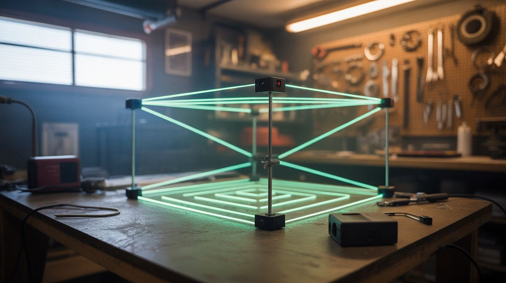

# #176 — Laser Maze

  

> Laser pointers, mirrors, fog, and photosensors create a real-life spy movie laser security maze in your garage.

## Ratings

     

## 🧪 What Is It?

A grid of laser beams crisscrosses a room at various heights and angles. Add fog or haze and the beams become visible as bright lines in the air — exactly like the laser security systems in heist movies. Players have to navigate through the web of beams without breaking any. Photosensors on the receiving end of each beam detect when a beam is interrupted, triggering an alarm (buzzer, siren, flashing lights).

This is an absolute hit at parties, Halloween events, and kids' birthday parties. It combines the theatrics of visible laser beams in fog with the game mechanic of physical challenge. Set it up in a garage, hallway, or basement and you've got an attraction that people will line up to try.

<strong>🧰 Ingredients</strong>

- [ ] Laser pointers or laser diode modules — 5-10 of them, red or green *(source: dollar store, online, ~$1-3 each)*
- [ ] Small mirrors for redirecting beams *(source: craft store mirror tiles or broken compact mirrors, ~$3)*
- [ ] Photoresistors (LDR) or photodiodes — one per beam endpoint *(source: electronics supplier, ~$0.50 each)*
- [ ] Arduino or Raspberry Pi for detecting beam breaks *(source: online, ~$5)*
- [ ] Buzzer or alarm for triggers *(source: electronics supplier or salvaged from alarm clock, ~$2)*
- [ ] Fog machine or haze machine *(source: party supply store, ~$15-25 rental/purchase)*
- [ ] Clamps, clothespins, and small tripods for positioning lasers *(source: dollar store and around the house, ~$5)*
- [ ] Black tape and zip ties *(source: around the house)*
- [ ] Timer display (optional) for scoring *(source: phone app or Arduino-driven display)*

## 🔨 Build Steps

1. **Plan the beam layout.** Sketch the room and plan where each laser beam will cross. Vary heights — some at ankle level (step over), some at waist height (duck under), some diagonal (limbo sideways). Leave enough gap between beams for a person to physically pass through. Start with 5-7 beams and add more for difficulty.

2. **Mount the lasers.** Attach each laser pointer or module to a fixed position — clamped to a shelf, taped to a wall, or mounted on a small tripod or block of wood. The beam must be perfectly still and precisely aimed. Use a binder clip or clothespin to hold the laser button down for continuous operation.

3. **Set up beam paths.** Aim each laser directly at its target — either a photosensor on the opposite wall, or a mirror that redirects the beam to another mirror and eventually to a sensor. Mirrors let you create angled beams and extend a single laser through multiple path segments, using fewer laser sources.

4. **Install the photosensors.** Mount a photoresistor or photodiode at the endpoint of each beam. Position it so the laser dot hits it directly. When the beam is unbroken, the sensor reads high light. When someone's body interrupts the beam, the sensor reads low/no light. The Arduino monitors these transitions.

5. **Program the detection system.** Write Arduino code that monitors all photosensor inputs. When any sensor drops below a threshold (beam broken), trigger the alarm output. Add a short delay (50-100ms) to avoid false triggers from fog density changes. The alarm can be a buzzer, siren, LED flasher, or all three.

6. **Add fog.** Set up the fog machine at floor level. The fog makes the laser beams visible as bright lines in the air — without fog, the beams are invisible (which is a different kind of challenge, but less cinematic). A light haze is better than dense fog — you want the beams clearly visible but the room still navigable.

7. **Add lighting and atmosphere.** Kill all room lights except the lasers. Add dramatic background music (spy movie soundtrack) and red or blue accent lighting. The fog + colored lasers + darkness creates an incredibly immersive atmosphere.

8. **Test and calibrate.** Walk through the maze yourself. Verify each beam triggers the alarm when broken. Check for blind spots where someone could slip through without breaking a beam. Adjust beam positions to close gaps. Make sure the fog density doesn't cause false alarms — the photosensors should be calibrated for the ambient fog level.

9. **Add scoring.** Use the Arduino to track the time from entry to exit and count beam breaks. Display the time and score on a screen or scoreboard. This turns it from a one-time experience into a competitive game people will attempt over and over.

## ⚠️ Safety Notes

> [!WARNING]
> **Laser eye safety.** Use Class 2 lasers only (under 5mW). Position all beams so they can't accidentally hit someone in the eye — no beams at exact eye height, no beams aimed toward the entrance/exit where someone might look directly into them. Green lasers are more eye-visible at lower power, so you can use dimmer ones.

- **Fog machine safety.** The fog machine nozzle is very hot. Keep it elevated and out of the path where players crawl. Fog fluid can make floors slippery — put down non-slip mats if the floor is smooth. Ensure room ventilation so fog doesn't accumulate to uncomfortable density.
- **Physical injury from the maze.** People will be ducking, crawling, and contorting. Make sure there are no sharp edges, hard corners, or objects on the floor that someone could land on. Pad any hard surfaces at head height.

## 🔗 See Also

- [Laser Fog Projector](017-laser-fog-projector/) — lasers and fog for visual art instead of a game
- [Pepper's Ghost Hologram](171-peppers-ghost-hologram/) — another theatrical illusion build

