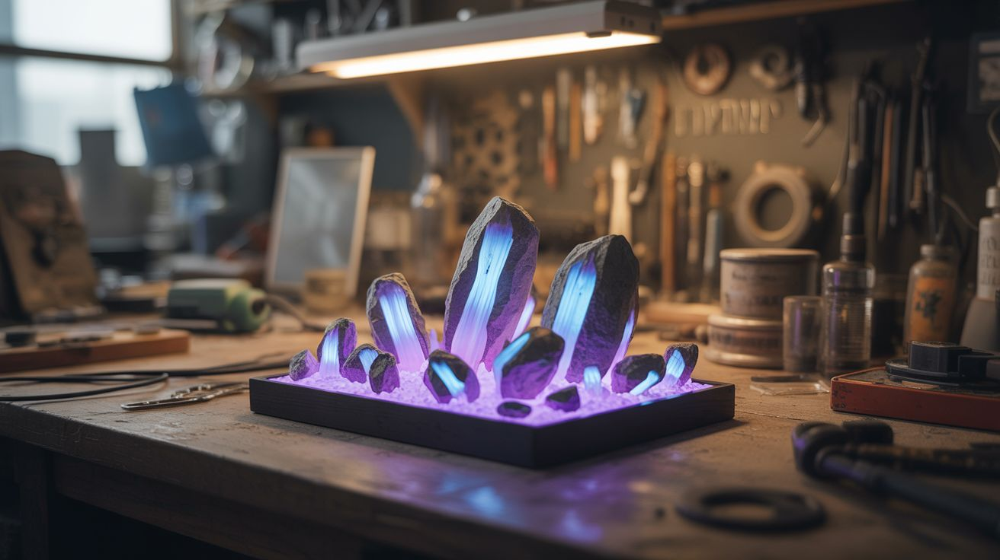

# #177 — UV Mineral Display

  

> Collect fluorescent minerals and display them under UV light — ordinary-looking rocks that glow like radioactive alien crystals.

## Ratings

     

## 🧪 What Is It?

Many common minerals fluoresce under ultraviolet light — they absorb UV photons and re-emit them as vivid visible light. Calcite glows red or orange. Fluorite (the mineral fluorescence is named after) glows blue or purple. Willemite glows an intense green. Sodalite switches from boring gray to blazing orange. Under normal light, these rocks look completely ordinary. Under UV, they look like props from a sci-fi movie.

Building a UV mineral display means collecting fluorescent specimens and mounting them in a display case with UV LED lighting. Flip a switch and a shelf of ordinary rocks transforms into a collection of glowing alien crystals. It's geology, physics, and interior design all in one.

<strong>🧰 Ingredients</strong>

- [ ] Fluorescent mineral specimens — calcite, fluorite, willemite, sodalite, scheelite, etc. *(source: rock shows, online mineral shops, or find them yourself — ~$3-15 per specimen)*
- [ ] UV LED strip or UV flashlight (shortwave 254nm is best for minerals, but longwave 365-395nm works for many) *(source: online, ~$8-15 for LED strip; shortwave UV lamp ~$25-40)*
- [ ] Display case or shadow box *(source: thrift store, craft store, or build from scrap wood, ~$5-10)*
- [ ] Black fabric or paint for display lining *(source: craft store, ~$3)*
- [ ] Small labels for identifying specimens *(source: around the house)*
- [ ] Toggle switch for UV lights *(source: hardware store, ~$2)*
- [ ] Power supply for UV LEDs *(source: wall adapter, free-$5)*

## 🔨 Build Steps

1. **Acquire fluorescent minerals.** Start with the "Big Four" that are widely available and dramatically fluorescent: calcite (red/orange/pink), fluorite (blue/purple), willemite (green), and sodalite/hackmanite (orange). Online mineral dealers sell "fluorescent specimen" collections. Local gem and mineral shows are even better — you can test specimens under UV before buying.

2. **Test your specimens.** Not all specimens of a given mineral are fluorescent — it depends on trace impurities. Test each rock under UV light before incorporating it into your display. Some minerals fluoresce under longwave UV (365nm) but not shortwave (254nm), and vice versa. Some fluoresce different colors under different wavelengths.

3. **Build or prepare the display case.** Line the interior of a shadow box, shelf, or display case with black fabric or flat black paint. The dark background maximizes the contrast of the glowing minerals. Individual compartments or small platforms for each specimen work well.

4. **Install UV lighting.** Mount UV LED strips along the top and/or sides of the display case, aimed at the specimens. Position them so the UV light hits the minerals evenly but isn't visible directly to the viewer. For the most dramatic effect, install both longwave (365nm) and shortwave (254nm) UV sources on separate switches — some minerals glow differently under each.

5. **Arrange the specimens.** Position each mineral in the display case. Put the brightest fluorescers in prominent positions. Group by color for a rainbow effect, or by mineral type for an educational layout. Leave enough space between specimens that each one is distinct.

6. **Add labels.** Label each specimen with the mineral name, fluorescent color, and wavelength it responds to. This adds educational value and lets visitors understand what they're seeing. Use white paint or white ink on black labels — they'll glow too under UV, which is a nice touch.

7. **Wire the lighting.** Connect the UV LED strips to a toggle switch and power supply. Ideally, add a second switch for normal white LEDs so viewers can compare the minerals under regular light vs. UV light. The before/after reveal — ordinary rocks under white light, then glowing alien crystals under UV — is the best part.

8. **Optional: add phosphorescent specimens.** Some minerals (like certain calcites) are phosphorescent — they continue to glow after the UV light is turned off. Include these and demonstrate the "afterglow" effect by turning the UV off and watching certain specimens continue to emit light for seconds or minutes.

## ⚠️ Safety Notes

> [!WARNING]
> **Shortwave UV (254nm) is dangerous.** UVC light at 254nm causes skin burns and eye damage (photokeratitis — essentially sunburn on your corneas). If using a shortwave UV lamp, wear UV-blocking safety glasses and minimize direct skin exposure. Never look directly at a shortwave UV source. Longwave UV (365-395nm) is much safer but can still cause eye discomfort with prolonged direct exposure.

- **Some fluorescent minerals contain toxic elements.** Willemite contains zinc, scheelite contains tungsten, and some uranium-bearing minerals (autunite, torbernite) are mildly radioactive. Wash hands after handling. Don't grind or inhale dust from mineral specimens. Display them, don't eat them.

## 🔗 See Also

- [UV Reactive Water Wall](023-uv-reactive-water-wall.md) — UV fluorescence in liquid form
- [Polarization Art](174-polarization-art.md) — another hidden visual phenomenon revealed through physics
