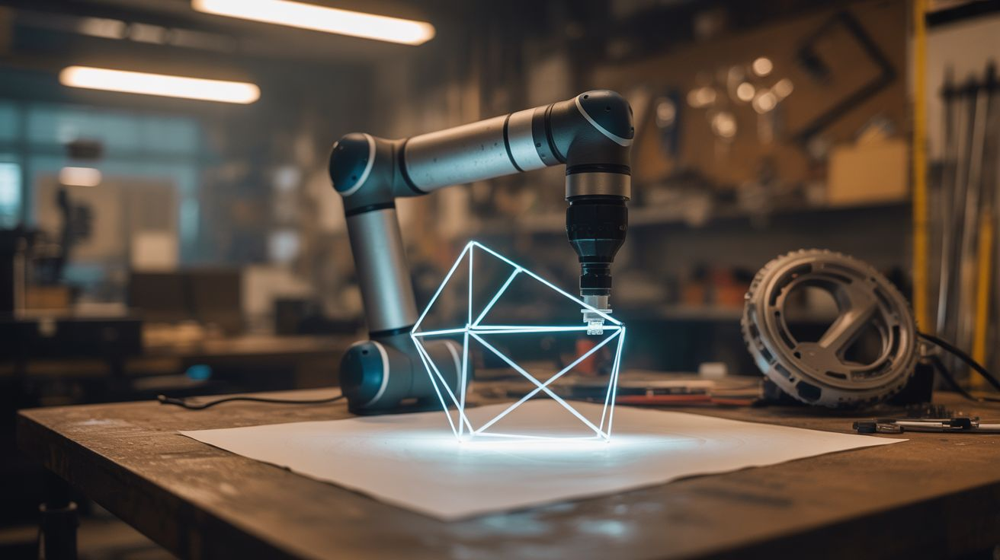

# #178 — Light Painting Robot

  

> An LED mounted on a robot arm, combined with a long-exposure camera, draws perfect geometric light art in the dark.

## Ratings

| Jaw Drop Rating | Brain Melt Level | Wallet Damage | Spicy Level | Clout Potential | Time to Build |
|---|---|---|---|---|---|
| ⭐⭐⭐⭐⭐ | ⭐⭐⭐⭐ | ⭐⭐ | ⭐ | ⭐⭐⭐⭐⭐ | ⭐⭐⭐⭐ |

## What Is It?

Light painting is a photography technique where you move a light source through the frame during a long exposure — the camera records the entire path of the light as a bright streak. Normally this is done by hand, which limits you to wobbly, imprecise shapes. But mount an LED on a computer-controlled robot arm (even a simple one made from servos), program precise movements, and you get perfect circles, spirals, mathematical curves, 3D wireframes, and geometric patterns drawn in light with inhuman precision.

The photographs look like CGI renders but they're real, single-exposure images. No post-processing, no compositing — the light trail exists in physical space during the exposure. The robot can draw patterns that would take a human years of practice to approximate, and it can reproduce them identically every time. Change the LED color mid-path and you get multicolor designs.

## Ingredients

- [ ] Servo motors — 2-3 standard hobby servos (SG90 or MG996R) *(source: online, ~$2-5 each)*
- [ ] Arduino or similar microcontroller *(source: online, ~$5)*
- [ ] RGB LED or addressable LED (WS2812B single pixel) *(source: online, ~$1)*
- [ ] Servo arm/bracket material — popsicle sticks, 3D-printed arms, or aluminum strips *(source: craft store or hardware store, ~$3)*
- [ ] Camera with manual/bulb exposure mode (phone with long exposure app works) *(source: already own)*
- [ ] Tripod for the camera *(source: already own or ~$10)*
- [ ] Screws, hot glue, zip ties for assembly *(source: around the house)*
- [ ] USB cable and computer for programming *(source: already own)*
- [ ] Dark room or outdoor nighttime location *(source: free)*

## Build Steps

1. **Design the robot arm.** A simple 2-axis arm (shoulder joint + elbow joint) driven by two servos can reach most of a 2D plane. For 3D light painting, add a third axis or mount the arm on a rotating base. Each servo provides one degree of freedom. Simple is fine — even a single servo sweeping an LED in an arc produces stunning results.

2. **Build the arm.** Mount servos to rigid arms (popsicle sticks for small builds, aluminum strip or 3D-printed parts for larger builds). Connect the arm segments at the servo hinge points. The LED mounts at the tip of the last arm segment — this is the "end effector" that traces the light path.

3. **Mount the LED.** Attach an RGB LED to the end of the arm. Wire it back to the Arduino through the arm segments, securing the wires so they don't snag during motion. If using an addressable LED (WS2812B), you only need 3 wires — power, ground, and data — and you can change color programmatically at any point during the drawing.

4. **Program basic motion.** Write Arduino code that moves the servos through a simple pattern — a circle, a figure-eight, or a sine wave. Use the Servo library and `millis()` for smooth, time-based motion rather than `delay()`. Map mathematical functions to servo angles: `angle = amplitude * sin(time * frequency)` produces smooth oscillations.

5. **Set up the camera.** Mount your camera on a tripod, aimed at the robot arm from the front. Set to manual mode: ISO 100 (lowest), aperture f/8-f/16, and shutter speed to "bulb" or the longest available (30 seconds to several minutes). In a dark room, only the LED will register on the sensor.

6. **Take test exposures.** Turn off all lights. Start the camera exposure, then trigger the robot arm program to run its pattern. When the pattern completes, close the shutter. Review the image — you should see the LED's path traced as a clean, sharp light trail. Adjust exposure time and LED brightness as needed.

7. **Program complex patterns.** Move beyond simple oscillations. Program mathematical curves: spirals (`r = theta`), Lissajous figures (`x = sin(a*t), y = sin(b*t)`), rose curves, cardioids, or 3D wireframe projections. Change the LED color at specific points in the path for multicolor designs. The mathematical precision of the robot is what sets this apart from hand-held light painting.

8. **Layer multiple exposures.** For extremely complex images, run multiple patterns during a single long exposure, changing color between each. Or composite multiple exposures in-camera by keeping the shutter open while running several different programs. Some cameras support multiple-exposure modes for this.

9. **Scale up.** For larger installations, use bigger servos and longer arms, or mount the whole assembly on a motorized dolly that translates across the frame. A robot arm on a moving platform can fill an entire room with light trails in a single exposure.

## Safety Notes

- **Servo motors can pinch.** When the arm is in motion, keep fingers clear of the servo joints and arm segments. Small servos have surprising torque — enough to pinch skin or trap a finger. Don't reach into the arm's sweep zone while a program is running.
- **Long-exposure photography in the dark means working in the dark.** Set up the workspace in daylight, then darken it. Know where everything is. Don't trip over the tripod or robot assembly. Mark any obstacles with small glow-in-the-dark tape.

## See Also

- [POV Globe](019-pov-globe.md) — LEDs creating images through rapid motion, perceived by the eye instead of captured by camera
- [Holographic Fan Display](022-holographic-fan-display.md) — another project where LEDs and motion create images
