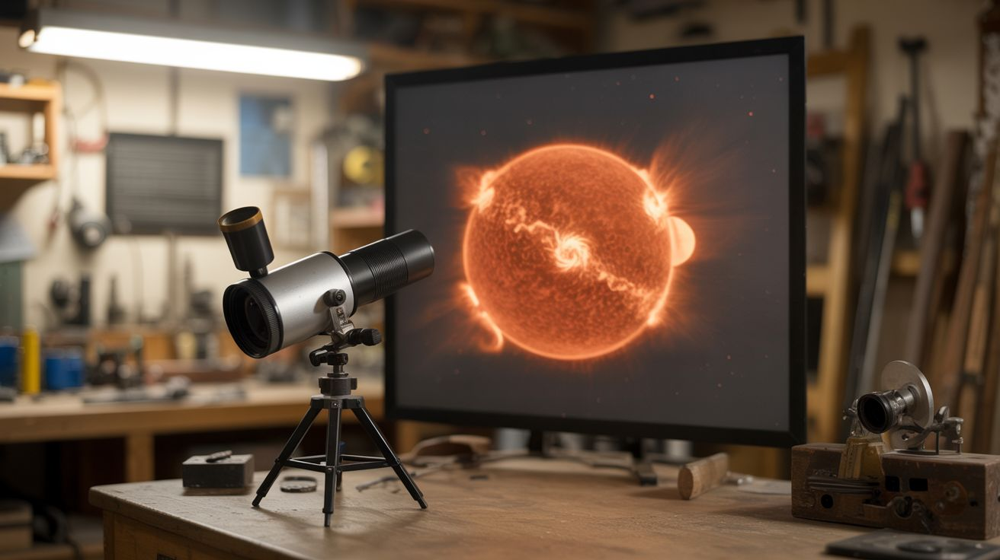

# #179 — Solar Projector

  

> A telescope projects a live image of the sun onto a screen, revealing sunspots, solar granulation, and eclipses in real time.

## Ratings

     

## 🧪 What Is It?

Instead of looking through a telescope at the sun (which would instantly and permanently damage your eyes), you aim the telescope at the sun and let the image project out of the eyepiece onto a white screen or card held behind it. The result is a bright, clear, magnified image of the sun's disc showing real features: dark sunspots moving across the surface, bright faculae near the limb, and during eclipses, the moon's shadow crossing the disc in real time.

This technique — called solar projection — was used by astronomers for centuries before solar filters existed. It's completely safe when done correctly (you never look through the telescope), requires no special equipment beyond a basic telescope and a white surface, and produces an image that multiple people can view simultaneously. During a solar eclipse, it's the easiest and safest way to share the view with a crowd.

<strong>🧰 Ingredients</strong>

- [ ] Telescope or binoculars — any refractor or reflector works, even a cheap one *(source: thrift store, attic, or borrow from a friend, ~$10-30)*
- [ ] White cardboard, poster board, or a white wall for the projection screen *(source: around the house, free)*
- [ ] Tripod or mount for the telescope *(source: comes with the telescope, or improvise with a camera tripod)*
- [ ] Cardboard sunshade (to shade the screen from direct sunlight) *(source: scrap cardboard, free)*
- [ ] Optional: finder scope cap or cap with pinhole for safe aiming *(source: make from cardboard)*

## 🔨 Build Steps

1. **Set up the telescope.** Mount the telescope on its tripod in a sunny location. Remove the lens/dust cap. If the telescope has a finder scope, cap it or remove it entirely — never look through any optic pointed at the sun.

2. **Insert a low-power eyepiece.** Use the lowest-magnification (longest focal length) eyepiece available. Higher magnifications concentrate heat at the eyepiece, which can crack the lens or melt the eyepiece housing. Low power spreads the light out over a larger area and is safer for the optics.

3. **Aim without looking.** Point the telescope in the general direction of the sun by watching the telescope's shadow on the ground. When the telescope's shadow is at its shortest (the tube is pointed at the sun), the telescope is roughly aimed. Refine the aim by holding a white card about 12 inches behind the eyepiece — the sun's projected disc will appear as a bright circle on the card.

4. **Focus the projection.** Move the card closer or farther from the eyepiece until the sun's disc is in sharp focus. You should see a clean, bright circle with a sharp edge. If sunspots are present, they'll appear as small dark marks on the projected disc. Adjust the telescope's focus knob for the sharpest image.

5. **Add a sunshade.** Cut a hole in a large piece of cardboard that fits around the telescope tube. This shades the projection card from direct sunlight, dramatically improving contrast. The projected solar image will be much easier to see against the shaded card.

6. **Observe sunspots.** Sunspots appear as dark spots on the projected disc. Larger ones are clearly visible; smaller ones may require better focus or slightly higher magnification. Sketch their positions — if you observe daily, you can track them moving across the sun's face as it rotates (one full rotation takes about 27 days).

7. **Track solar changes.** Set up the projection at the same time each day and sketch or photograph what you see. Sunspot groups grow, shrink, and move. Solar activity follows an approximately 11-year cycle. During solar maximum, the disc may have dozens of spots; during minimum, it may be perfectly blank for weeks.

## ⚠️ Safety Notes

> [!WARNING]
> **NEVER look through the telescope at the sun.** This will cause immediate, permanent, painless blindness. The telescope concentrates sunlight by a factor of hundreds — it's worse than looking at the sun with the naked eye. Always project the image onto a screen. Cap or remove the finder scope before aiming anywhere near the sun.

- **Eyepiece heating.** The concentrated sunlight passing through the eyepiece generates significant heat. Don't leave the telescope aimed at the sun for more than a few minutes at a time with cheap plastic eyepieces — they can melt or crack. Metal eyepieces are more durable. If the eyepiece gets hot to the touch, give it a break.
- **Don't let children look through the telescope.** Even with the projection method set up, children may be tempted to peek through the eyepiece. Supervise closely, or physically block access to the eyepiece end.

## 🔗 See Also

- [Fresnel Lens Solar Forge](020-fresnel-lens-solar-forge/) — another project harnessing the sun's energy with optics (with very different intent)
- [Schlieren Optics](172-schlieren-optics/) — another optics project that reveals normally invisible phenomena
