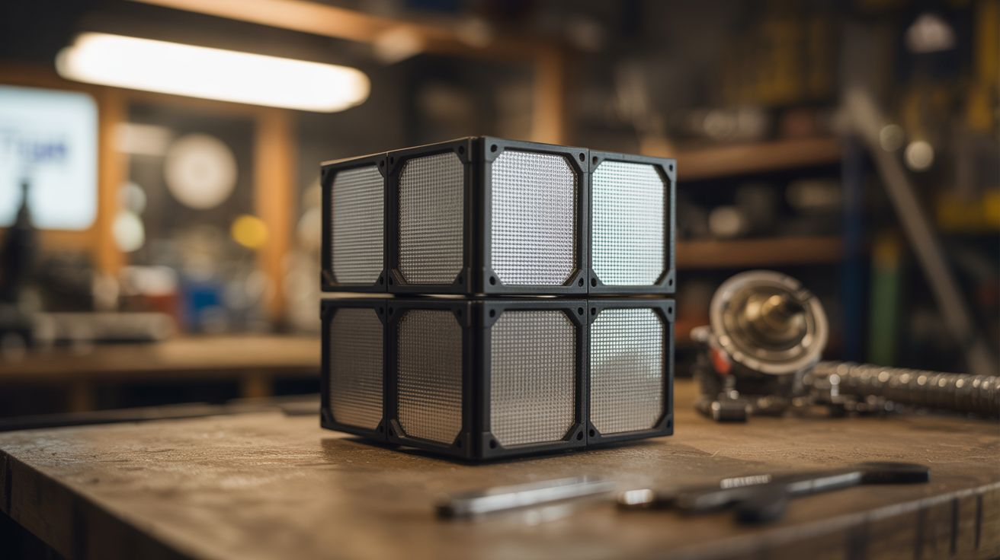

# #180 — Retroreflector Array

  

> Corner cube reflectors that bounce any light beam directly back to its source — the same tech left on the Moon by Apollo astronauts.

## Ratings

     

## 🧪 What Is It?

A retroreflector is a device that reflects light (or any wave) directly back toward its source, regardless of the angle it arrives from. The simplest form is a corner cube — three flat mirrors arranged at exactly 90 degrees to each other, like the inside corner of a box. Any light ray that enters the corner bounces off all three surfaces and exits traveling in exactly the opposite direction, parallel to the incoming ray.

NASA left retroreflector arrays on the Moon during the Apollo missions. Scientists on Earth shoot lasers at them and time the return pulse to measure the Earth-Moon distance to millimeter precision. You can build the exact same thing from mirror tiles and test it with a laser pointer — shine a laser at it from across a field and the beam comes right back to you. It works from any angle without any aiming, which is what makes it borderline magical.

<strong>🧰 Ingredients</strong>

- [ ] Small mirror tiles or pieces of mirror — three per corner cube *(source: craft store or dollar store, ~$2-3)*
- [ ] Hot glue or epoxy for joining at 90 degrees *(source: around the house)*
- [ ] Right-angle bracket or wooden corner jig for alignment *(source: hardware store corner brace or scrap wood, ~$2)*
- [ ] Laser pointer for testing *(source: already own, ~$2-5)*
- [ ] Mounting board or frame *(source: scrap wood, free)*
- [ ] Ruler and square for precise alignment *(source: already own)*

## 🔨 Build Steps

1. **Understand the geometry.** A corner cube retroreflector uses three mutually perpendicular mirrors — imagine standing inside the corner of a room and looking at the point where two walls and the floor meet. That corner, with mirror surfaces, is a retroreflector. Light bounces off all three surfaces and reverses direction, no matter what angle it enters from.

2. **Cut the mirrors.** You need three square mirrors of equal size for each corner cube. 2-inch squares work well for a first build. Glass mirror tiles from craft stores are pre-cut and work perfectly. If cutting mirrors, score with a glass cutter and snap cleanly.

3. **Build an alignment jig.** Precision matters — the three mirrors must meet at exactly 90 degrees. Use a machinist's square or a wooden corner (like the inside corner of a box) as a jig. The more precisely you achieve 90-degree angles, the more accurately the reflector returns light to its source.

4. **Assemble the corner cube.** Place one mirror flat (the "floor"). Glue the second mirror perpendicular to the first along one edge (a "wall"). Glue the third mirror perpendicular to both the first and second (the second "wall"), meeting at the corner. Use hot glue or epoxy. Hold everything against the alignment jig until the adhesive sets.

5. **Test with a laser.** In a dim room, shine a laser pointer at the corner cube from a few feet away. Look for the return beam — it should come back very close to the laser source. Move to different angles and distances. A well-made corner cube returns the beam from any angle within its roughly 60-degree field of view.

6. **Build an array.** Make 4-9 corner cubes and mount them on a board in a grid pattern, all oriented with their corners facing outward. An array provides a larger target area and returns more light. This is how the Apollo retroreflector arrays work — multiple corner cubes packed together.

7. **Range test.** Take the array outdoors at night. Have a friend hold it at increasing distances while you shine a laser at it. A well-made array is visible as a bright return dot from hundreds of feet away. The return dot stays bright regardless of where you stand — unlike a flat mirror, which only returns light at one specific angle.

8. **Demonstrate the principle.** The most impressive demo: have someone hold the array at 100+ feet, shine a laser at it, and show that the return dot appears right next to the laser pointer. Then rotate the array to different angles — the return dot barely moves. This is the retroreflection principle that makes road signs, bicycle reflectors, and cat's eyes work.

## ⚠️ Safety Notes

> [!WARNING]
> **Laser pointer safety.** The laser beam returns directly to the source — which means directly toward your eyes. Aim the laser slightly off-axis from your face. Never look directly along the laser beam toward the reflector. Use low-power (Class 2, under 5mW) lasers only.

- **Glass mirror edges are sharp.** Handle cut mirrors carefully. Tape the edges of each mirror tile before assembly to prevent cuts. Wear gloves when cutting or handling glass.

## 🔗 See Also

- [Laser Maze](176-laser-maze/) — another laser optics project with a very different purpose
- [Laser Fog Projector](017-laser-fog-projector/) — lasers for visual display instead of precision optics
