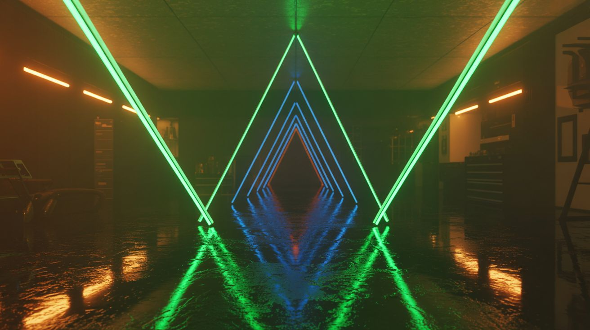

# 💡 Light & Visual

  

  

> Builds that bend, focus, project, and manipulate light in ways that make people question reality — holograms, lasers, optics, and things that glow.

This category covers everything that plays with the electromagnetic spectrum: lasers, LEDs, lenses, UV, plasma glow, optical illusions, and projection. Some are pure art, some are real science instruments, and some are both.

**Common salvage sources:** CRT TVs (flyback transformers, electron guns), rear-projection TVs (Fresnel lenses), old monitors, LED strips, laser pointers, mirrors, lenses from cameras and projectors.

## Builds

<a class="cat-card" href="015-giant-plasma-globe.md">
#015Giant Plasma Globe

Jaw

Brain

Wallet

Spicy

Clout

Time

</a>
<a class="cat-card" href="016-infinity-mirror-table.md">
#016Infinity Mirror Table

Jaw

Brain

Wallet

Spicy

Clout

Time

</a>
<a class="cat-card" href="017-laser-fog-projector.md">
#017Laser Fog Projector

Jaw

Brain

Wallet

Spicy

Clout

Time

</a>
<a class="cat-card" href="018-shadow-chandelier.md">
#018Shadow Chandelier

Jaw

Brain

Wallet

Spicy

Clout

Time

</a>
<a class="cat-card" href="019-pov-globe.md">
#019POV Globe

Jaw

Brain

Wallet

Spicy

Clout

Time

</a>
<a class="cat-card" href="020-fresnel-lens-solar-forge.md">
#020Fresnel Lens Solar Forge

Jaw

Brain

Wallet

Spicy

Clout

Time

</a>
<a class="cat-card" href="021-crt-oscilloscope-visualizer.md">
#021CRT Oscilloscope Visualizer

Jaw

Brain

Wallet

Spicy

Clout

Time

</a>
<a class="cat-card" href="022-holographic-fan-display.md">
#022Holographic Fan Display

Jaw

Brain

Wallet

Spicy

Clout

Time

</a>
<a class="cat-card" href="023-uv-reactive-water-wall.md">
#023UV Reactive Water Wall

Jaw

Brain

Wallet

Spicy

Clout

Time

</a>
<a class="cat-card" href="171-peppers-ghost-hologram.md">
#171Pepper's Ghost Hologram

Jaw

Brain

Wallet

Spicy

Clout

Time

</a>
<a class="cat-card" href="172-schlieren-optics.md">
#172Schlieren Optics

Jaw

Brain

Wallet

Spicy

Clout

Time

</a>
<a class="cat-card" href="173-fiber-optic-star-ceiling.md">
#173Fiber Optic Star Ceiling

Jaw

Brain

Wallet

Spicy

Clout

Time

</a>
<a class="cat-card" href="174-polarization-art.md">
#174Polarization Art

Jaw

Brain

Wallet

Spicy

Clout

Time

</a>
<a class="cat-card" href="175-camera-obscura-room.md">
#175Camera Obscura Room

Jaw

Brain

Wallet

Spicy

Clout

Time

</a>
<a class="cat-card" href="176-laser-maze.md">
#176Laser Maze

Jaw

Brain

Wallet

Spicy

Clout

Time

</a>
<a class="cat-card" href="177-uv-mineral-display.md">
#177UV Mineral Display

Jaw

Brain

Wallet

Spicy

Clout

Time

</a>
<a class="cat-card" href="178-light-painting-robot.md">
#178Light Painting Robot

Jaw

Brain

Wallet

Spicy

Clout

Time

</a>
<a class="cat-card" href="179-solar-projector.md">
#179Solar Projector

Jaw

Brain

Wallet

Spicy

Clout

Time

</a>
<a class="cat-card" href="180-retroreflector-array.md">
#180Retroreflector Array

Jaw

Brain

Wallet

Spicy

Clout

Time

</a>

---

### Suggested Build Order

Start with passive optics, progress toward motorized displays:

1. **[#020 — Fresnel Lens Solar Forge](020-fresnel-lens-solar-forge.md)** — Pure optics. No electronics.
2. **[#175 — Camera Obscura Room](175-camera-obscura-room.md)** — Passive pinhole optics.
3. **[#179 — Solar Projector](179-solar-projector.md)** — Lens-based light projection.
4. **[#171 — Pepper's Ghost Hologram](171-peppers-ghost-hologram.md)** — Classical optical illusion.
5. **[#180 — Retroreflector Array](180-retroreflector-array.md)** — Reflective geometry.
6. **[#177 — UV Mineral Display](177-uv-mineral-display.md)** — UV light source + specimens.
7. **[#017 — Laser Fog Projector](017-laser-fog-projector.md)** — Laser + fog machine.
8. **[#016 — Infinity Mirror Table](016-infinity-mirror-table.md)** — LED strips + mirror arrays.
9. **[#023 — UV Reactive Water Wall](023-uv-reactive-water-wall.md)** — UV lighting + water circulation.
10. **[#174 — Polarization Art](174-polarization-art.md)** — Polarizer filter experiments.
11. **[#176 — Laser Maze](176-laser-maze.md)** — Laser grid assembly.
12. **[#173 — Fiber Optic Star Ceiling](173-fiber-optic-star-ceiling.md)** — Extended installation project.
13. **[#015 — Giant Plasma Globe](015-giant-plasma-globe.md)** — High-voltage plasma filaments.
14. **[#021 — CRT Oscilloscope Visualizer](021-crt-oscilloscope-visualizer.md)** — CRT deflection circuits.
15. **[#018 — Shadow Chandelier](018-shadow-chandelier.md)** — Complex 3D shadow geometry.
16. **[#172 — Schlieren Optics](172-schlieren-optics.md)** — Advanced optical theory.
17. **[#022 — Holographic Fan Display](022-holographic-fan-display.md)** — POV display synchronization.
18. **[#019 — POV Globe](019-pov-globe.md)** — Fast LED control + rotation timing.
19. **[#178 — Light Painting Robot](178-light-painting-robot.md)** — Motorized light source + camera sync.

### Related Categories

- [Laser Lab](../laser-lab/) — Laser projection and beam steering
- [Mad Scientist](../mad-scientist/) — Plasma and electrical discharge effects
- [Raspberry Pi & Arduino](../pi-and-arduino/) — LED control and POV displays

---

## 📚 Reference Guides

- [Tools Needed](../../reference/tools-needed.md)
- [Sourcing Guide](../../reference/sourcing-guide.md)
- [Difficulty & Ratings Guide](../../reference/difficulty-guide.md)
