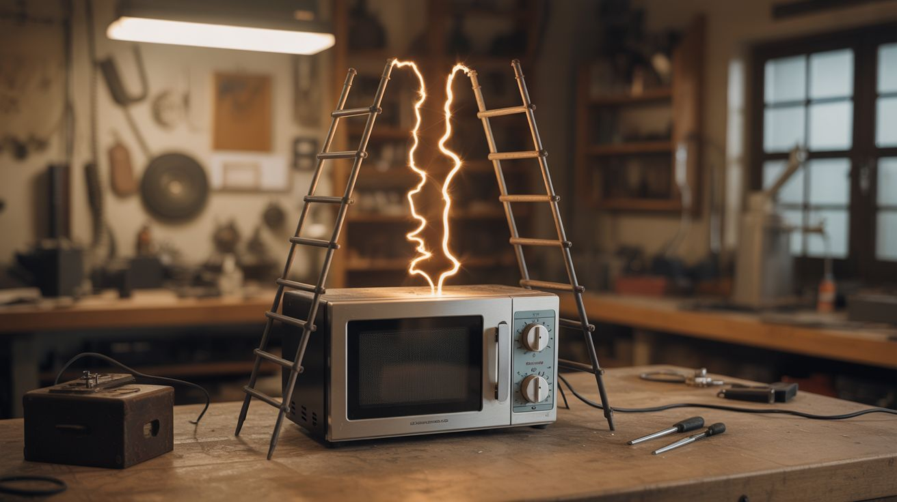

# #034 — Jacob's Ladder

  

> Two diverging metal rods plus a microwave oven transformer equals a rising arc of electricity that looks like it belongs in a 1930s horror movie.

## Ratings

     

## 🧪 What Is It?

A Jacob's Ladder is the most iconic high-voltage display ever built. Two metal rods spread apart from bottom to top in a V shape, powered by a high-voltage transformer. An arc strikes at the narrow bottom where the rods are closest, then the heated air rises (hot air rises — basic convection), carrying the arc upward along the diverging rods. As the arc stretches and the gap widens, it eventually breaks. A new arc immediately forms at the bottom and the cycle repeats. The result is a continuous stream of arcs climbing the rods like a ladder.

It's the prop from every mad scientist movie ever made, and it's genuinely one of the simplest high-voltage builds you can do. A microwave oven transformer provides the voltage. Two copper or steel rods provide the path. That's basically it.

<strong>🧰 Ingredients</strong>

- [ ] Microwave oven transformer (MOT) — provides ~2000V AC *(dead microwave, e-waste)*
- [ ] Copper or steel rod x2 — 1/4" diameter, 18"-24" long *(hardware store)*
- [ ] Non-conductive base — thick wood block, cutting board, or acrylic sheet *(hardware store)*
- [ ] Power cord with plug *(old appliance)*
- [ ] Power switch — mains-rated toggle switch *(hardware store, electronics supplier)*
- [ ] Inline fuse — 15A, for the primary side *(hardware store)*
- [ ] Insulated standoffs or blocks — to mount the rods to the base *(hardware store)*
- [ ] Wire nuts and electrical tape *(hardware store)*

## 🔨 Build Steps

1. **Recover the MOT.** Remove the transformer from a dead microwave. Discharge the microwave's capacitor first — short the terminals with an insulated screwdriver. Unbolt the transformer. Leave both the primary and secondary windings intact — unlike the spot welder build, you want the full high-voltage output here.
2. **Remove the magnetic shunts (optional).** The shunts between the primary and secondary limit current. Removing them increases the available current and makes for fatter, louder arcs. However, this also increases the danger — a shunt-less MOT can deliver lethal current. For a first build, leave the shunts in.
3. **Bend the rods.** Bend each rod into an L shape at the bottom — the horizontal portion bolts to the base, and the vertical portion forms the ladder. The two rods should be about 1/4" apart at the bottom and 4"-6" apart at the top. The wider the spread at the top, the taller the arc travels before breaking.
4. **Mount the rods to the base.** Bolt the horizontal sections of the rods to the non-conductive base using insulated standoffs. The rods must be rigidly mounted — vibration from the arc will make loose rods buzz annoyingly. Keep the rods at least 6" from the transformer.
5. **Wire the secondary.** Connect each of the MOT's secondary (high-voltage) output wires to one of the rods. Use insulated connectors and keep the connections as short as possible. The secondary output is approximately 2000V AC — it will arc to anything grounded within range.
6. **Wire the primary.** Connect the power cord through the fuse and switch to the MOT's primary winding. The primary is the winding with the thicker wire and fewer turns. Double-check which winding is which — connecting mains to the secondary would produce only a few volts on the primary and accomplish nothing.
7. **First power-on.** Stand back, flip the switch, and watch. An arc should strike at the bottom of the V and begin climbing. If no arc forms, the bottom gap is too wide — bend the rods closer together. If the arc stays at the bottom and doesn't climb, the rods may be too parallel — increase the spread at the top.
8. **Tune the geometry.** Adjust the rod angle to change how fast the arcs climb and how tall they get. A steeper V makes arcs climb faster and break sooner. A shallower V gives slower, taller arcs. The sweet spot depends on your MOT's voltage and current.

## ⚠️ Safety Notes

> **Spicy Level 5 build.** Read the [Safety Guide](../../docs/safety/README.md) and [High Voltage Safety](../../docs/safety/high-voltage.md) before starting.

- A microwave oven transformer outputs approximately 2000V at up to 500mA — well above the lethal threshold. This is the most dangerous build in this category. Never touch the rods, the secondary wiring, or anything connected to the high-voltage side while the unit is powered or for several seconds after power-off. The MOT has enough stored energy in its magnetic field to deliver a lethal shock even after the switch is flipped off.
- The arc produces intense UV light, ozone, and nitrogen oxides. Operate outdoors or in a very well-ventilated space. Do not stare directly at the arc — it can cause arc eye (UV burns to the cornea), similar to welding flash. Safety glasses with UV protection are recommended.
- Keep all flammable materials far from the device. The arc temperature exceeds 5000°F. Paper, fabric, or solvents near the arc will ignite.

## 🔗 See Also

- [Musical Tesla Coil](033-musical-tesla-coil.md)
- [Electromagnetic Can Crusher](035-electromagnetic-can-crusher.md)

**References:**
- [Appliance Teardown Guide](../../docs/reference/appliance-teardown-guide.md)
- [Technical Glossary](../../docs/reference/glossary.md)
