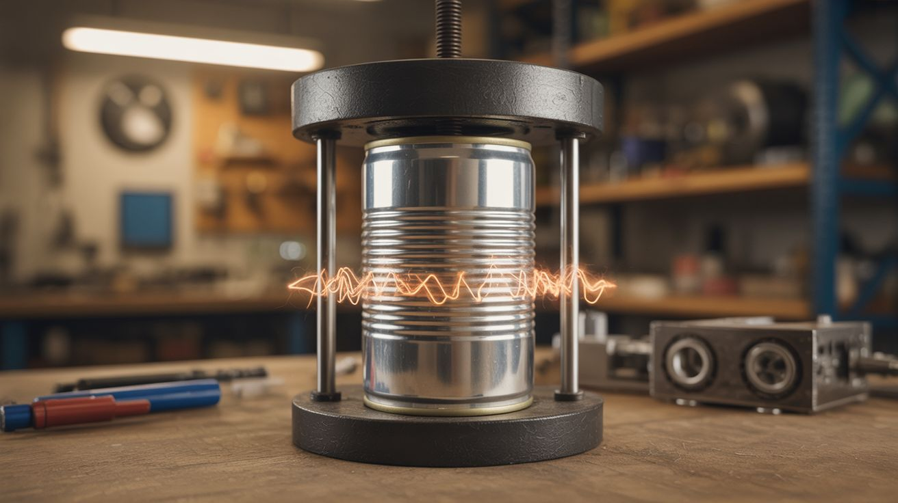

# #035 — Electromagnetic Can Crusher

  

> A massive capacitor bank discharges through a coil wrapped around an aluminum can. Eddy currents generate an opposing magnetic field that crushes the can inward in milliseconds. Physics at its most violent.

## Ratings

     

## 🧪 What Is It?

When a massive pulse of current flows through a coil, it creates a rapidly expanding magnetic field. If an aluminum can sits inside that coil, the changing field induces eddy currents in the can's walls. Those eddy currents generate their own magnetic field, which opposes the coil's field. The result: the can wall is squeezed inward by magnetic pressure. With enough current flowing fast enough, the can collapses to a fraction of its diameter in a few milliseconds — often with a satisfying bang like a gunshot.

This is the same principle behind electromagnetic forming used in aerospace manufacturing. You're just doing it with a capacitor bank made from salvaged microwave capacitors and a coil wound from heavy copper wire. The can never touches anything. It's crushed by an invisible magnetic force. It's one of the most dramatic demonstrations of electromagnetism you can build.

<strong>🧰 Ingredients</strong>

- [ ] Capacitor bank — 6-12 microwave oven capacitors (~1µF at 2100V each) wired in parallel *(dead microwaves, e-waste)*
- [ ] Heavy copper wire — 8-10 AWG solid or stranded, ~15 feet for the crushing coil *(electrical supplier)*
- [ ] High-current switch — SCR, IGBT, or a spark gap switch *(electronics supplier)*
- [ ] Charging circuit — variac + bridge rectifier, or a dedicated HV charging supply *(electronics supplier, salvage)*
- [ ] Bleed/dump resistors — high-wattage, for safe discharge *(electronics supplier)*
- [ ] Voltmeter — for monitoring charge voltage *(multimeter or panel meter)*
- [ ] Aluminum soda cans — empty *(recycling bin)*
- [ ] Coil form — PVC pipe or cardboard tube, slightly larger than a soda can *(hardware store)*
- [ ] Heavy-gauge bus bar wire — for connecting the capacitor bank to the coil *(electrical supplier)*
- [ ] Insulated enclosure for the capacitor bank *(plywood box)*
- [ ] Safety shield — polycarbonate or plexiglass sheet *(hardware store)*

## 🔨 Build Steps

1. **Build the capacitor bank.** Wire 6-12 microwave capacitors in parallel — positive to positive, negative to negative. Mount them securely in a plywood or plastic enclosure. Label polarity clearly. Install bleed resistors across the bank. Install a voltmeter across the terminals.
2. **Build the charging circuit.** A variac feeding a bridge rectifier provides adjustable DC voltage. Include a current-limiting resistor (50-100 ohm, high-wattage) in series to prevent inrush damage. Charge slowly — monitor the voltage and stop at your target (typically 1500-2000V).
3. **Wind the crushing coil.** Wrap 8-12 turns of the heavy copper wire tightly around the coil form (PVC pipe). The coil should be about the height of a soda can. The tighter and more uniform the winding, the more uniform the crush. Secure the turns with electrical tape or epoxy.
4. **Install the discharge switch.** An SCR or IGBT in series between the capacitor bank and the coil handles the discharge pulse. The trigger circuit fires the switch, dumping the stored energy through the coil in a few milliseconds. A spark gap switch (two blunt electrodes with an adjustable gap) also works — when the voltage exceeds the breakdown voltage of the gap, it fires automatically.
5. **Wire the discharge circuit.** Use the thickest, shortest wire possible between the capacitor bank, the switch, and the coil. Every inch of wire and every connection adds resistance, which reduces peak current and weakens the crush. Bolted copper bus bar connections are ideal. Avoid solder joints in the high-current path — they can't handle the pulse.
6. **Test at low energy first.** Charge the bank to a low voltage (500-800V) for your first test. Place an empty can inside the coil. Stand behind the safety shield. Fire the switch. The can should show visible dimpling or partial crushing. Increase voltage on subsequent tests.
7. **Tune for maximum crush.** Higher voltage = more energy = harder crush. More capacitance = more energy at the same voltage. Tighter coil turns = more uniform field. A well-built system at 2000V with 10µF of capacitance will crush a can to about 1/3 its original diameter. The bang is loud.
8. **Document everything.** Slow-motion video of the crush is spectacular. The can collapses faster than the eye can follow at full power. A phone camera at 240fps captures the deformation beautifully.

## ⚠️ Safety Notes

> **Spicy Level 4 build.** Read the [Safety Guide](../../docs/safety/README.md) and [High Voltage Safety](../../docs/safety/high-voltage.md) before starting.

- This is a high-energy capacitor bank at lethal voltage. Everything in the safety notes for the Capacitor Discharge Welder applies here, multiplied. The energy levels here are higher. Treat the charged bank as a lethal hazard at all times. Verify discharge before touching anything. Bleed resistors must be installed and functional.
- The discharge produces an extremely loud bang at high energy levels — comparable to a gunshot. Hearing protection is required. The electromagnetic pulse can also damage nearby electronics — keep phones, computers, and credit cards well away from the coil.
- Aluminum fragments can be ejected if the can tears instead of crushing cleanly. Always operate behind a polycarbonate shield. Never put your hands inside or near the coil when the bank is charged.

## 🔗 See Also

- [Rail Gun](036-rail-gun.md)
- [Coil Gun](037-coil-gun.md)

**References:**

- [Appliance Teardown Guide](../../docs/reference/appliance-teardown-guide.md)
- [Technical Glossary](../../docs/reference/glossary.md)
