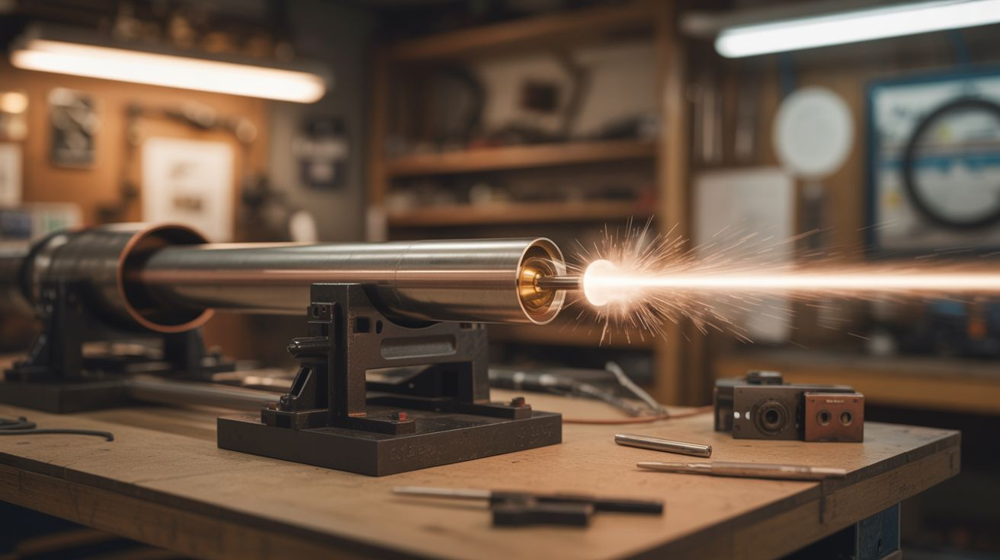

# #036 — Rail Gun

  

> Two parallel copper rails, a conductive projectile, and a massive current pulse. The Lorentz force launches the projectile at terrifying speed. Welcome to electromagnetic propulsion.

## Ratings

     

## 🧪 What Is It?

A rail gun uses the Lorentz force to accelerate a projectile. Two parallel conducting rails sit side by side. A conductive armature (the projectile) bridges the gap between them. When massive current flows down one rail, across the armature, and back up the other rail, the current-carrying armature sits in its own magnetic field. The Lorentz force (current x magnetic field) pushes the armature down the rails and out the barrel at high speed.

The US Navy spent billions developing rail guns that launch projectiles at Mach 6. Yours won't hit Mach 6. But with a large capacitor bank and thick copper rails, you can build a benchtop rail gun that launches small aluminum or copper slugs fast enough to puncture cardboard, embed in wood, or dent metal. The flash and bang at the breech is spectacular — the current vaporizes the contact surface between armature and rails, producing a plasma flash.

This is one of the most advanced builds in this book. It requires understanding of high-current electrical systems, material science, and basic ballistics. It's also one of the most rewarding.

<strong>🧰 Ingredients</strong>

- [ ] Capacitor bank — large, 10-50µF at 400-2000V (from microwave caps, camera flash caps, or purchased) *(e-waste, electronics supplier)*
- [ ] Copper rail stock — 1/4" x 1" flat copper bar, two pieces, 12"-24" long *(electrical supplier, metal supplier)*
- [ ] Non-conductive rail housing — G10/FR4 fiberglass, HDPE, or hardwood block, machined to hold the rails parallel *(plastics supplier, hardware store)*
- [ ] Armature/projectile — copper or aluminum slug that fits snugly between the rails *(machined from copper bar)*
- [ ] High-current discharge switch — SCR, IGBT, or spark gap *(electronics supplier)*
- [ ] Charging circuit — variable DC supply with current limiting *(electronics supplier, salvage)*
- [ ] Heavy copper bus bars and bolted connections — for the power path *(electrical supplier)*
- [ ] Bleed resistors — across the capacitor bank *(electronics supplier)*
- [ ] Voltmeter — to monitor charge *(multimeter)*
- [ ] Backstop — sand bucket, ballistic gel, or thick wood block to catch projectiles *(hardware store)*
- [ ] Safety shield — polycarbonate sheet *(hardware store)*

## 🔨 Build Steps

1. **Build the capacitor bank.** Wire capacitors in parallel for maximum current delivery. The bank needs to be low-impedance — use bolted copper bus bar connections, not wire. Every milliohm of resistance reduces peak current and projectile velocity. Mount capacitors in an insulated enclosure with bleed resistors.
2. **Machine the rail housing.** Mill or route two parallel grooves in a block of non-conductive material (G10 fiberglass is ideal — it's strong, insulating, and heat-resistant). The grooves should hold the copper rails parallel with a gap of 1/4"-3/8" between them. The rails must be perfectly straight and parallel.
3. **Install the rails.** Press-fit or epoxy the copper bars into the grooves. The rails should extend 12"-18" — longer rails give more acceleration time but also more friction loss. Bolt the breech ends (back end) of the rails to the bus bars leading to the capacitor bank through the switch.
4. **Make the armatures.** Machine small slugs from copper or aluminum that slide freely between the rails with minimal gap. The armature must make solid contact with both rails simultaneously. A rectangular cross-section matching the rail gap works. Some builders use a thin copper foil armature that vaporizes on firing — the plasma expansion adds propulsive force.
5. **Install the discharge switch.** Wire an SCR, IGBT, or spark gap between the capacitor bank and the rail breech. The switch must handle the full bank voltage and peak current — which can reach thousands of amps. A gate driver circuit fires the SCR on command.
6. **Build the trigger system.** A momentary switch triggers the gate driver, which fires the SCR, which dumps the capacitor bank through the rails. The trigger circuit should be electrically isolated from the power circuit to protect the operator. An optocoupler provides this isolation.
7. **Set up the range.** Build a backstop — a sand-filled bucket or a thick hardwood block at least 10 feet downrange. Clear the area behind and to the sides of the rail gun. Place the polycarbonate safety shield between you and the breech (the flash from the breech is intense and can spray copper vapor).
8. **Test at low energy.** Load an armature, charge to a low voltage (200-400V), stand behind the shield, and fire. The armature should exit the muzzle and hit the backstop. If it doesn't move, check rail-to-armature contact and circuit resistance. Increase energy gradually on subsequent shots.
9. **Inspect rails after each shot.** The armature scours the rail surface on each firing. Pitting and erosion are normal but degrade performance over time. Sand the rails smooth between shots. Copper armatures are gentler on the rails than aluminum.
10. **Document muzzle velocity.** Two chronograph screens or a ballistic pendulum let you measure projectile speed. This lets you calculate the system's efficiency (kinetic energy out / electrical energy in). Expect 1-5% efficiency — most energy goes into heating the rails and armature.

## ⚠️ Safety Notes

- This device launches projectiles. Treat it with the same respect as a firearm. Never point it at anything you don't intend to destroy. Always use a backstop. Clear the range before firing. Be aware of local laws regarding electromagnetic launchers — some jurisdictions regulate them.
- The capacitor bank is a lethal electrical hazard at the voltages involved. All capacitor safety rules apply: bleed resistors, voltmeter verification, insulated enclosure, never touch when charged. The energy stored in a 50µF bank at 2000V is 100 joules — enough to cause fatal cardiac arrest.
- The breech flash produces intense light, UV radiation, and vaporized copper particles. Wear safety glasses (welding shade if available), hearing protection, and do not breathe the copper vapor. Operate outdoors or in a very well-ventilated space.

## 🔗 See Also

- [Coil Gun](037-coil-gun.md)
- [Electromagnetic Can Crusher](035-electromagnetic-can-crusher.md)
