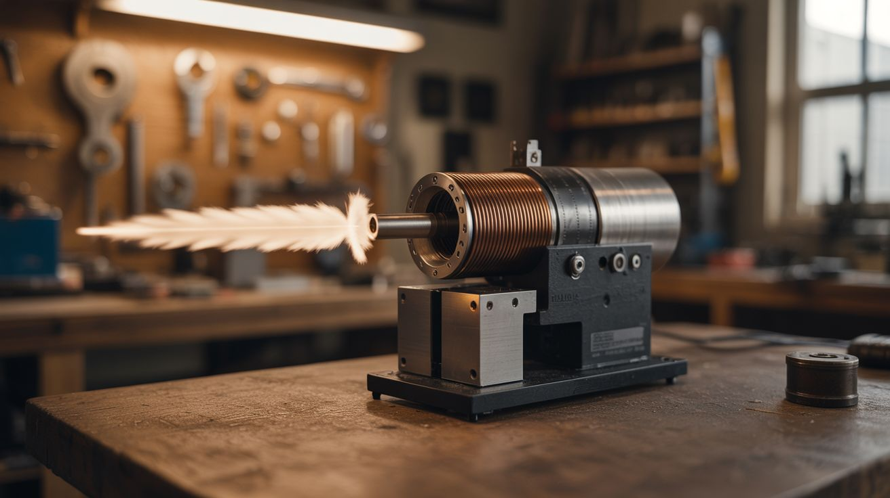

# #037 — Coil Gun

  

> A solenoid coil plus a capacitor bank yanks a ferromagnetic projectile down a barrel at high speed. Quieter and cleaner than a rail gun, and arguably more elegant.

## Ratings

| Jaw Drop Rating | Brain Melt Level | Wallet Damage | Spicy Level | Clout Potential | Time to Build |
|---|---|---|---|---|---|
| ⭐⭐⭐⭐ | ⭐⭐⭐⭐ | ⭐⭐⭐ | ⭐⭐⭐⭐ | ⭐⭐⭐⭐ | ⭐⭐⭐ |

## What Is It?

A coil gun (also called a Gauss gun) uses a solenoid electromagnet to accelerate a ferromagnetic projectile (typically a steel or iron slug) down a barrel. When current flows through the coil, it creates a strong magnetic field that pulls the slug toward the coil's center. The trick is timing — you have to cut the current just as the projectile reaches the center. If you leave it on, the same magnetic field that pulled the projectile in will now pull it back, decelerating it. Time it right and the projectile exits the coil at speed.

Multi-stage coil guns use several coils in sequence, each one firing as the projectile passes through, adding more velocity at each stage. With good timing circuits and a decent capacitor bank, a multi-stage coil gun can launch small steel slugs fast enough to embed in wood.

Compared to a rail gun, a coil gun is cleaner (no rail erosion), quieter (no plasma flash), and easier on components. It's also more mechanically elegant — the projectile doesn't touch the barrel.

## Ingredients

- [ ] Capacitor bank — camera flash capacitors (330µF, 300-400V) or microwave caps *(disposable cameras, e-waste)*
- [ ] Barrel — non-magnetic tube (brass, aluminum, or plastic), inner diameter matched to the projectile *(hardware store, hobby shop)*
- [ ] Magnet wire — 18-22 AWG enameled copper wire for winding the coils *(electronics supplier)*
- [ ] Projectile — soft iron or mild steel rod, cut to 1-2 cm lengths *(hardware store, machine shop)*
- [ ] SCR or MOSFET — for switching the discharge pulse *(electronics supplier)*
- [ ] Timing circuit — 555 timer or microcontroller-based, with optical sensors for multi-stage *(electronics supplier)*
- [ ] Optical sensors (for multi-stage) — IR LED + phototransistor pairs at each coil *(electronics supplier)*
- [ ] Charging circuit — disposable camera flash circuit, or dedicated boost converter *(salvage, electronics supplier)*
- [ ] Bleed resistors *(electronics supplier)*
- [ ] Freewheeling diodes — across each coil to absorb inductive kickback *(electronics supplier)*
- [ ] Insulated project enclosure *(hardware store)*

## Build Steps

1. **Wind the coils.** Wrap 50-100 turns of magnet wire tightly around the barrel to form a solenoid coil. For a single-stage gun, one coil is all you need. For multi-stage, wind 3-5 identical coils spaced along the barrel. Each coil should be slightly longer than the projectile. Secure windings with epoxy or varnish.
2. **Build the capacitor bank.** For camera flash caps: wire multiple 330µF capacitors in parallel per stage. Each stage gets its own capacitor bank. Install bleed resistors across each bank. For microwave caps: use one per stage — they store more energy but at higher voltage, requiring more careful handling.
3. **Build the charging circuit.** The flash circuit from a disposable camera charges its capacitor to ~300V from a 1.5V battery. Salvage these circuits — they work perfectly as cap chargers. One per stage. Add a voltmeter or charge indicator LED so you know when each stage is ready.
4. **Install the switching.** Each coil fires through its own SCR. The SCR gate is triggered by either a manual button (single-stage) or an optical sensor (multi-stage). Install a freewheeling diode across each coil (reverse-biased) — when the SCR turns off, the collapsing magnetic field produces a voltage spike that will destroy the SCR without this diode.
5. **Build the optical timing (multi-stage).** Mount an IR LED on one side of the barrel and a phototransistor on the other, just before each coil. When the projectile passes, it breaks the beam, triggering the next coil to fire. This passive timing automatically adjusts to the projectile's speed at each stage.
6. **Assemble the barrel assembly.** Mount the barrel horizontally on a base. Position the coils, sensors, and wiring. Keep the barrel straight — any bend will cause the projectile to scrape, adding friction and reducing velocity.
7. **Load and fire.** Drop a projectile into the breech end of the barrel. Charge all stages. The projectile should be positioned just behind the first coil. Fire the first stage (manually for single-stage, or give the projectile a gentle push to trigger the first sensor for multi-stage). The projectile accelerates through each stage and exits the muzzle.
8. **Measure and optimize.** Use a chronograph or ballistic pendulum to measure muzzle velocity. Experiment with coil length, number of turns, capacitor voltage, and sensor placement. The biggest efficiency gains come from precise timing — the coil must turn off before the projectile passes center.

## Safety Notes

- Even a modest coil gun can launch projectiles fast enough to cause injury. Always use a backstop. Never point it at anyone. Treat it as you would any projectile launcher.
- Camera flash capacitors at 300V can deliver a painful and potentially dangerous shock. Microwave capacitors at 2000V+ are lethal. Always discharge capacitors before working on the circuit. Bleed resistors must be installed and verified functional.
- The magnetic field from the coils is strong enough to attract nearby ferromagnetic objects (tools, screws, keys). Keep the work area clear of loose metal when the coils are energized.

## See Also

- [Rail Gun](036-rail-gun.md)
- [Electromagnetic Levitator](038-electromagnetic-levitator.md)

**References:**
- [Appliance Teardown Guide](../../reference/appliance-teardown-guide.md)
- [Technical Glossary](../../reference/glossary.md)
