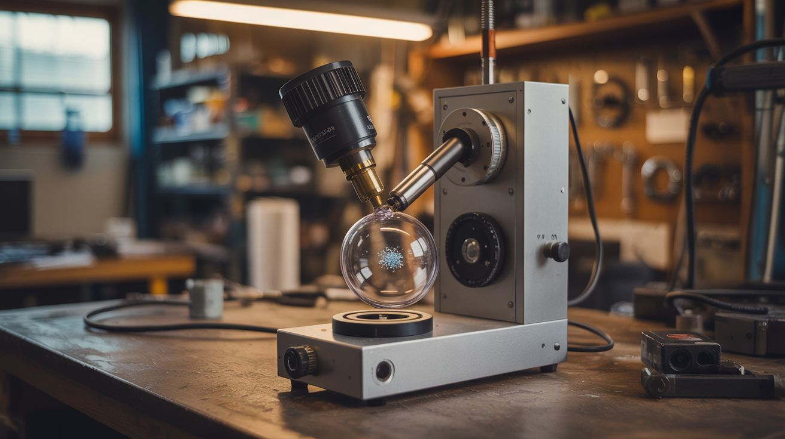

# #040 — Mass Spectrometer

  

> Ionize atoms, accelerate them through a magnetic field, and watch them separate by mass. Identify elements in your garage. This is real analytical chemistry.

## Ratings

| Jaw Drop Rating | Brain Melt Level | Wallet Damage | Spicy Level | Clout Potential | Time to Build |
|---|---|---|---|---|---|
| ⭐⭐⭐⭐ | ⭐⭐⭐⭐⭐ | ⭐⭐⭐ | ⭐⭐⭐ | ⭐⭐⭐⭐ | ⭐⭐⭐⭐ |

## What Is It?

A mass spectrometer separates atoms or molecules by their mass-to-charge ratio. The basic principle: ionize a sample (strip electrons from atoms to give them a charge), accelerate the ions through an electric field, then bend their path with a magnetic field. Lighter ions curve more, heavier ions curve less. A detector at different positions identifies which masses are present. It's how scientists identify unknown substances, detect isotopes, and verify the composition of materials.

Building one at home requires a vacuum (ions need a clear path without air molecules in the way), an ionization source (a hot filament works), accelerating electrodes, a magnetic field (permanent magnets or an electromagnet), and a detector (a simple metal plate connected to a sensitive ammeter). CRT components provide several of these — the electron gun is an ionization and acceleration system, and the deflection coils provide the magnetic field. The vacuum chamber from build #039 provides the environment.

This is the most intellectually demanding build in the book. But the payoff is insane — you're doing real analytical chemistry with salvaged parts.

## Ingredients

- [ ] Vacuum chamber — from build #039 or similar, capable of reaching <1 Torr *(see [Vacuum Chamber](039-vacuum-chamber.md))*
- [ ] CRT electron gun assembly — provides hot filament and accelerating electrodes *(dead CRT TV)*
- [ ] High-voltage power supply — adjustable 500V-5kV DC, low current *(flyback driver or dedicated supply)*
- [ ] Strong magnets — neodymium block magnets or an electromagnet coil *(dead hard drives, motors)*
- [ ] Detector plate — small metal plate or wire, connected to a sensitive current meter *(scrap, electronics supplier)*
- [ ] Picoammeter or electrometer — to detect the tiny ion currents *(electronics supplier, or build from op-amps)*
- [ ] Vacuum feedthrough connectors — to bring electrical connections through the chamber wall *(lab supply, or epoxied wire-through-holes)*
- [ ] Sample introduction system — a small crucible on the filament for solid samples *(scrap metal)*
- [ ] Adjustable mounting hardware — to position the detector at different angles/positions *(hardware store)*
- [ ] Insulating standoffs — ceramic or PTFE *(hardware store, lab supply)*

## Build Steps

1. **Set up the vacuum system.** You need a vacuum chamber that can reach at least moderate vacuum (below 1 Torr, ideally below 0.1 Torr). The fridge compressor vacuum pump from build #039 may not go deep enough alone — consider adding a second stage or using a rotary vane pump from salvage (old HVAC equipment).
2. **Prepare the ionization source.** The simplest method: a hot tungsten filament (from an incandescent bulb) heated by passing current through it. Electrons boil off the filament (thermionic emission). Place the sample material near the filament — the hot electrons bombard the sample atoms and knock electrons loose, creating positive ions. Alternatively, use the electron gun assembly from a CRT, which already has a filament, grid, and accelerating anode.
3. **Build the accelerating stage.** Two plates with a voltage difference between them accelerate the ions from the source toward the magnetic field region. The higher the voltage, the faster the ions travel and the harder they are to bend — but also the more energy resolution you get. Start at 500V and adjust from there.
4. **Set up the magnetic field.** Mount strong permanent magnets (neodymium from hard drives) to create a uniform field perpendicular to the ion path. The ions enter the field region traveling in a straight line and curve into a circular arc. The radius of the arc depends on the ion's mass-to-charge ratio — this is the separation.
5. **Position the detector.** Mount a small metal plate or wire at the expected landing zone for the ions. Different masses land at different positions along the arc. Either move the detector to scan across positions, or use multiple detectors. Connect the detector to a sensitive current meter — ion currents are in the nanoamp to picoamp range.
6. **Build the detection electronics.** A transimpedance amplifier (op-amp with high-value feedback resistor) converts the tiny ion current to a measurable voltage. An LF356 or OPA128 op-amp with a 1G-ohm feedback resistor can detect picoamp currents. Shield the circuit carefully — electromagnetic noise will swamp the signal otherwise.
7. **Seal and evacuate.** Install all components inside the vacuum chamber. Run all electrical connections through vacuum feedthroughs (wires epoxied through holes in the chamber wall, or proper feedthrough connectors). Evacuate the chamber.
8. **Calibrate with known samples.** Start with a known element — copper wire heated on the filament, for instance. The mass spectrum of copper should show peaks at mass 63 and 65 (the two natural isotopes). If you can distinguish these two peaks, your spectrometer has useful resolution.
9. **Analyze unknowns.** Once calibrated, introduce unknown metal samples. The mass spectrum identifies the elements present by their atomic masses. Even crude resolution can distinguish iron (56) from copper (63) from zinc (65) from lead (207).

## Safety Notes

- The high-voltage power supply is a serious electrical hazard. All HV connections must be inside the sealed vacuum chamber or properly insulated. Never open the chamber while the HV is energized. Include interlocks that cut HV when the chamber is vented.
- Heating unknown materials can release toxic fumes. Even inside a vacuum chamber, the material may outgas when you vent. Vent the chamber outdoors or into a fume hood. Do not vaporize lead, mercury, cadmium, or other toxic metals without proper containment.
- The vacuum chamber is under mechanical stress (atmospheric pressure pushing inward). All the safety notes from build #039 apply.

## See Also

- [Vacuum Chamber](039-vacuum-chamber.md)
- [Cloud Chamber](041-cloud-chamber.md)

**References:**
- [Appliance Teardown Guide](../../reference/appliance-teardown-guide.md)
- [Technical Glossary](../../reference/glossary.md)
