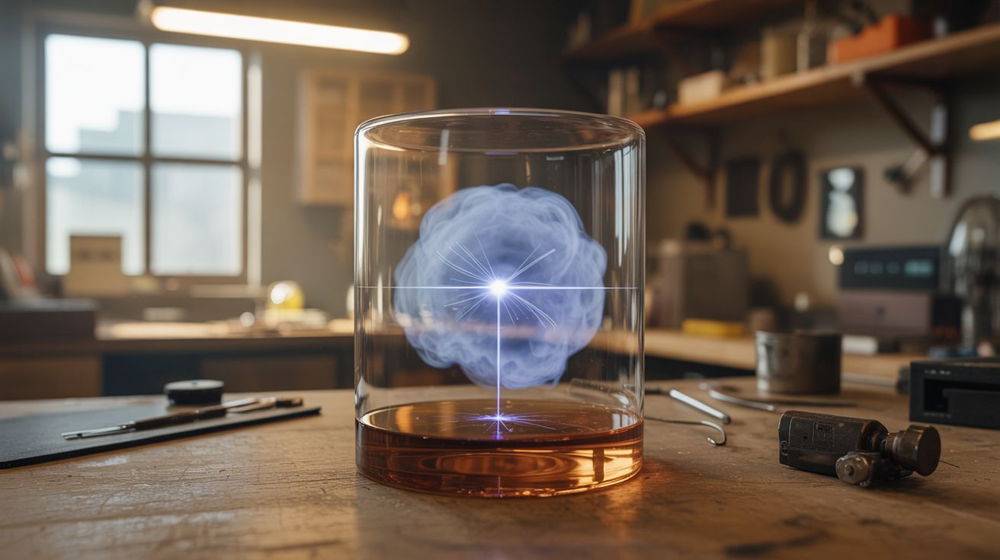

# #041 — Cloud Chamber

  

> Supersaturated alcohol vapor makes invisible radiation visible. Watch alpha particles, beta particles, and cosmic rays leave vapor trails in real time. In your kitchen.

## Ratings

| Jaw Drop Rating | Brain Melt Level | Wallet Damage | Spicy Level | Clout Potential | Time to Build |
|---|---|---|---|---|---|
| ⭐⭐⭐⭐⭐ | ⭐⭐ | ⭐⭐ | ⭐⭐ | ⭐⭐⭐⭐⭐ | ⭐ |

## What Is It?

A cloud chamber is one of the oldest particle physics detectors, and it still produces results that make people's jaws drop. The principle: a layer of supersaturated alcohol vapor sits just above a very cold surface. When a charged particle (alpha, beta, or cosmic ray muon) passes through the vapor, it ionizes air molecules along its path. Those ions act as condensation nuclei — alcohol vapor condenses on them, forming a visible trail. You literally see the path of individual subatomic particles as wispy white lines appearing and fading in the vapor.

Alpha particles from a household smoke detector's americium-241 source leave short, fat trails. Beta particles leave long, thin, wandering trails. Cosmic ray muons — particles from deep space that rain down on Earth constantly — leave perfectly straight lines that shoot across the entire chamber. It's breathtaking. You're watching particles from outer space pass through your kitchen.

The build is dead simple. A fish tank or clear container, isopropyl alcohol, dry ice, and a strong flashlight. That's it. Under an hour from start to first particle tracks.

## Ingredients

- [ ] Clear container — glass fish tank, large glass bowl, or clear plastic box with a flat bottom *(pet store, thrift store)*
- [ ] Felt or sponge strip — to line the top inner edge for alcohol supply *(craft store)*
- [ ] Isopropyl alcohol — 99% concentration (not 70%) *(pharmacy, hardware store)*
- [ ] Dry ice — a slab large enough to cover the container's bottom *(grocery store, ice supplier)*
- [ ] Black felt or construction paper — for the bottom of the container (dark background) *(craft store)*
- [ ] Bright flashlight or LED strip — angled to illuminate the vapor layer from the side *(already own, hardware store)*
- [ ] Insulated gloves — for handling dry ice *(hardware store)*
- [ ] Radioactive source (optional) — americium-241 from a smoke detector, or a thoriated welding rod *(hardware store, home)*
- [ ] Metal tray — to hold the dry ice under the container *(kitchen)*

## Build Steps

1. **Prepare the container.** Place a strip of black felt or construction paper on the inside bottom of the container (this becomes the top when flipped). Glue or tape a strip of felt or sponge around the inside upper rim of the container. This felt strip will hold the alcohol and let it evaporate slowly downward.
2. **Soak the felt with alcohol.** Saturate the felt strip with 99% isopropyl alcohol. Don't flood the container — you want the felt damp, not dripping. The alcohol evaporates from the warm top and settles toward the cold bottom, creating a supersaturated vapor layer.
3. **Set up the dry ice.** Place a slab of dry ice on the metal tray. The dry ice should be large enough to cover the full bottom area of your container. Use insulated gloves — dry ice is -78°C (-109°F) and will cause instant frostbite on bare skin.
4. **Invert the container.** Flip the container upside down and set it on the dry ice slab, so the felt strip (now at the top inside) is warm and the open bottom (now sealed against the dry ice) is extremely cold. The alcohol vapor sinks from the felt toward the cold surface, creating a supersaturated zone about 1-2 inches above the dry ice.
5. **Wait for equilibrium.** Give it 5-10 minutes for the temperature gradient to stabilize. The container should be cold enough that you see a faint fog layer forming just above the bottom. This fog layer is where the magic happens.
6. **Illuminate from the side.** Shine a bright, focused light horizontally across the fog layer. LED flashlights or a narrow beam work best. You need the light to catch the tiny condensation trails without washing out the dark background.
7. **Watch for tracks.** In a dark room with the side light on, you should start seeing thin white trails appearing and fading in the fog layer. Short, thick trails are alpha particles (if you have a radioactive source nearby). Long, thin, wiggly trails are beta particles. Perfectly straight lines crossing the entire chamber are cosmic ray muons — these appear with no radioactive source at all, about one every few seconds.
8. **Add a radioactive source (optional).** Place a smoke detector's americium-241 button inside the chamber (remove it from the detector carefully). You'll see a burst of alpha particle trails radiating outward from the source — short, straight, thick lines, all about the same length (because all alpha particles from Am-241 have the same energy). It's stunning.

## Safety Notes

- Dry ice causes severe frostbite on contact with skin. Always handle with insulated gloves. Do not use dry ice in a sealed, unventilated room — it sublimes into CO2 and can displace oxygen in enclosed spaces.
- Isopropyl alcohol is flammable. Keep it away from open flames and heat sources. The vapor is heavier than air and can accumulate near the floor. Work in a ventilated area.
- The americium-241 in a smoke detector emits alpha particles that cannot penetrate skin and are harmless externally. However, do not ingest or inhale the material. Handle the source with tweezers and wash hands afterward. Do not crush or grind the pellet.

## See Also

- [Grape Plasma](042-grape-plasma.md)
- [Vacuum Plasma Cloud Chamber](../unholy-combos/054-vacuum-plasma-cloud-chamber.md)
