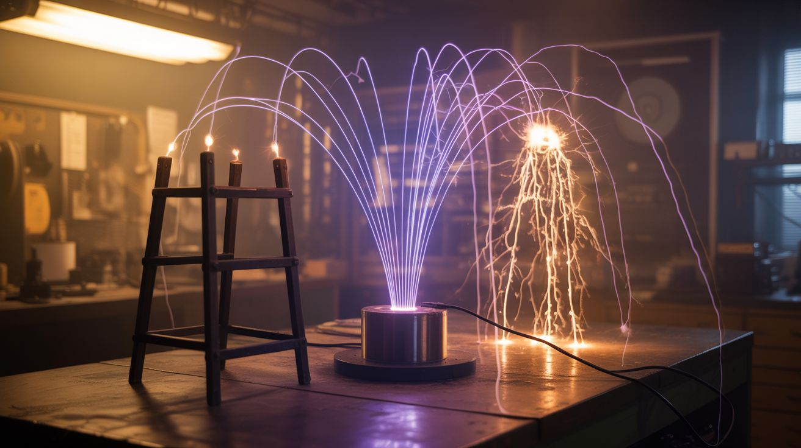

# ⚡ Mad Scientist

  

  

> High voltage, electromagnetic forces, and physics experiments that belong in a government lab but somehow live in your garage. Expect sparks, levitation, and at least one alarmed neighbor.

Tesla coils that play music. Electromagnetic can crushers. Rail guns. Levitating objects. Vacuum chambers. Cloud chambers that reveal invisible radiation. This is the category where you stop building tools and start building demonstrations of raw physical forces.

Most of these builds involve high voltage, strong magnetic fields, or vacuum systems. They demand respect and understanding of the physics involved. But the payoff is seeing forces that are normally invisible made dramatically, unmistakably visible.

---

## Builds

<a class="cat-card" href="033-musical-tesla-coil/">
#033Musical Tesla Coil

Jaw

Brain

Wallet

Spicy

Clout

Time

</a>
<a class="cat-card" href="034-jacobs-ladder/">
#034Jacob's Ladder

Jaw

Brain

Wallet

Spicy

Clout

Time

</a>
<a class="cat-card" href="035-electromagnetic-can-crusher/">
#035Electromagnetic Can Crusher

Jaw

Brain

Wallet

Spicy

Clout

Time

</a>
<a class="cat-card" href="036-rail-gun/">
#036Rail Gun

Jaw

Brain

Wallet

Spicy

Clout

Time

</a>
<a class="cat-card" href="037-coil-gun/">
#037Coil Gun

Jaw

Brain

Wallet

Spicy

Clout

Time

</a>
<a class="cat-card" href="038-electromagnetic-levitator/">
#038Electromagnetic Levitator

Jaw

Brain

Wallet

Spicy

Clout

Time

</a>
<a class="cat-card" href="039-vacuum-chamber/">
#039Vacuum Chamber

Jaw

Brain

Wallet

Spicy

Clout

Time

</a>
<a class="cat-card" href="040-mass-spectrometer/">
#040Mass Spectrometer

Jaw

Brain

Wallet

Spicy

Clout

Time

</a>
<a class="cat-card" href="041-cloud-chamber/">
#041Cloud Chamber

Jaw

Brain

Wallet

Spicy

Clout

Time

</a>
<a class="cat-card" href="042-grape-plasma/">
#042Grape Plasma

Jaw

Brain

Wallet

Spicy

Clout

Time

</a>

---

### Suggested Build Order

Start with kitchen physics, progress toward electromagnetic weapons:

1. **[#042 — Grape Plasma](042-grape-plasma/)** — One-star effort. Microwave + grape = plasma.
2. **[#041 — Cloud Chamber](041-cloud-chamber/)** — See radiation tracks. Simple sealed chamber.
3. **[#034 — Jacob's Ladder](034-jacobs-ladder/)** — Classic high-voltage arc. Basic circuit.
4. **[#039 — Vacuum Chamber](039-vacuum-chamber/)** — Vessel construction with vacuum pump.
5. **[#037 — Coil Gun](037-coil-gun/)** — Electromagnet switching and projectile acceleration.
6. **[#033 — Musical Tesla Coil](033-musical-tesla-coil/)** — Resonant circuits + audio modulation.
7. **[#035 — Electromagnetic Can Crusher](035-electromagnetic-can-crusher/)** — High-current pulse generation.
8. **[#038 — Electromagnetic Levitator](038-electromagnetic-levitator/)** — Feedback control loops for levitation.
9. **[#036 — Rail Gun](036-rail-gun/)** — Extreme current delivery and magnetic field control.
10. **[#040 — Mass Spectrometer](040-mass-spectrometer/)** — The ultimate: vacuum + ions + magnets + detection.

### Related Categories

- [Laser Lab](../laser-lab/) — High-energy physics demonstrations
- [Light & Visual](../light-and-visual/) — Plasma and electrical discharge visualization
- [Junkyard Auto](../junkyard-auto/) — Ignition coil and high-voltage automotive salvage

---

## 📚 Reference Guides

- Tools Needed
- Sourcing Guide
- Difficulty & Ratings Guide
