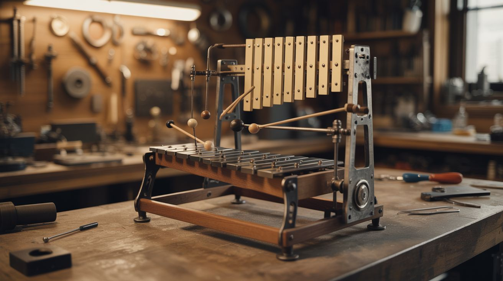

# #181 — Musical Marble Machine

  

> A gravity-powered orchestra made from scrap metal, xylophone bars, and the patience of a watchmaker.

## Ratings

     

## 🧪 What Is It?

A hand-cranked or motor-driven mechanical instrument that lifts steel marbles to the top of a tower, then releases them down a series of ramps, channels, and switches where they strike tuned xylophone bars, bells, and drums to play actual music. Think of it as a giant music box where you can see every note happen.

The magic is in the programming wheel — a large rotating cylinder with adjustable pegs that trigger marble releases at precise moments, turning the machine into a sequencer. Change the pegs, change the song. The whole thing runs on gravity and gears, no electronics required.

<strong>🧰 Ingredients</strong>

- [ ] Steel ball bearings, 10-16mm diameter, at least 50 *(source: dead bearings from skateboards, bikes, or industrial surplus — ~$10 for a bag)*
- [ ] Xylophone or glockenspiel bars, or cut aluminum/steel bar stock to length *(source: thrift store instrument or metal supplier)*
- [ ] Scrap steel or aluminum for ramps, channels, and frame *(source: bed frames, shelf brackets, angle iron from scrap yard)*
- [ ] Large gear set or sprocket + chain for the lift mechanism *(source: old bicycle drivetrain)*
- [ ] Wooden dowels or threaded rod for axles *(source: hardware store)*
- [ ] Plywood or MDF for the programming wheel and base *(source: scrap wood)*
- [ ] Small screws, bolts, and adjustable pegs for the programming drum *(source: hardware store)*
- [ ] Hand crank or small DC motor with gear reduction *(source: dead drill, mixer, or window motor)*
- [ ] Rubber tubing or silicone for marble guides *(source: hardware store or aquarium supply)*
- [ ] Wood glue, epoxy, and assorted fasteners *(source: hardware store)*

## 🔨 Build Steps

1. **Design your scale.** Decide how many notes you want. A pentatonic scale (5 notes) is forgiving and sounds good no matter what. Cut or source your tone bars — each bar's pitch is determined by its length. Shorter = higher pitch. Use an online tuner to file bars to the right note.

2. **Build the frame.** Construct a vertical tower frame from angle iron or heavy wood, at least 3 feet tall. The taller the tower, the more complex the marble path can be. Make it sturdy — the whole machine vibrates when running and a wobbly frame kills the sound.

3. **Create the lift mechanism.** Build a marble elevator using a bicycle chain with small cups or scoops attached at regular intervals. Mount a large sprocket at the top and bottom of the tower. The chain loop carries marbles from the collection bin at the bottom to the release point at the top.

4. **Build the programming wheel.** Cut a large plywood disc (12-18 inches diameter). Drill a grid of holes around the perimeter — one ring of holes per note. Insert removable pegs into the holes where you want notes to trigger. As the wheel rotates, each peg pushes a lever that releases a marble down that note's channel.

5. **Construct the marble channels.** Build angled ramps from sheet metal or aluminum channel that guide each marble from its release point to the correct tone bar. The angle needs to be steep enough that marbles roll reliably but not so steep they fly off the bar without ringing it.

6. **Mount the tone bars.** Suspend each bar on two rubber grommets at its nodal points (about 22% from each end). The bars must be free to vibrate — clamping them kills the sound. Mount them over a resonance box (open wooden box beneath) to amplify the tone.

7. **Add the striking mechanism.** Position each marble channel so the marble drops onto the center of its tone bar from a height of 1-2 inches. Too high and the bar dampens from impact force; too low and you can't hear it. Test and adjust.

8. **Build the collection system.** After striking a bar, marbles need to roll into a funnel that feeds back to the bottom of the lift. Use bent sheet metal to create a catch basin under all the tone bars that slopes toward the chain elevator's intake.

9. **Connect the drive.** Link the programming wheel and the lift chain to the same drive shaft via gears so they stay synchronized. The ratio matters — the lift needs to supply marbles fast enough that the programming wheel never calls for a note with no marble ready.

10. **Tune and program.** Load a song by placing pegs in the programming wheel. Start simple — "Mary Had a Little Lamb" or a 4-bar loop. Crank the handle (or power the motor) and debug. You'll spend more time adjusting marble timing than anything else. That's normal.

## ⚠️ Safety Notes

> [!WARNING]
> **Pinch hazard.** Gears, chains, and sprockets will grab fingers without hesitation. Keep hands clear of the drive mechanism while operating, and add a guard cover over exposed chain runs.
- **Flying marbles.** During testing, marbles will occasionally launch off ramps at unexpected angles. Wear safety glasses until all the channels are dialed in.
- **Heavy frame.** The completed machine can weigh 30+ pounds and is top-heavy. Bolt it to a table or add a wide base to prevent tipping.

## 🔗 See Also

- [Stirling Engine](182-stirling-engine.md) — another mechanical build powered by simple physics
- [Magnetic Gear Train](188-magnetic-gear-train.md) — contactless gear meshing for when you want motion without friction

**References:**
- [Appliance Teardown Guide](../../docs/reference/appliance-teardown-guide.md)
- [Technical Glossary](../../docs/reference/glossary.md)
