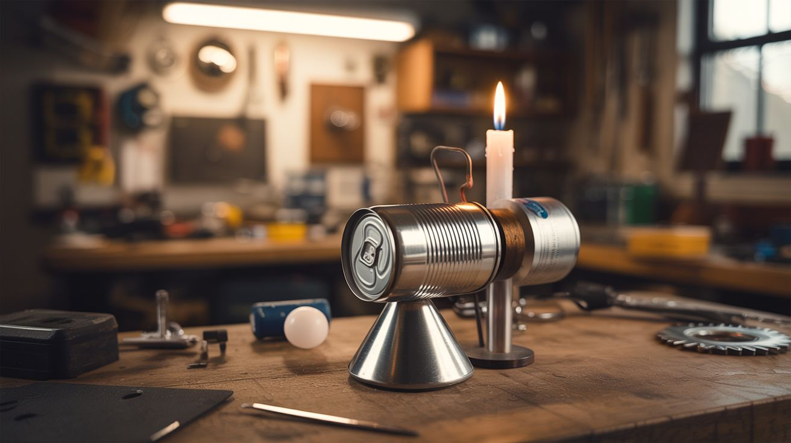

# #182 — Stirling Engine

  

> Two soda cans, a balloon, and a candle walk into a garage — and walk out as a working heat engine.

## Ratings

| Jaw Drop Rating | Brain Melt Level | Wallet Damage | Spicy Level | Clout Potential | Time to Build |
|---|---|---|---|---|---|
| ⭐⭐⭐⭐ | ⭐⭐⭐ | ⭐ | ⭐ | ⭐⭐⭐⭐ | ⭐⭐⭐ |

## What Is It?

A Stirling engine converts heat differences into mechanical motion — no combustion, no fuel injection, no explosions. You heat one end and cool the other, and the expanding/contracting air drives a piston back and forth. Robert Stirling patented this in 1816, and the beautiful thing is you can build a working version from literal garbage.

This build uses two soda cans as the hot and cold chambers, a balloon membrane as the power piston, and steel wool as the regenerator (the part that makes Stirling engines efficient). Light a candle under the hot end and the engine spins a flywheel entirely on temperature differential. It's thermodynamics you can hold in your hand.

## Ingredients

- [ ] 2 aluminum soda cans *(source: recycling bin)*
- [ ] 1 latex balloon *(source: dollar store)*
- [ ] Steel wool, fine grade *(source: hardware store or kitchen drawer)*
- [ ] Stiff wire (coat hanger or 14-gauge) for the crankshaft and connecting rod *(source: closet or hardware store)*
- [ ] Small piece of wood or cork for the displacer piston *(source: wine bottle or craft store)*
- [ ] Tea light candle or alcohol lamp *(source: anywhere)*
- [ ] Epoxy or JB Weld for airtight seals *(source: hardware store)*
- [ ] 2 small bearings or brass tubing for crankshaft supports *(source: dead hard drive or hobby shop)*
- [ ] Scrap wood for the base *(source: scrap pile)*

## Build Steps

1. **Prepare the hot cylinder.** Cut the top off one soda can cleanly using a sharp knife or rotary tool. This becomes the hot-side cylinder where the displacer piston will move. Sand any sharp edges.

2. **Build the displacer piston.** Cut a disc of steel wool or cork just slightly smaller than the interior of the soda can (about 1mm clearance all around). It needs to move freely up and down inside the can without friction but also without too much air gap. Attach a stiff wire pushrod vertically through its center.

3. **Prepare the cold top.** Cut the bottom off the second soda can. This flat disc becomes the top plate of your engine. Drill a small center hole for the displacer pushrod and a second offset hole for the power piston connection.

4. **Make the power piston.** Stretch a piece of balloon rubber over a short section of can or PVC pipe (about 1 inch diameter). This flexible membrane is your power piston — it flexes in and out as pressure changes inside the sealed cylinder. Attach a short wire linkage to its center.

5. **Assemble the cylinder.** Epoxy the cold top plate onto the open end of the hot cylinder can, with the displacer inside. Seal every joint airtight — even a tiny leak will kill the engine. The displacer pushrod passes through the center hole; seal around it with a tiny dab of grease.

6. **Build the crankshaft.** Bend stiff wire into a crankshaft with two throws offset 90 degrees from each other. One throw connects to the displacer pushrod, the other to the power piston linkage. Mount the crankshaft on bearing supports attached to a wooden base.

7. **Add a flywheel.** Attach a weighted disc (a large washer, CD, or metal lid) to the crankshaft. The flywheel stores momentum to carry the engine through the dead points in each cycle. Heavier is better, within reason.

8. **Mount and connect.** Secure the cylinder assembly to the base with the hot end (bottom of the original can) facing down, positioned over where the candle will sit. Connect the displacer and power piston linkages to their respective crankshaft throws.

9. **Test run.** Light the candle under the hot end. Wait 30-60 seconds for the temperature differential to build. Give the flywheel a gentle spin to start the engine. If it doesn't sustain, check for air leaks, reduce friction on the crankshaft, or adjust linkage lengths.

## Safety Notes

- **Open flame.** You're using a candle directly under a metal can. Keep flammable materials away from the setup and never leave it running unattended.
- **Hot metal.** The bottom of the hot cylinder will get very hot. Don't touch it during or immediately after operation. Use the wooden base as a handle.

## See Also

- [Curie Engine](189-curie-engine.md) — another heat-powered motor, this one using magnetic phase transitions
- [Musical Marble Machine](181-musical-marble-machine.md) — a much larger mechanical build if you want to level up

**References:**
- [Appliance Teardown Guide](../../reference/appliance-teardown-guide.md)
- [Technical Glossary](../../reference/glossary.md)
