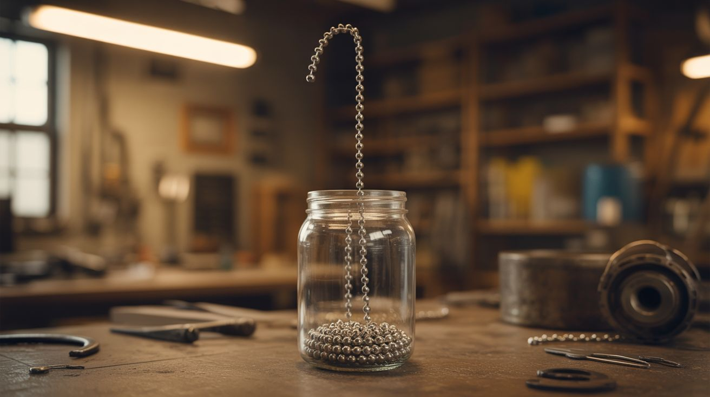

# #184 — Chain Fountain

  

> Drop one end of a ball chain out of a jar and watch physics throw the rest of it into the sky.

## Ratings

| Jaw Drop Rating | Brain Melt Level | Wallet Damage | Spicy Level | Clout Potential | Time to Build |
|---|---|---|---|---|---|
| ⭐⭐⭐⭐ | ⭐ | ⭐ | ⭐ | ⭐⭐⭐⭐⭐ | ⭐ |

## What Is It?

Also called the Mould Effect (after Steve Mould who popularized it), the chain fountain is a self-siphoning chain that leaps upward out of a container in a gravity-defying arc before falling to the ground. Coil a long ball chain into a beaker or jar placed on a high surface, pull one end over the rim and let it drop — and the chain doesn't just slide out. It launches itself upward in a clean arc, sometimes rising a foot or more above the jar's rim, forming a beautiful parabolic fountain.

The physics is still debated, but the leading explanation involves the rigid links of the chain pushing off the pile and the container bottom, giving the rising chain an upward kick that sustains the arc. It's one of those rare phenomena where the setup takes 30 seconds and the result looks like a visual effects shot.

## Ingredients

- [ ] Ball chain (bead chain), 25-50 feet, metal preferred *(source: hardware store, pull-chain for ceiling lights — buy several and connect them, ~$10-15)*
- [ ] Tall glass beaker, jar, or vase *(source: thrift store or kitchen cabinet)*
- [ ] High surface — table, shelf, or balcony railing, at least 4-6 feet off the ground *(source: your furniture)*
- [ ] Slow-motion camera (phone works) for capturing the effect *(source: your phone)*

## Build Steps

1. **Get the right chain.** Ball chain (the kind used on ceiling fan pulls and dog tags) works best because the beads act as rigid links with defined joints. Longer chains produce more dramatic fountains. Buy multiple 10-foot lengths and connect them with the included connectors.

2. **Choose your vessel.** A tall, narrow container works better than a wide, shallow one. The chain needs to pile up vertically so it can feed smoothly. Glass beakers are ideal because you can see the chain depleting from inside.

3. **Coil the chain.** This is the critical step. Don't just dump the chain in — carefully coil it in neat, flat layers inside the container. Each layer should sit cleanly on top of the last. Tangled chain = failed fountain. This is meditative work; put on some music.

4. **Position the container.** Place the jar on the edge of a high surface. The more drop distance below the rim, the faster the chain accelerates and the higher the fountain arc. A second-story balcony produces spectacular results.

5. **Start the fountain.** Grab the free end of the chain and gently pull it over the rim, letting it fall toward the ground. Once gravity takes over, the chain will begin to self-siphon. Within seconds, the rising arc should appear — the chain levitating above the jar's rim in a smooth curve before plunging downward.

6. **Film it.** Set up your phone in slow-motion mode (240fps if available) before starting. The fountain effect happens fast and is nearly impossible to appreciate in real time. Slow-mo reveals the individual beads leaping and the arc forming.

7. **Experiment.** Try different chain lengths, container heights, and container materials. Metal containers may give a higher arc than glass because the chain pushes off a harder surface. Try starting the chain at different speeds — a sharp yank vs. a gentle pull changes the initial arc.

## Safety Notes

- **Falling chain.** A 50-foot metal chain falling from height has real momentum. Keep people and pets away from the landing zone. The chain end whips around unpredictably as the last links exit the jar.
- **Container breakage.** The chain can scratch or crack glass containers as it whips out. If using a glass jar, accept that it might not survive. Ceramic or metal containers are more durable.

## See Also

- [Eddy Current Brake](186-eddy-current-brake.md) — another "wait, that shouldn't be possible" physics demo
- [Prince Rupert's Drop](190-prince-ruperts-drop.md) — counterintuitive material science that looks like magic

**References:**
- [Appliance Teardown Guide](../../reference/appliance-teardown-guide.md)
- [Technical Glossary](../../reference/glossary.md)
