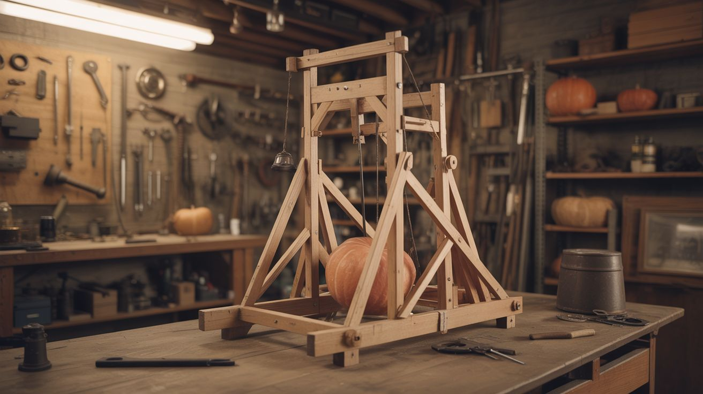

# #185 — Trebuchet

  

> A medieval siege engine built from a bed frame and spite — capable of launching pumpkins into the next zip code.

## Ratings

     

## 🧪 What Is It?

A counterweight trebuchet uses a heavy mass falling under gravity to whip a long arm around a pivot, slinging a projectile at the other end in a high arc. It's the most efficient pre-gunpowder siege weapon ever invented, and it's an absolute blast to build from scrap.

This version uses a steel bed frame for the main structure, concrete-filled buckets for the counterweight, and a fabric sling for the projectile pouch. A well-built 6-foot arm trebuchet can throw a tennis ball 100+ feet or a water balloon across a field. Scale it up and you're at pumpkin-chunkin competition levels.

<strong>🧰 Ingredients</strong>

- [ ] Steel bed frame (queen or king size for the base and uprights) *(source: curb, dumpster, or thrift store — free to $10)*
- [ ] Steel pipe or thick wooden beam, 6-8 feet, for the throwing arm *(source: scrap yard or fence post)*
- [ ] Heavy-duty steel axle bolt, 3/4" minimum *(source: hardware store)*
- [ ] 5-gallon bucket filled with concrete or sand (~80-100 lbs) for counterweight *(source: hardware store for bucket, free sand/concrete scraps)*
- [ ] Fabric or canvas for the sling pouch *(source: old backpack, tarp, or canvas bag)*
- [ ] Paracord or strong rope for sling cords *(source: hardware store or surplus store)*
- [ ] Bent nail or smooth pin for the release mechanism *(source: junk drawer)*
- [ ] Bolts, U-bolts, and brackets for assembly *(source: hardware store)*
- [ ] Tennis balls, water balloons, or small pumpkins for ammo *(source: obvious)*

## 🔨 Build Steps

1. **Build the A-frame base.** Cut and weld (or bolt) bed frame rails into two A-frame uprights, about 4 feet tall. Connect them at the top with a horizontal crossbar — this is where the throwing arm pivots. The base needs to be wide and heavy enough that the machine doesn't flip when the counterweight drops.

2. **Prepare the throwing arm.** The arm should be 6-8 feet long with the pivot point about 1/4 of the way from the counterweight end. This gives you a 3:1 or 4:1 ratio — the counterweight drops a short distance while the sling end swings a long arc. Drill a hole through the arm at the pivot point for the axle.

3. **Mount the arm.** Install the axle bolt through the A-frame crossbar and through the arm. The arm must swing freely with minimal friction. Use washers and locknuts. Grease the pivot point.

4. **Attach the counterweight.** Hang the concrete-filled bucket from the short end of the arm using a sturdy chain or U-bolt. The counterweight should swing freely (a "floating" counterweight is more efficient than a fixed one because it keeps pulling straight down throughout the swing).

5. **Build the sling.** Cut a rectangular pouch from canvas, about 8x12 inches. Attach two equal-length cords (paracord) to the corners — each cord should be roughly the same length as the long end of the arm. One cord attaches permanently to the arm tip. The other has a loop that sits over a bent-nail release pin at the arm tip.

6. **Set the release angle.** The angle of the release pin determines when the sling opens and the projectile flies. Bend the nail so the loop slides off when the arm is near vertical (roughly 45 degrees past top-dead-center). Too early and the projectile goes straight up; too late and it plows into the ground. This takes experimentation.

7. **Build the trough.** Construct a shallow channel on the base below the arm for the sling to rest in before launch. The sling needs to slide smoothly along this trough during the initial pull — any snagging kills your range.

8. **Load and cock.** Pull the long end of the arm down (raising the counterweight). Place the projectile in the sling pouch and lay the sling flat in the trough. Hook the release cord loop over the pin. Hold the arm down with a release pin or trigger rope.

9. **Fire.** Pull the trigger from a safe distance using a long rope. The counterweight drops, the arm whips over, the sling accelerates around the arc, and at the right moment the loop slips off the pin and the projectile launches. The first shot will tell you exactly how to adjust the release pin angle.

10. **Tune for range.** Adjust counterweight mass, sling length, and release pin angle. Longer sling = higher speed but harder to control. More counterweight = more energy but more stress on the frame. Document each shot's settings so you can dial it in.

## ⚠️ Safety Notes

> **Spicy Level 3 build.** Read the [Safety Guide](../../docs/safety/README.md) before starting.

> [!WARNING]
> **Projectile trajectory is unpredictable during tuning.** Until the release angle is dialed in, projectiles can go sideways, straight up, or backward. Clear a wide area (100+ feet in all directions) during test shots. Never stand in front of or beside the machine during firing.
- **Counterweight drop zone.** The falling counterweight has enormous momentum. Keep hands, feet, and spectators away from the drop path. A finger caught under 100 lbs of concrete will not be a finger anymore.
- **Structural failure.** On the first few firings, inspect all bolts and welds for stress. The forces involved are significant — a failing arm or axle becomes a projectile itself.

## 🔗 See Also

- [Hydraulic Robot Arm](183-hydraulic-robot-arm.md) — mechanical advantage on a smaller, gentler scale
- [Backyard Water Slide](../big-builds/191-backyard-water-slide.md) — another big outdoor build for maximum weekend glory
