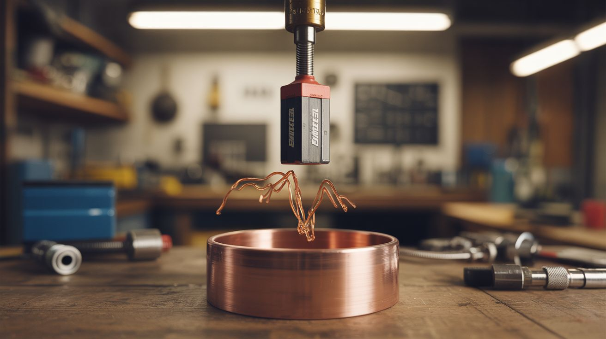

# #186 — Eddy Current Brake

  

> Drop a neodymium magnet into a copper pipe and watch it fall in slow motion — no tricks, just physics flexing.

## Ratings

| Jaw Drop Rating | Brain Melt Level | Wallet Damage | Spicy Level | Clout Potential | Time to Build |
|---|---|---|---|---|---|
| ⭐⭐⭐⭐⭐ | ⭐ | ⭐⭐ | ⭐ | ⭐⭐⭐⭐⭐ | ⭐ |

## What Is It?

When a strong magnet moves through a conductive tube, it induces circulating electrical currents (eddy currents) in the tube wall. Those currents generate their own magnetic field that opposes the magnet's motion — Lenz's law in action. The result: a powerful neodymium magnet dropped into a thick-walled copper pipe falls in eerie slow motion, as if gravity has been turned down to 10%.

The pipe isn't magnetic. The magnet isn't touching the walls. There's no friction. It's pure electromagnetic braking, and it's one of the most visually striking physics demos you can build in five minutes with two components.

## Ingredients

- [ ] Neodymium magnet, cylindrical, sized to fit inside the pipe with ~2mm clearance *(source: dead hard drive magnets work, or buy on Amazon — $5-10)*
- [ ] Thick-walled copper pipe, 2-4 feet long, 3/4" or 1" diameter *(source: plumbing surplus, scrap yard, or hardware store — $10-20)*
- [ ] A non-magnetic tube of similar diameter (PVC or aluminum) for comparison *(source: hardware store)*
- [ ] A regular steel magnet or non-magnetic slug of similar size for comparison *(source: junk drawer)*

## Build Steps

1. **Source the copper pipe.** Thicker walls = stronger braking effect. Type L or Type K copper plumbing pipe is ideal. Avoid thin-wall tubing — the effect still works but is much less dramatic. Clean the inside with a pipe brush if it's oxidized.

2. **Size your magnet.** The magnet should fit inside the pipe with minimal clearance. The closer the magnet is to the walls (without touching), the stronger the eddy currents. A stack of 2-3 disc magnets often works better than one — more magnetic flux = more braking.

3. **The basic demo.** Hold the copper pipe vertically. Drop the magnet in the top. Time how long it takes to emerge from the bottom. Now drop a non-magnetic object of similar weight — it falls normally. The magnet will take 5-10x longer depending on pipe thickness and magnet strength.

4. **Set up the comparison.** Get a PVC pipe of the same length. Drop the same magnet through it — it falls at normal speed. This proves the effect is electromagnetic, not friction. Copper is non-magnetic but highly conductive; PVC is neither.

5. **Try an aluminum pipe.** Aluminum is less conductive than copper, so the braking effect is weaker but still visible. This demonstrates that the braking force scales with conductivity.

6. **Temperature experiment.** Cool the copper pipe in a freezer for an hour. Cold copper has lower resistance, which means stronger eddy currents and even slower magnet fall. Compare room-temperature vs. cold pipe drop times for a science fair knockout.

7. **Build a visible demo stand.** Mount the copper pipe vertically on a wooden base with a clear acrylic tube alongside it for the non-magnetic comparison drop. Add a collection pad at the bottom (foam or felt) to catch the magnet. Label everything for presentation.

## Safety Notes

- **Neodymium magnets are dangerously strong.** Two magnets snapping together can pinch skin hard enough to draw blood or crush fingertips. Handle with care and keep them away from small children, credit cards, and electronics.
- **Magnet ingestion is life-threatening.** If you're building this with kids, never let them handle small magnets unsupervised. Two swallowed magnets can pinch through intestinal walls and require emergency surgery.

## See Also

- [Lenz's Law Slow-Mo Magnet](../weird-science/199-lenzs-law-slow-mo-magnet.md) — the same principle explored further in the Weird Science category
- [Chain Fountain](184-chain-fountain.md) — another "that can't be real" physics demo
