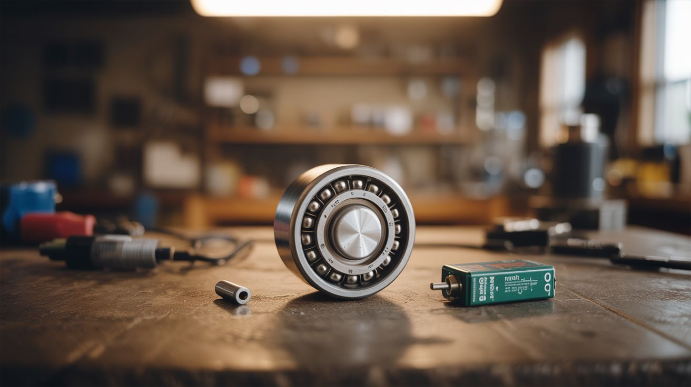

# #187 — Ball Bearing Motor

  

> One battery, one magnet, one ball bearing — the world's simplest electric motor, assembled in 60 seconds.

## Ratings

| Jaw Drop Rating | Brain Melt Level | Wallet Damage | Spicy Level | Clout Potential | Time to Build |
|---|---|---|---|---|---|
| ⭐⭐⭐⭐ | ⭐ | ⭐ | ⭐ | ⭐⭐⭐⭐ | ⭐ |

## What Is It?

The ball bearing motor (also called a homopolar motor variant) is the absolute minimum viable electric motor. Stick a neodymium magnet to the bottom of a AA battery. Touch a ball bearing (or bent wire) to the top terminal so it also contacts the magnet. Current flows through the bearing, through the magnet's field, and the Lorentz force spins the whole assembly. That's it. Three components, 60 seconds, and you have a spinning motor.

It's the perfect gateway build — zero tools required, impossible to mess up, and the "wait, HOW?" reaction from spectators is guaranteed. Once you understand why it works (current-carrying conductor in a magnetic field experiences a force), you understand the principle behind every electric motor ever made.

## Ingredients

- [ ] AA battery (fresh, fully charged) *(source: junk drawer)*
- [ ] Neodymium disc magnet, sized to match or slightly exceed battery diameter *(source: dead hard drive or Amazon — $3)*
- [ ] Steel ball bearing, approximately 8-12mm diameter *(source: dead skateboard bearing, hardware store, or slingshot ammo)*
- [ ] Optional: copper wire for a more stable contact version *(source: any stranded wire)*

## Build Steps

1. **Attach the magnet.** Stick the neodymium magnet to the flat negative terminal of the AA battery. It should snap on firmly and hang there when you hold the battery positive-end-up. The magnet becomes both the south electrical contact and the magnetic field source.

2. **Balance the bearing.** Place the ball bearing on top of the battery's positive terminal (the nub). It should sit centered on the bump. This is your contact point and rotating element.

3. **Complete the circuit.** Gently touch the ball bearing with one finger while also touching the magnet with another finger on the same hand. Current flows from the battery through the bearing, through your finger (tiny current, perfectly safe at 1.5V), into the magnet, and back to the battery. The bearing should start spinning.

4. **Hands-free version.** Bend a piece of copper wire into a bridge shape that touches both the ball bearing on top and the magnet on the bottom, completing the circuit without your fingers. The bearing will spin continuously until the battery dies.

5. **Wire dancer version.** Instead of a ball bearing, bend a piece of copper wire into a shape (heart, spiral, stick figure) that balances on the positive terminal and brushes against the magnet. The whole wire sculpture spins. This is the classic "homopolar motor" demo and makes for much better video.

6. **Speed experiments.** Try different magnet strengths, different battery sizes (C, D), and multiple stacked magnets. Stronger field = faster spin. Note: the battery will drain quickly because this is essentially a dead short through a very low resistance path.

7. **Explain the physics.** Current flows radially through the magnet. The magnetic field points axially (up/down through the magnet). A radial current in an axial field produces a tangential force (Lorentz force). That tangential force spins the magnet. Draw it out — it clicks once you see the three perpendicular vectors.

## Safety Notes

- **Battery heating.** This circuit draws high current and will drain and heat the battery quickly. Don't leave it running for more than a minute or two. If the battery gets hot to the touch, disconnect immediately.
- **Neodymium magnets.** Strong magnets near batteries and metal objects can snap together violently. Keep fingers clear of pinch points.

## See Also

- [Homopolar Motor](../weird-science/198-homopolar-motor.md) — the Weird Science take on this same principle with fancier builds
- [Magnetic Gear Train](188-magnetic-gear-train.md) — magnets creating motion through a different mechanism
