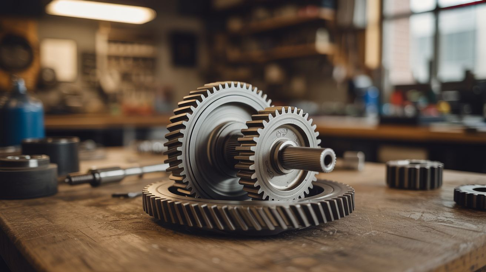

# #188 — Magnetic Gear Train

  

> Gears that mesh and transfer torque through pure magnetic force — they never touch, and it looks like witchcraft.

## Ratings

     

## 🧪 What Is It?

Magnetic gears replace physical teeth with alternating magnetic poles arranged around a disc. When two magnetic gear discs are placed near each other with the right pole pattern, spinning one causes the other to spin — just like meshing gears — but with an air gap between them. No contact, no friction, no wear, no lubrication needed.

The effect is hypnotic: two discs floating in space, one driving the other with nothing visible between them. You can even put a solid wall between them and they'll still couple. By using different numbers of magnet poles on each disc, you get gear ratios — a disc with 8 poles driving a disc with 16 poles gives you 2:1 reduction, just like physical gears.

<strong>🧰 Ingredients</strong>

- [ ] Neodymium disc magnets, 8-10mm diameter, at least 24 *(source: Amazon or magnet supplier — ~$10-15 for a pack of 50)*
- [ ] Wooden or acrylic discs, 4-6 inches diameter, for mounting magnets *(source: craft store, laser cutter, or hand-cut from plywood)*
- [ ] Bolts or dowels for axles *(source: hardware store)*
- [ ] Bearings or brass bushings for smooth axle rotation *(source: dead hard drive, skateboard, or hobby shop)*
- [ ] Plywood or acrylic sheet for the mounting frame *(source: scrap wood or craft store)*
- [ ] Epoxy or super glue for fixing magnets in place *(source: hardware store)*
- [ ] Drill press or hand drill with circle-cutting capability *(source: your shop)*

## 🔨 Build Steps

1. **Design the pole pattern.** Decide on the number of magnetic poles per disc. More poles = smoother coupling but weaker torque per pole. Start with 8 poles per disc (8 magnets equally spaced around the rim, alternating north-south-north-south). This gives a 1:1 gear ratio.

2. **Cut the discs.** Cut circles from plywood or acrylic, 4-6 inches in diameter. Mark the magnet positions evenly around the perimeter, about 5mm from the edge. Precision matters — uneven spacing causes the gears to cog (jerk instead of spin smoothly).

3. **Install the magnets.** Drill shallow pockets for each magnet and epoxy them in place. Critical: alternate the polarity around the disc. North-up, south-up, north-up, south-up. Use a marker to label polarity before gluing. Getting one magnet flipped will ruin the meshing.

4. **Mount the axles.** Drill center holes in each disc and press-fit a bolt or dowel as an axle. Mount bearings on a frame plate so each disc spins freely. The discs should be parallel and close together — 5-10mm gap is typical. Closer = stronger coupling but also stronger resistance.

5. **Test the coupling.** Spin one disc by hand. The other should follow, locked in sync. If it slips or jerks, check magnet spacing and polarity. If it won't couple at all, move the discs closer together or use stronger magnets.

6. **Build a gear ratio pair.** Make a second set of discs with different pole counts — one with 8 poles and one with 16. Mount them with the right spacing. The 8-pole disc spins twice for every one rotation of the 16-pole disc. You've built a 2:1 magnetic gear reducer with zero contact.

7. **Add a third gear for a train.** Mount three or more discs in a line, each coupling magnetically to the next. Spin the first disc and watch the motion propagate down the chain. The intermediate disc will spin in the opposite direction, just like physical gears.

8. **Wall pass-through demo.** Mount two coupled magnetic gears on opposite sides of a thin wooden or acrylic wall. Spin one side — the other side spins too, through the wall. This is the killer demo that makes people lose their minds.

## ⚠️ Safety Notes

> [!WARNING]
> **Magnet handling.** Neodymium magnets snap together with surprising force. When installing magnets in alternating polarity, adjacent magnets will try to flip or fly out of your hand into the previous one. Work carefully and keep spare magnets far from the work area.
- **Epoxy curing.** Let epoxy fully cure (24 hours for most types) before testing. A magnet ripping free from a spinning disc becomes a high-speed projectile.
- **Finger pinch.** The magnetic coupling creates real torque. Don't stick fingers between spinning magnetic gears — they can pinch harder than you'd expect from "non-contact" gears.

## 🔗 See Also

- [Ball Bearing Motor](187-ball-bearing-motor.md) — the simplest electromagnetic motion build
- [Musical Marble Machine](181-musical-marble-machine.md) — traditional mechanical gearing taken to artistic extremes

**References:**
- [Appliance Teardown Guide](../../reference/appliance-teardown-guide.md)
- [Technical Glossary](../../reference/glossary.md)
