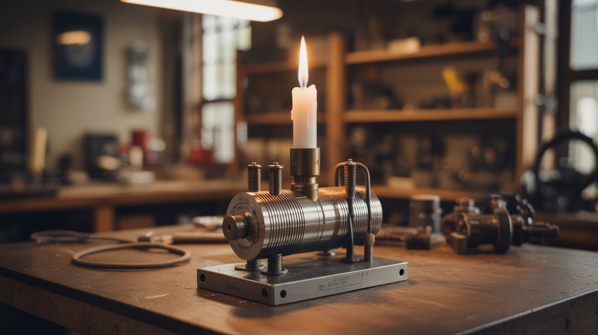

# #189 — Curie Engine

  

> A candle-powered motor that runs on the moment nickel stops being magnetic — thermodynamics and magnetism tag-teaming.

## Ratings

     

## 🧪 What Is It?

A Curie engine exploits the Curie temperature — the point at which a ferromagnetic material loses its magnetism due to heat. A nickel wire or disc is partially heated by a candle. The heated section becomes non-magnetic and is no longer attracted to a nearby permanent magnet. The cool (still magnetic) section gets pulled toward the magnet, rotating the assembly. The formerly hot section cools down, becomes magnetic again, and the cycle continues — a self-sustaining heat engine powered by a phase transition.

Pierre Curie described this temperature threshold in 1895, and it's one of those beautiful intersections of thermal physics and magnetism that most people have never heard of. The engine runs silently on a single candle with no moving electrical parts.

<strong>🧰 Ingredients</strong>

- [ ] Nickel wire or thin nickel strip, 6-12 inches *(source: old nickel-plated items, or buy nickel wire online — ~$5)*
- [ ] Strong permanent magnet (neodymium or ceramic) *(source: dead hard drive or speaker)*
- [ ] Tea light candle or alcohol lamp *(source: dollar store)*
- [ ] Thin steel sewing needle or pin for the axle *(source: sewing kit)*
- [ ] Small piece of cork or eraser for the hub *(source: wine bottle or office supply)*
- [ ] Support stand — wire frame or wooden blocks *(source: scrap materials)*
- [ ] Optional: Canadian nickel coins (pre-1982, which are actually nickel) *(source: coin collection)*

## 🔨 Build Steps

1. **Understand the Curie temperature of nickel.** Nickel loses its ferromagnetism at 358 degrees C (676 degrees F). A candle flame reaches about 1,000 degrees C, so it's more than hot enough. The key is that only the section directly in the flame gets hot enough — the rest stays magnetic.

2. **Build the rotor.** Bend the nickel wire into a circle about 3-4 inches in diameter, or cut a disc from nickel sheet. Push a needle through the center as an axle. The rotor needs to be balanced and spin freely with minimal friction. A cork or eraser hub helps center the axle.

3. **Set up the support.** Mount the axle on two upright supports so the nickel rotor hangs vertically and spins freely. The supports can be bent wire, wooden blocks with notches, or anything that lets the needle rest with minimal friction. Glass V-blocks work beautifully.

4. **Position the magnet.** Place a strong permanent magnet near the edge of the rotor at roughly the 3 o'clock or 9 o'clock position. It should be close enough that it visibly pulls the nickel rotor toward it (you'll see the rotor deflect). The magnet should be just outside the rotor's circumference.

5. **Position the candle.** Place the candle so its flame heats the nickel rotor at a point about 30-45 degrees before the magnet (in the direction of intended rotation). The geometry matters: heat a spot, that spot loses magnetism and is no longer pulled toward the magnet, the next cool spot gets pulled into the magnet's field, which rotates the rotor, which brings the next section into the flame.

6. **Start the engine.** Light the candle and wait 30-60 seconds for the nickel to reach Curie temperature at the flame point. Give the rotor a gentle nudge in the correct direction. If the geometry is right, it will continue spinning on its own. The rotation will be slow — a few RPM — but self-sustaining.

7. **Tune the geometry.** If the engine stalls, adjust the relative positions of magnet and flame. The flame needs to be "upstream" of the magnet in the rotation direction. Also check that the rotor spins freely — even slight axle friction will stall a Curie engine because the driving force is subtle.

8. **Try the coin version.** Stack 3-4 pre-1982 Canadian nickels on a needle axle and set them up the same way. The coins have more thermal mass so they take longer to heat and cool, resulting in slower rotation but a very clean demo.

## ⚠️ Safety Notes

> [!WARNING]
> **Open flame.** The candle is heating metal to over 350 degrees C. Keep flammable materials clear. The nickel rotor itself becomes hot enough to cause burns — don't touch it while running or immediately after.
- **Heated nickel can discolor and become brittle.** After many cycles, the wire or disc at the heating point may develop heat oxidation. This is cosmetic but eventually weakens the material. Replace the rotor if it shows cracks.

## 🔗 See Also

- [Stirling Engine](182-stirling-engine.md) — another candle-powered engine using a completely different thermodynamic principle
- [Eddy Current Brake](186-eddy-current-brake.md) — another intersection of magnetism and motion with surprising results

**References:**
- [Appliance Teardown Guide](../../docs/reference/appliance-teardown-guide.md)
- [Technical Glossary](../../docs/reference/glossary.md)
