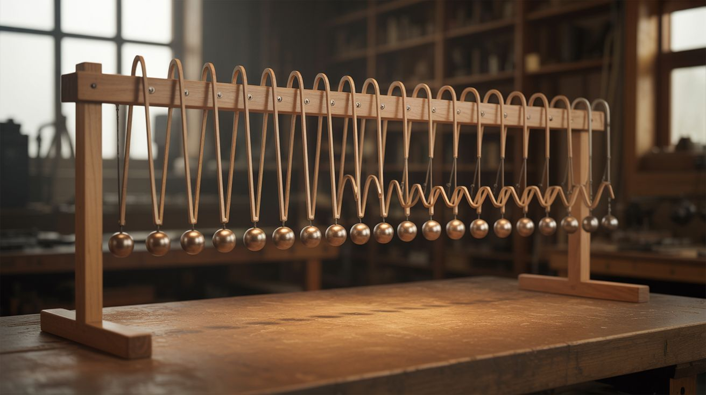

# #316 — Pendulum Wave Machine

  

> 15 pendulums of precisely calculated lengths create mesmerizing wave patterns that shift between chaos and perfect synchronization.

## Ratings

| Jaw Drop Rating | Brain Melt Level | Wallet Damage | Spicy Level | Clout Potential | Time to Build |
|---|---|---|---|---|---|
| ⭐⭐⭐⭐⭐ | ⭐⭐⭐ | ⭐ | ⭐ | ⭐⭐⭐⭐⭐ | ⭐⭐ |

## What Is It?

An array of 15 pendulums mounted side by side on a horizontal bar, each one slightly longer than the last. The lengths are calculated so that in exactly 60 seconds, the longest pendulum completes N swings and the shortest completes N+14 swings — each adjacent pendulum differs by exactly one oscillation per cycle. Release them all simultaneously from the same angle and watch: they start in perfect unison, then gradually separate into traveling waves, standing waves, pairs, trios, apparent randomness — and then, exactly 60 seconds later, snap back into perfect synchronization. The cycle repeats indefinitely. Zero electronics. Zero power source. Pure gravitational physics producing patterns that look choreographed by software.

The math is simple. A pendulum's period depends only on its length: T = 2pi * sqrt(L/g). Shorter pendulums swing faster. By calculating the exact lengths needed for each pendulum to complete a specific number of swings in 60 seconds, you guarantee that they all realign at the 60-second mark. The visual result, however, is deeply counterintuitive. Your brain refuses to believe that gravity alone produces this coordinated, seemingly intelligent motion. The pendulums appear to communicate with each other, forming snaking waves that travel back and forth, splitting into groups that pulse in and out of phase, dissolving into what looks like chaos, and then — right on cue — locking back into perfect unison. The effect is hypnotic.

This is one of the most elegant physics demonstrations ever conceived, and it costs almost nothing to build. Fishing line and hex nuts on a wooden frame. Restaurant-worthy visual elegance from hardware-store components. The precision is in the math and the measurement, not the materials. Get the lengths right and the physics does everything else.

## Ingredients

- [ ] Wooden or aluminum frame — horizontal top bar about 30" long, supported by two sturdy vertical sides, 18-24" tall *(scrap lumber, old shelf, or hardware store, ~$5-10)*
- [ ] 15 identical weights — steel hex nuts, ball bearings, or fishing sinkers, all the same mass *(hardware store, ~$3)*
- [ ] Fishing line or thin nylon cord — low stretch, uniform diameter *(tackle box or hardware store, ~$3)*
- [ ] Eye hooks or screw eyes, quantity 15 — for mounting points along the top bar *(hardware store, ~$3)*
- [ ] Ruler + calculator — for computing pendulum lengths *(already own)*
- [ ] Tape measure — for cutting cord to precise lengths *(already own)*
- [ ] Release bar — a straight piece of angle iron, wood dowel, or flat bar *(scrap, free)*
- [ ] Hot glue or thread lock compound — to secure knots and prevent slippage *(workshop, ~$2)*
- [ ] Fine-tipped marker — for marking cord lengths *(already own)*

## Build Steps

1. **Calculate pendulum lengths.** Decide on a total cycle time (60 seconds is standard). Choose the number of swings for the longest pendulum — say, 51 swings in 60 seconds. The shortest pendulum (#15) will complete 65 swings in 60 seconds (51 + 14). For each pendulum, calculate the period (T = 60/N where N is the number of swings), then solve for length: L = g * (T / 2pi)^2, where g = 9.81 m/s^2. This gives you 15 specific lengths. For a table-sized version, you can scale down — a common range is approximately 25-40 cm. Use a spreadsheet to compute all 15 lengths to the millimeter.

2. **Build the frame.** Construct a sturdy frame with a horizontal top bar at least 30" long. The bar must be rigid — any flex changes the effective pendulum lengths. Use a level to ensure the bar is perfectly horizontal. The frame should be heavy or clamped to a table so it doesn't rock when the pendulums swing.

3. **Install the mounting points.** Screw 15 eye hooks into the underside of the top bar, evenly spaced about 1.5-2" apart. All eye hooks must be at exactly the same height — use a straightedge to verify. Even a 2mm difference in mounting height changes the effective length enough to throw off synchronization.

4. **Cut and attach the pendulums.** Cut 15 lengths of fishing line according to your calculations. The length is measured from the pivot point (center of the eye hook) to the center of the weight. Tie each weight securely and loop the other end through its eye hook. Apply a drop of hot glue or thread lock to each knot to prevent slippage — a knot that loosens by even 1mm will cause that pendulum to drift out of sync.

5. **Verify individual periods.** Before testing the full array, time each pendulum individually. Count 10 swings and divide the total time by 10 to get the period. Compare to your calculated value. If a pendulum is off, adjust the cord length by tiny increments (1-2mm) until it matches. This is the most critical calibration step.

6. **Build the release mechanism.** You need all 15 pendulums to start swinging at exactly the same instant from the same angle. Hold all 15 weights against a flat bar (angle iron or a straight piece of wood) pulled to one side at about 20-30 degrees from vertical. When you pull the bar away cleanly and quickly, all pendulums release simultaneously. A hinged bar that swings out of the way works better than pulling straight back, which tends to release the end pendulums before the middle ones.

7. **Release and observe.** Pull back all 15 weights, hold them against the release bar, and let go. The full cycle takes 60 seconds. Watch for traveling waves (a "snake" pattern rippling back and forth), standing waves (alternating groups swinging in and out), paired/tripled groupings, apparent chaos, and finally — perfect resynchronization. Film it from the side for the best visual angle. Slow motion footage reveals even more detail.

8. **Fine-tune stragglers.** After the first 60-second cycle, check whether all pendulums return to synchronization at the same moment. Any pendulum that's early or late needs its cord adjusted by fractions of a millimeter. This fine-tuning may take several iterations. Once calibrated, the machine will repeat perfectly for hundreds of cycles, limited only by air resistance gradually damping the amplitudes.

## Safety Notes

- Minimal danger overall. Swinging weights can hit fingers during setup — keep hands clear of the swing path during operation.
- The frame must be stable. A top-heavy frame with 15 swinging weights can tip over, especially if it's tall and narrow. Use a wide base, bolt it to a table, or add ballast to the bottom.
- Fishing line under tension can snap and whip. Use line rated well above the weight of your pendulum bobs. Inspect for fraying periodically.

## See Also

- [Musical Marble Machine](181-musical-marble-machine.md)
- [Magnetic Gear Train](188-magnetic-gear-train.md)
- [Foucault Pendulum](../weird-science/311-foucault-pendulum.md)
