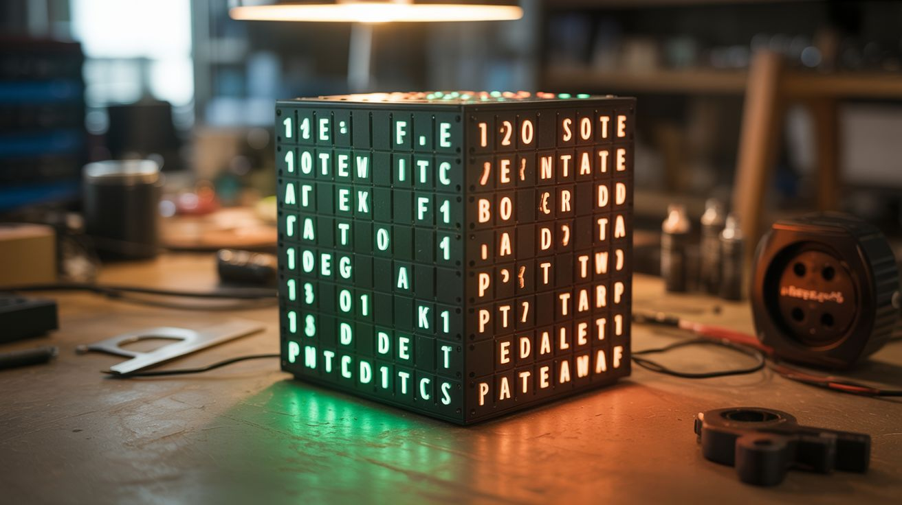

# #122 — LED Cube 8x8x8

  

> 512 LEDs soldered into a 3D matrix — animations, text, fire effects, and audio-reactive patterns floating in space.

## Ratings

     

## 🧪 What Is It?

An 8x8x8 LED cube is 512 LEDs soldered into a three-dimensional grid, each individually addressable. With an ESP32 or Arduino driving the multiplexing, you can display 3D animations that float in mid-air: rain falling through the cube, fire flickering upward, text scrolling in 3D, sine waves rippling, and audio-reactive patterns that dance to music. It's a volumetric display — the closest thing to a hologram you can build at home. The soldering takes patience (512 joints), but the result is a mesmerizing light sculpture that stops everyone who sees it.

<strong>🧰 Ingredients</strong>

- [ ] 512+ LEDs — common anode or cathode, 5mm diffused, single color or RGB *(electronics supplier)*
- [ ] ESP32 or Arduino Mega — needs enough GPIO for column/layer control *(electronics supplier)*
- [ ] Shift registers (74HC595) — for column multiplexing, need 8 of them *(electronics supplier)*
- [ ] Transistors (2N2222 or MOSFET) — 8, for layer switching *(electronics supplier)*
- [ ] Resistors — 64x current limiting, value depends on LED forward voltage *(electronics supplier)*
- [ ] Perfboard or custom PCB — for the driver board *(electronics supplier)*
- [ ] Soldering iron, solder, flux *(workshop)*
- [ ] Jig template — drilled wood or 3D printed grid for bending LED leads consistently *(workshop)*
- [ ] Solid core wire — for horizontal connections *(electronics supplier)*
- [ ] Power supply — 5V 3A+ *(old phone charger or lab supply)*

## 🔨 Build Steps

1. **Build the soldering jig.** Drill an 8x8 grid of holes spaced 20mm apart in a piece of wood or MDF. The holes should fit the LED bodies snugly. This jig ensures every LED layer is perfectly aligned and evenly spaced. Precise spacing is critical — crooked layers ruin the visual effect.
2. **Bend and trim LED leads.** Insert 64 LEDs into the jig. Bend one lead (cathode for common-cathode design) 90 degrees so it reaches the adjacent LED's cathode. Solder the cathodes together in rows to form horizontal connections. Trim excess leads.
3. **Build all 8 layers.** Repeat the process for all 8 layers. Each layer is an 8x8 grid of 64 LEDs with their cathodes connected in a shared plane. Test each layer by applying power — all 64 LEDs should light.
4. **Stack the layers.** Carefully remove each layer from the jig and stack them vertically, one above the other, with the anode leads from one layer connecting to the column bus running vertically. The anode leads are bent upward and soldered to the layer above, creating 64 vertical columns of 8 LEDs each.
5. **Wire the driver board.** Build the multiplexing circuit: 8 shift registers (74HC595) daisy-chained handle the 64 columns. 8 transistors switch the 8 layers. The ESP32 sends serial data to the shift registers and selects which layer is active. By cycling through all 8 layers faster than the eye can see (>100Hz), all 512 LEDs appear lit simultaneously.
6. **Connect the cube to the driver.** Wire the 64 column leads from the cube to the shift register outputs (through current-limiting resistors). Wire the 8 layer common connections to the transistor collectors.
7. **Program basic patterns.** Start with simple animations: all on, all off, one layer at a time, rain (random LEDs on the top layer, shifting down each frame), planes scanning through axes. This validates every connection.
8. **Add complex animations.** Program sine waves, fire simulation, 3D text rendering, rotating shapes, and Game of Life in 3D. For audio-reactive mode, add a microphone module and use FFT to map frequency bands to cube layers or columns.
9. **Build an enclosure (optional).** Mount the cube on a clear acrylic base with the driver board hidden underneath. A smoked acrylic case makes the LEDs pop against a dark background. Add a microphone port for audio reactivity.

## ⚠️ Safety Notes

- You are making 512+ solder joints. Take breaks to avoid repetitive strain. Use a fume extractor or work in a ventilated area — solder fumes are irritating with prolonged exposure.
- The driver board handles significant current when all LEDs are on simultaneously. Ensure your power supply is rated for peak load and that transistor heat sinks are adequate if using high-brightness LEDs.
- Test each layer before stacking. Debugging a connection error in a completed cube is exponentially harder than fixing it layer by layer.

## 🔗 See Also

- [Music Visualizer LED Wall](../python-projects/145-music-visualizer-led-wall.md)
- [MIDI Stepper Organ](135-midi-stepper-organ.md)

**References:**
- [Electronics & Microcontrollers Guide](../../docs/reference/electronics-and-microcontrollers.md)
