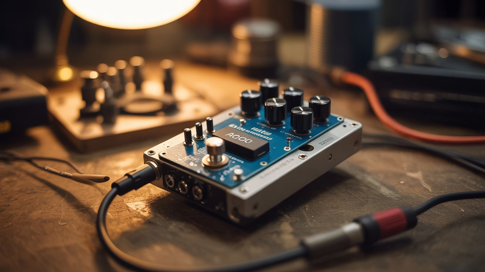

# #124 — Arduino Guitar Pedal

  

> An Arduino reads analog audio and applies digital effects — distortion, delay, chorus — housed in a dead hard drive chassis.

## Ratings

     

## 🧪 What Is It?

Guitar effect pedals are just analog-to-digital converters, signal processing, and digital-to-analog converters — the exact thing a microcontroller excels at. An Arduino reads the guitar signal through its ADC, processes it in real-time (distortion by clipping the waveform, delay by buffering and replaying, chorus by modulating a delayed copy), and outputs the modified signal through a DAC or PWM filter. House the whole thing in a dead hard drive chassis for industrial aesthetics, add knobs salvaged from old stereos for parameter control, and you've got a custom guitar pedal that cost $15 instead of $150.

<strong>🧰 Ingredients</strong>

- [ ] Arduino Uno or Nano — needs ADC and enough clock speed for audio processing *(electronics supplier)*
- [ ] Op-amp (LM386 or similar) — for input/output amplification *(electronics supplier)*
- [ ] 1/4" audio jacks — input and output *(electronics supplier, music store)*
- [ ] Potentiometers — 3-4 for effect parameters (gain, tone, mix, etc.) *(electronics supplier)*
- [ ] Capacitors and resistors — for input/output filters *(electronics supplier)*
- [ ] Dead hard drive chassis — for housing *(e-waste bin)*
- [ ] Stomp switch — true bypass footswitch *(electronics supplier)*
- [ ] 9V battery or power jack *(electronics supplier)*
- [ ] Knobs — salvaged from old stereos or radios *(thrift store, e-waste)*
- [ ] Perfboard *(electronics supplier)*

## 🔨 Build Steps

1. **Build the input stage.** The guitar signal is too weak for the Arduino's ADC to read effectively. Build a pre-amp using an op-amp circuit that amplifies the guitar signal and biases it to the Arduino's 0-5V ADC range. A simple non-inverting amplifier with a gain of ~20 works well.
2. **Connect to the Arduino ADC.** Feed the amplified, biased signal into one of the Arduino's analog input pins. Set the ADC to free-running mode for the fastest sample rate. The Arduino Uno's ADC can sample at about 9600 Hz — not hi-fi, but enough for gritty lo-fi effects.
3. **Write the effect algorithms.** In the main loop, read the ADC, process the sample, and output it. For distortion: clamp values above a threshold. For delay: store samples in a circular buffer and add delayed samples to the current output. For tremolo: multiply the signal by a slow sine wave.
4. **Build the output stage.** The Arduino outputs a PWM signal that needs to be filtered into analog audio. Build a low-pass RC filter (resistor + capacitor) to smooth the PWM into an analog waveform. Follow with an op-amp buffer to drive the output jack at proper impedance.
5. **Add parameter controls.** Wire potentiometers to the remaining analog input pins. Read their values in the code to control effect parameters: gain/drive for distortion, delay time and feedback for delay, rate and depth for chorus.
6. **Prepare the enclosure.** Open a dead hard drive and remove the internals. The machined aluminum chassis is a perfect pedal enclosure — it's metal, shielded, and looks industrial. Drill holes for the audio jacks, knobs, LED indicator, and stomp switch.
7. **Wire the bypass switch.** Install a true-bypass footswitch that routes the signal directly from input to output when the effect is off, and through the Arduino circuit when engaged. This ensures zero signal degradation when the pedal is off.
8. **Assemble and test.** Mount the perfboard circuit inside the HDD chassis. Attach the knobs, jacks, and switch. Power up, plug in a guitar, and start tweaking. Adjust the code parameters to find sounds you like.

## ⚠️ Safety Notes

- Audio circuits are low voltage and generally safe, but be careful with the op-amp power supply. Double-check polarity before connecting power — reversed polarity destroys ICs instantly.
- Grounding is critical for audio circuits. Poor grounding introduces hum and buzz. Use the HDD chassis as a ground plane and connect all ground points to it with short leads.
- If using the pedal with an amplifier, start at low volume. Digital clipping from the Arduino can produce unexpectedly loud artifacts that may damage speakers if the amp is cranked.

## 🔗 See Also

- [Pi DJ Controller](131-pi-dj-controller.md)
- [MIDI Stepper Organ](135-midi-stepper-organ.md)

**References:**

- [Electronics & Microcontrollers Guide](../../docs/reference/electronics-and-microcontrollers.md)
