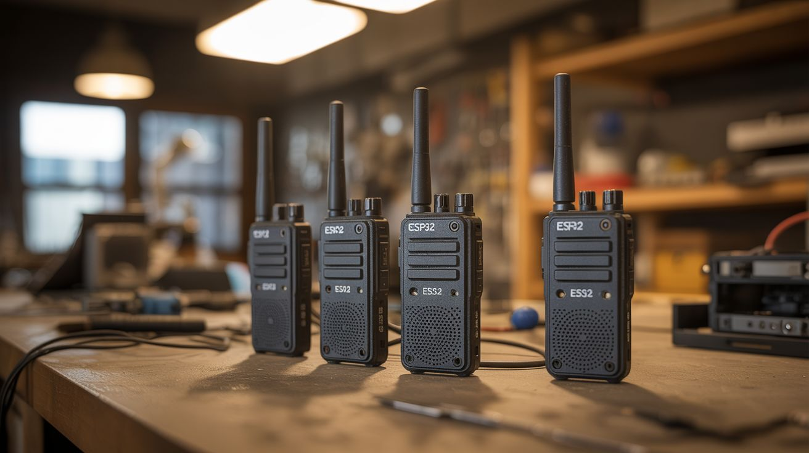

# #125 — ESP32 Mesh Walkie-Talkie

  

> Multiple ESP32 boards with mics and speakers form a mesh radio network — decentralized communication with no infrastructure.

## Ratings

     

## 🧪 What Is It?

The ESP32 has built-in WiFi that can operate in ad-hoc mode — no router required. Connect multiple ESP32s together and they form a mesh network where each node relays messages to every other node. Add a microphone and speaker to each one and you have a walkie-talkie system that doesn't need cell towers, internet, or any infrastructure at all. Each unit is a self-contained node: talk into the mic, the audio is digitized and broadcast over WiFi mesh to all other nodes, which play it through their speakers. Range is limited per hop (~100-300ft), but with mesh networking, each additional node extends the range because it relays to the next.

<strong>🧰 Ingredients</strong>

- [ ] ESP32 boards — one per unit, minimum 2 *(electronics supplier, ~$4 each)*
- [ ] INMP441 I2S MEMS microphone modules — one per unit *(electronics supplier)*
- [ ] MAX98357 I2S amplifier with speaker — one per unit *(electronics supplier)*
- [ ] Small speakers — 3W, 4 ohm *(electronics supplier, salvaged from old devices)*
- [ ] Push-to-talk button — momentary switch *(electronics supplier)*
- [ ] LiPo battery — 3.7V 1000mAh+ for portable operation *(electronics supplier)*
- [ ] TP4056 charging board — for LiPo management *(electronics supplier)*
- [ ] 3D printed or project box enclosure *(workshop, electronics supplier)*
- [ ] Antenna — external antenna improves range (optional) *(electronics supplier)*

## 🔨 Build Steps

1. **Set up the ESP32 development environment.** Install the Arduino IDE with ESP32 board support, or use PlatformIO. Flash a basic WiFi scan sketch to verify each board works.
2. **Wire the microphone.** Connect the INMP441 I2S MEMS mic to the ESP32 using the I2S bus (WS, SCK, SD pins). These digital mics give much better audio quality than analog electret mics with the ESP32's noisy ADC.
3. **Wire the speaker amplifier.** Connect the MAX98357 I2S DAC/amplifier to a second I2S bus on the ESP32 (the ESP32 supports two I2S peripherals). Wire the speaker to the amplifier output.
4. **Implement the mesh network.** Use the ESP-NOW protocol or the painlessMesh library. ESP-NOW is simpler for audio streaming — it's a connectionless protocol that broadcasts packets to registered peers with low latency. Register each device's MAC address with every other device.
5. **Code the audio pipeline.** In push-to-talk mode: when the button is pressed, read audio samples from the I2S mic, compress them (simple mu-law encoding reduces bandwidth), and broadcast via ESP-NOW. When receiving, decompress and output to the I2S amplifier. Buffer a few packets to smooth playback.
6. **Add push-to-talk logic.** Wire a momentary button to a GPIO pin. When pressed, the unit switches to transmit mode (mic active, speaker muted). When released, it switches to receive mode (mic muted, speaker active). An LED indicates transmit/receive state.
7. **Build the enclosures.** House each unit in a project box or 3D printed case with openings for the mic, speaker, button, charging port, and antenna. Mount the battery inside.
8. **Add power management.** Wire the LiPo battery through the TP4056 charging board to a 3.3V regulator feeding the ESP32. Add a power switch. The units should last several hours on a 1000mAh battery.
9. **Test range and mesh.** Test direct communication range between two units. Then place a third unit in between and verify it extends the range by relaying messages. Each additional node increases network coverage.

## ⚠️ Safety Notes

- LiPo batteries can catch fire if punctured, overcharged, or short-circuited. Always use a proper charging board (TP4056 with protection circuit). Never leave LiPo batteries charging unattended.
- WiFi mesh networks operate on 2.4GHz. This is legal for low-power communication in most jurisdictions, but check your local regulations regarding ad-hoc wireless communication devices.
- The ESP32 can draw peak currents that cause voltage drops on weak batteries, leading to brownouts and reboots. Use batteries with sufficient discharge rate and add bulk capacitors near the ESP32 power pins.

## 🔗 See Also

- [Pirate Radio](134-pirate-radio.md)
- [ESP32 Weather Station](132-esp32-weather-station.md)

**References:**
- [Electronics & Microcontrollers Guide](../../docs/reference/electronics-and-microcontrollers.md)
