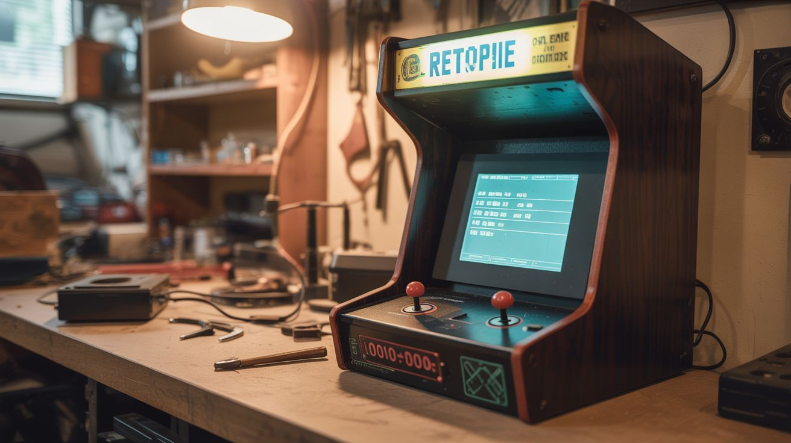

# #126 — Retro Arcade Cabinet

  

> A Pi 4 running RetroPie in a repurposed furniture cabinet with arcade buttons — 10,000+ retro games.

## Ratings

| Jaw Drop Rating | Brain Melt Level | Wallet Damage | Spicy Level | Clout Potential | Time to Build |
|---|---|---|---|---|---|
| ⭐⭐⭐⭐ | ⭐⭐ | ⭐⭐ | ⭐ | ⭐⭐⭐⭐ | ⭐⭐⭐ |

## What Is It?

A full-sized arcade cabinet running thousands of classic games — Pac-Man, Street Fighter, Galaga, Mario, Sonic, everything from the golden age of gaming. The Pi 4 runs RetroPie, which emulates dozens of retro consoles and arcade boards. Instead of building a cabinet from scratch, repurpose an old nightstand, bookshelf, or thrift store furniture piece. Add a salvaged monitor, wire up arcade buttons and a joystick through a USB encoder, and you've got a piece of furniture that's secretly a universal game machine. It becomes the centerpiece of any game room.

## Ingredients

- [ ] Raspberry Pi 4 (4GB recommended) *(electronics supplier)*
- [ ] MicroSD card 64GB+ — holds the OS and game library *(electronics supplier)*
- [ ] Old monitor or TV — 19-24 inch *(thrift store, e-waste)*
- [ ] Arcade buttons — 8-10 per player *(online arcade supply)*
- [ ] Arcade joystick — Sanwa or clone *(online arcade supply)*
- [ ] Zero delay USB encoder — connects buttons/joystick to USB *(online arcade supply)*
- [ ] Speakers + small amplifier — for game audio *(thrift store, electronics supplier)*
- [ ] Furniture cabinet — nightstand, end table, small bookshelf *(thrift store)*
- [ ] MDF or plywood — for the control panel *(hardware store)*
- [ ] Marquee artwork — printed on translucent material with LED backlight (optional) *(print shop)*

## Build Steps

1. **Choose and prepare the cabinet.** Find a piece of furniture that's roughly the right size for an arcade cabinet — a nightstand or small bookshelf works well. Remove shelves and internal hardware. The monitor mounts inside where you cut an opening in the back or top.
2. **Cut the monitor opening.** Measure your monitor panel and cut a matching opening in the cabinet. The monitor should be angled slightly backward (about 15 degrees) for comfortable viewing while standing. Secure the monitor panel inside the cabinet with brackets.
3. **Build the control panel.** Cut a piece of MDF to fit across the top front of the cabinet. Drill holes for the joystick (24mm) and buttons (28mm for standard arcade buttons). Layout should follow standard arcade button arrangements — plenty of templates available online.
4. **Install buttons and joystick.** Mount the arcade buttons and joystick in the drilled holes. Wire each button and joystick direction to the zero-delay USB encoder using quick-connect terminals (most arcade buttons come with them).
5. **Set up RetroPie.** Flash RetroPie to the MicroSD card and boot the Pi. Connect to WiFi. Configure the controller inputs by mapping each button and joystick direction during first-run setup. RetroPie walks you through it.
6. **Add games.** Transfer game ROMs to the Pi via USB, SFTP, or network share. Organize them by system (arcade, NES, SNES, Genesis, etc.). RetroPie auto-detects the correct emulator based on the folder structure.
7. **Wire the audio.** Connect the Pi's headphone output to a small amplifier module, then to speakers mounted inside the cabinet. Position speakers behind a grille cut in the cabinet for clean sound.
8. **Add finishing touches.** Paint or wrap the cabinet. Add a printed marquee at the top with LED backlighting. Install LED strips inside for ambient lighting. Add T-molding to the control panel edges for an authentic arcade feel.
9. **Configure per-game settings.** Some games need specific emulator tweaks. RetroPie's runcommand menu lets you set per-game resolution, emulator, and shader options. CRT shaders make modern screens look authentically retro.

## Safety Notes

- Arcade buttons and joystick wiring is low voltage (USB powered) and safe. However, the monitor power supply inside the cabinet carries mains voltage. Ensure all mains wiring is properly insulated and secured. Consider a power strip inside the cabinet with a single external power cord.
- If the cabinet is for a game room used by kids, secure the cabinet to the wall to prevent tipping. Arcade buttons invite enthusiastic slamming — the cabinet needs to be stable.
- Ventilation is important. The Pi 4, monitor, and amplifier generate heat in an enclosed cabinet. Add ventilation holes or a small fan to prevent overheating.

## See Also

- [Pi DJ Controller](131-pi-dj-controller.md)
- [Flight Sim Cockpit](../python-projects/154-flight-sim-cockpit.md)
