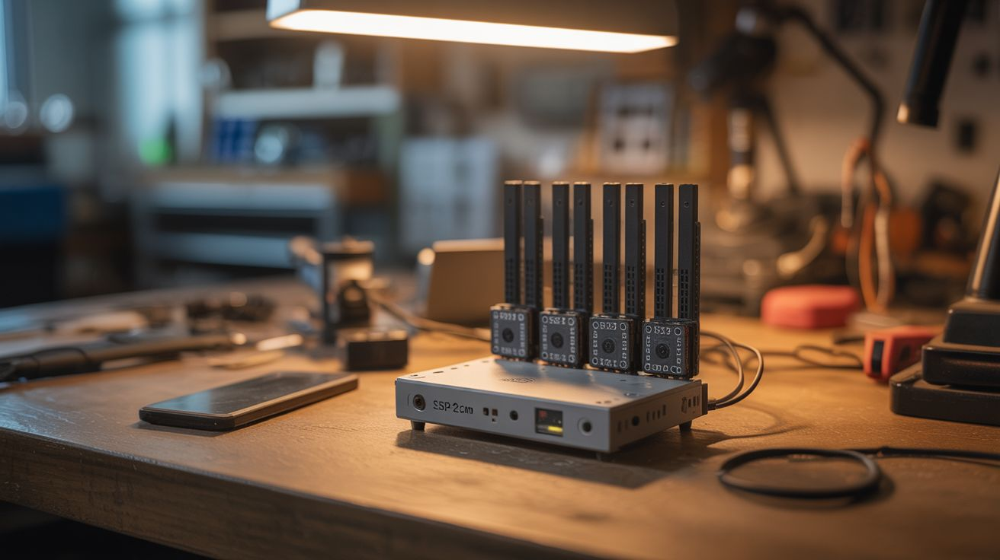

# #128 — ESP32-CAM Security

  

> Multiple $6 ESP32-CAM modules with IR LEDs and a Pi server — motion detection, night vision, and phone alerts.

## Ratings

     

## 🧪 What Is It?

Ring and Nest cameras cost $100+ each and require monthly subscriptions. An ESP32-CAM module costs $6 and includes a camera, WiFi, and a microcontroller. Add some IR LEDs for night vision, flash firmware that streams MJPEG over WiFi, and point it at your front door. A Raspberry Pi on your local network runs motion detection software (MotionEye or Frigate) that records clips and sends push notifications to your phone. Multiple cameras cover every angle. No cloud subscription, no monthly fees, all footage stays on YOUR hardware. A complete home security system for under $50.

<strong>🧰 Ingredients</strong>

- [ ] ESP32-CAM modules — $6 each, one per camera position *(electronics supplier)*
- [ ] OV2640 camera modules — usually included with ESP32-CAM *(electronics supplier)*
- [ ] IR LED boards — for night vision illumination *(electronics supplier)*
- [ ] 5V power supplies — one per camera, or run USB cables *(old phone chargers)*
- [ ] Raspberry Pi 3 or 4 — central recording server *(electronics supplier)*
- [ ] MicroSD card 64GB+ — for the Pi's storage *(electronics supplier)*
- [ ] USB hard drive — for extended recording storage (optional) *(e-waste, electronics supplier)*
- [ ] Weatherproof enclosures — for outdoor cameras *(hardware store, online)*
- [ ] FTDI USB-to-serial adapter — for flashing the ESP32-CAM *(electronics supplier)*

## 🔨 Build Steps

1. **Flash the ESP32-CAM firmware.** Connect the ESP32-CAM to your computer via the FTDI adapter (the ESP32-CAM has no USB port). Flash the ESP32-CAM-MB firmware or a custom Arduino sketch that serves an MJPEG stream over WiFi. Configure your WiFi credentials in the code before flashing.
2. **Test the camera stream.** Power the ESP32-CAM and navigate to its IP address in a browser. You should see a live video feed. Adjust resolution and quality settings — VGA (640x480) is a good balance of quality and bandwidth.
3. **Add night vision.** Wire IR LED boards to the ESP32-CAM's 3.3V output or a separate power supply. Position them around the camera lens. The camera's OV2640 sensor is naturally sensitive to IR light — with the IR LEDs on, it sees in complete darkness. For better IR performance, remove the tiny IR-cut filter from the camera module (a delicate operation but worthwhile).
4. **Set up the Pi server.** Install MotionEye OS or Frigate NVR on the Raspberry Pi. Both are free, open-source camera management systems that handle multiple camera streams, motion detection, recording, and notifications.
5. **Add cameras to the server.** In MotionEye or Frigate, add each ESP32-CAM as a network camera using its MJPEG stream URL. Configure motion detection zones, sensitivity, and recording triggers for each camera.
6. **Configure notifications.** Set up push notifications via Telegram bot, email (SMTP), or Pushover. When motion is detected, the Pi sends an alert with a snapshot to your phone within seconds.
7. **Weatherproof outdoor cameras.** Mount ESP32-CAMs in waterproof junction boxes from the hardware store. Drill a hole for the camera lens and seal with silicone. Run power via waterproof USB cables or Power over Ethernet adapters.
8. **Mount and position.** Install cameras at entry points — front door, back door, driveway, garage. Angle them to cover the approach areas. Test coverage at night to verify IR illumination reaches far enough.
9. **Add storage.** Connect a USB hard drive to the Pi for weeks of continuous recording. Configure automatic cleanup to delete old footage after a set period.

## ⚠️ Safety Notes

- Outdoor cameras must be properly weatherproofed. Water ingress destroys the ESP32-CAM instantly. Test weatherproof enclosures with a hose before installing electronics inside.
- Be aware of privacy laws regarding camera placement. In most jurisdictions, you can record your own property but not your neighbors' private areas. Point cameras at YOUR entry points, not across property lines.
- The ESP32-CAM's WiFi range is limited (~30-50 feet through walls). For distant cameras, use WiFi range extenders or run Ethernet with PoE adapters.

## 🔗 See Also

- [AI Doorbell](130-ai-doorbell.md)
- [Auto Plant Watering](127-auto-plant-watering.md)

**References:**
- [Appliance Teardown Guide](../../reference/appliance-teardown-guide.md)
- [Technical Glossary](../../reference/glossary.md)
- [Electronics & Microcontrollers Guide](../../reference/electronics-and-microcontrollers.md)
