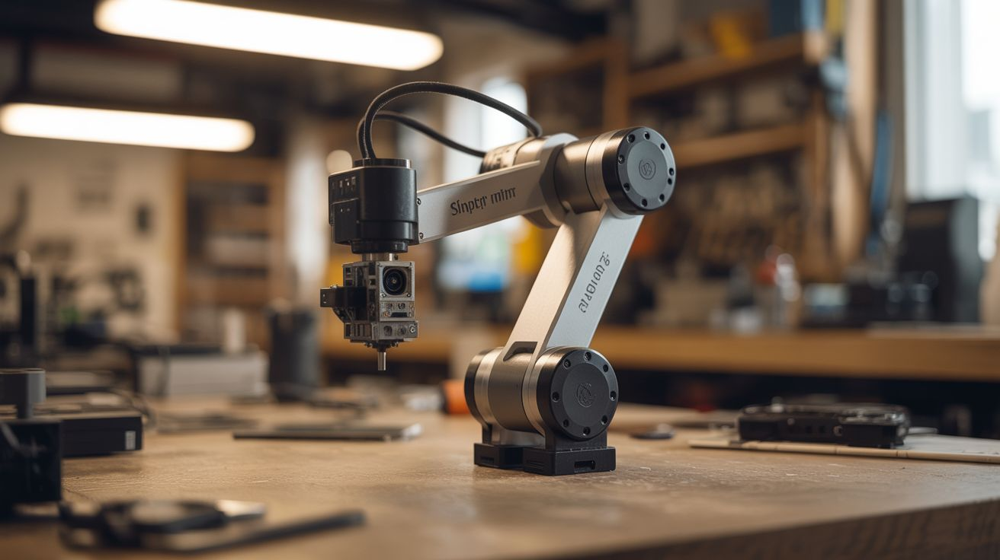

# #129 — Printer Robot Arm

  

> Stepper motors from dead printers + 3D printed joints = a working robotic arm that teaches positions and replays them.

## Ratings

     

## 🧪 What Is It?

Every inkjet and laser printer contains precision stepper motors that position the print head with sub-millimeter accuracy. Salvage 4-6 of these motors, mount them at joints of a 3D-printed or aluminum arm structure, and you have a robotic arm with industrial-grade positioning accuracy. Add an Arduino with stepper driver boards, and you can teach the arm positions by manually moving it (recording encoder values), then replay the movements automatically. The arm can pick and place small objects, sort items, draw pictures, or serve as a desktop automation tool. It's the same fundamental technology as a factory robot arm, built from printers headed for the landfill.

<strong>🧰 Ingredients</strong>

- [ ] Dead printers — 2-3 for stepper motors, rods, and belts *(e-waste bin)*
- [ ] Stepper driver boards (A4988 or DRV8825) — one per motor *(electronics supplier)*
- [ ] Arduino Mega — enough pins for multiple steppers *(electronics supplier)*
- [ ] 3D printed arm segments — or aluminum channel stock *(workshop, hardware store)*
- [ ] Bearings — from the same printers, or skate bearings *(e-waste, skate shop)*
- [ ] Gripper mechanism — servo-driven claw or suction cup *(electronics supplier, 3D print)*
- [ ] 12V power supply — steppers need more current than Arduino can provide *(old laptop charger)*
- [ ] Limit switches — for homing each axis *(electronics supplier, salvaged from printers)*
- [ ] Timing belts and pulleys — salvaged from the printers *(e-waste)*

## 🔨 Build Steps

1. **Harvest printer parts.** Disassemble 2-3 dead printers. Salvage stepper motors (usually 2-3 per printer), linear rods, bearings, timing belts, and pulleys. Also grab the limit switches — printers use them for homing the print head.
2. **Design the arm geometry.** Plan 3-4 joints: base rotation, shoulder, elbow, and wrist. Each joint is driven by a stepper motor through a timing belt or direct drive. Keep arm segments short (6-8 inches) to stay within the stepper motors' torque limits.
3. **Build or print the arm segments.** 3D print mounting brackets, joint housings, and arm links. Alternatively, use aluminum channel stock from the hardware store with drilled mounting holes. Each joint needs a bearing for smooth rotation and a mount for the stepper motor.
4. **Wire the stepper drivers.** Connect each A4988 driver to the Arduino: STEP and DIR pins to digital outputs, motor coils to the driver's output terminals. Wire all drivers to the 12V power supply. Set the current limit on each driver to match the stepper motor rating.
5. **Implement basic motion.** Write Arduino code that accepts serial commands (angle or step count for each joint) and drives the steppers accordingly. Use AccelStepper library for smooth acceleration/deceleration. Test each joint individually before combining movements.
6. **Add homing.** Install limit switches at the zero position of each joint. On startup, the arm moves each joint until it hits its limit switch, establishing a known reference position. All subsequent moves are relative to this home position.
7. **Implement teach mode.** Add a "teach" button. When pressed, the motors are de-energized and you can manually move the arm. Rotary encoders (or just reading the stepper driver's position) record each joint's position. Save a sequence of positions to EEPROM or SD card.
8. **Implement playback mode.** On command, the arm replays the taught sequence, moving between saved positions with smooth interpolation. Adjust speed via a potentiometer. The arm repeats the sequence endlessly — useful for repetitive tasks.
9. **Add a gripper.** Mount a servo-driven gripper or suction cup at the wrist. Add gripper open/close to the teach sequence. Now the arm can pick up objects, move them, and place them down.
10. **Refine and calibrate.** Fine-tune acceleration profiles, maximum speeds, and position accuracy. Add soft limits to prevent the arm from crashing into itself or the base. Test repeatability — a well-built arm should return to the same position within 1mm.

## ⚠️ Safety Notes

- Robotic arms can pinch, crush, or strike with surprising force. Never place hands in the arm's work envelope while it's running a programmed sequence. Always have an emergency stop button within reach.
- Stepper motors and drivers get HOT during extended operation. Ensure adequate ventilation around the drivers. Consider adding small heatsinks to the A4988 chips. Overheating causes missed steps and potential component failure.
- The 12V power supply for the steppers can deliver significant current. Ensure all wiring is properly insulated and connections are secure. A short circuit at the driver board can damage multiple components instantly.

## 🔗 See Also

- [Automated Microscope](../python-projects/148-automated-microscope.md)
- [Nerf Sentry Turret](138-nerf-sentry-turret.md)

**References:**
- [Appliance Teardown Guide](../../reference/appliance-teardown-guide.md)
- [Technical Glossary](../../reference/glossary.md)
- [Electronics & Microcontrollers Guide](../../reference/electronics-and-microcontrollers.md)
